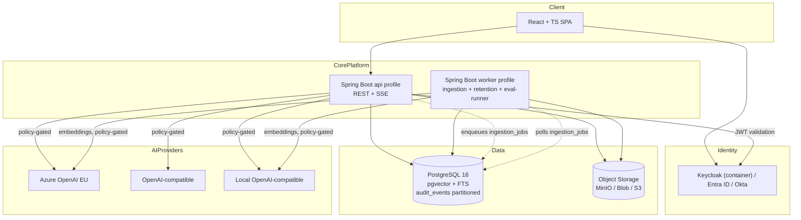
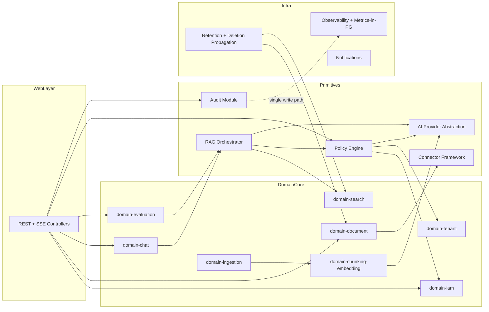
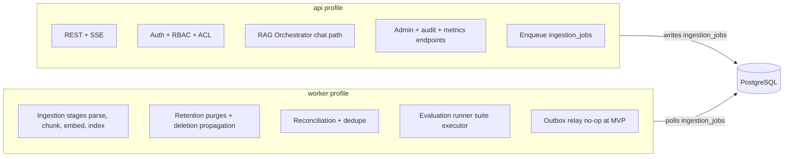

# Architecture Options — AI Knowledge Assistant for FinTech Engineering Teams

**Status:** Draft v1.0 (post-BRD, post-NFR, pre-SAD-lock)
**Author:** Solution Architect
**Source inputs:** [docs/BRD.md](BRD.md) v1.0, [docs/NFR.md](NFR.md) v1.0, [docs/BA_Analysis.md](BA_Analysis.md), [docs/Solution_Architecture.md](Solution_Architecture.md) v0.1
**Audience:** Product Owner, Engineering Lead, Security/Compliance, Finance
**Date:** 2026-05-19

> This document compares 2–3 candidate architectures for the MVP and recommends one. The current [Solution_Architecture.md](Solution_Architecture.md) v0.1 is consistent with the recommended option (Option B); the options exercise is captured here for traceability and stakeholder sign-off.

---

## 0. Reading Guide

- The MVP availability target (NFR §1.1) is **best-effort 99.0% with 99.5% as stretch, on a single-AZ / single-VM / single-Container-App footprint**, not a contractual SLA. Production launch tightens to 99.9% on managed multi-AZ HA — that is when the architecture must scale up, not before.
- The €500/month infra ceiling (NFR §6.3), the explicit out-of-scope list (NFR §6.10) and the €0/month observability cost ceiling (NFR §6.8) are binding constraints. Any option that requires Kubernetes, dedicated vector DBs, managed Elastic/OpenSearch, managed observability SaaS, multi-region, HA replicas, or hot-standby AI provider pools at MVP is **architecturally rejected**.
- The architectural primitives — **Policy Engine, AI Provider Abstraction, Connector Framework, RAG Orchestrator, Eval Runner, Audit Module** — are kept identical across all three options. They are the BRD's "hard architectural primitives" (BRD §8). Options differ only in **runtime topology and process boundaries** around those primitives.
- This document does **not** revisit feature scope, RBAC, ACL semantics, retention rules, or data residency policy — those are owned by the BRD and NFR. It only revisits **how to deploy** the platform that implements them.

---

## 1. Executive Summary

The MVP must deliver a multi-tenant, permission-aware RAG platform with auditability, EU residency, provider governance, and golden-question evaluation, on a **single-VM / Container App / App Service footprint inside a €500/month infra envelope**, with a 4–6 engineer team, in roughly 6 months.

Three candidate architectures are evaluated:

| Option | Shape | Verdict |
|---|---|---|
| **A — Pure Modular Monolith** | One Spring Boot process. Ingestion runs in-process via a scheduled executor. No separate worker. | Acceptable as a Day-1 fallback; meaningful risk that heavy ingestion contends with the API path. Not recommended past first pilot tenant. |
| **B — Modular Monolith + Async Worker** *(recommended)* | One Spring Boot codebase. Two deployment **profiles**: `api` and `worker`. PostgreSQL-backed job queue. Optional Node.js BFF deferred. | Best fit for MVP NFRs and constraints. Cleanly upgrades to production launch (multi-replica API, autoscaled worker pool) without re-architecture. |
| **C — Modular Monolith + Async Worker + Node.js BFF / AI Gateway** | Option B plus a small Node.js BFF that terminates SSE, shapes frontend APIs, and centralizes AI-provider calls. | Strictly better than B for streaming and AI-policy enforcement at the edge, but adds one more process and language to the MVP. Adopt **only if** the team has Node.js capacity and SSE termination from Spring proves painful in the first ingestion slice. |

**Recommendation: Option B for MVP**, with the **Option C BFF as an explicit, optional, post-pilot upgrade** rather than a Day-1 component. This matches BRD §1 ("Optional Node.js BFF / AI Gateway") and the NFR §6.10 MVP cost-control rule.

Explicitly **rejected without further analysis**:

- **Microservices** — Violates NFR §6.3 cost ceiling and team-size assumption (NFR §14.9). No business pressure or scale signal justifies it at MVP.
- **Serverless / event-driven (Functions + managed queue + managed vector DB)** — Conflicts with NFR §6.10 (no dedicated vector DB, no managed event broker), NFR §6.8 (€0 observability SaaS), and BRD §1 (single-VM / Container App preference). Cold-start risk hits the NFR §2.2 p95 TTFT ≤ 2 s budget directly.
- **Kubernetes-anything** — Explicit NFR §6.10 prohibition for MVP.

---

## 2. Option Comparison Table

| Dimension | A (Pure Monolith) | **B (Monolith + Worker)** | C (B + Node BFF/AI Gateway) |
|---|---|---|---|
| **Processes (MVP)** | 1 (API+ingest in-process) | 2 (api, worker) | 3 (api, worker, bff) |
| **Languages (MVP)** | Java + TS | Java + TS | Java + TS + Node |
| **Codebases** | 1 backend + 1 SPA | 1 backend (2 profiles) + 1 SPA | 1 backend + 1 BFF + 1 SPA |
| **Ingestion isolation** | Shared JVM with API; bounded executor mandatory | Separate JVM process; cleanest | Same as B |
| **Streaming chat (SSE)** | Spring Boot SSE direct to SPA | Spring Boot SSE direct to SPA | BFF terminates SSE, proxies to Spring |
| **AI provider call site** | Spring Boot only | Spring Boot only | Centralized in BFF + Spring fallback |
| **MVP infra cost** | ~€80–150 /mo | ~€120–200 /mo | ~€150–260 /mo |
| **Fits €500/mo ceiling** | Yes, easily | Yes | Yes (with margin) |
| **Path to production** | Requires extraction of worker before scaling | Just add API replicas + scale worker pool | Same as B, plus BFF autoscales independently |
| **Risk of ingestion ↔ API contention** | High | Eliminated by process split | Eliminated |
| **Operational complexity** | Lowest | Low | Low–medium |
| **Team-size fit (4–6 eng)** | Excellent | Excellent | Good (needs ≥ 1 Node-comfortable engineer) |
| **Risk of over-engineering** | Lowest | Low | Medium (BFF can grow scope) |
| **Match to existing SAD v0.1** | Partial (SAD assumes worker split) | Direct match | Match + BFF (which SAD lists as optional) |
| **Aligned with BRD §1 "Optional BFF"** | Yes | Yes | Yes |
| **Aligned with NFR §6.7 "1 API + 1 worker fixed footprint"** | Partial (no separate worker) | Direct match | Adds one container — still acceptable |

The remainder of this document expands each option in turn.

---

## 3. Option A — Pure Modular Monolith

### 3.1 Architecture style

Single Spring Boot 3 / Java 21 application. Internal **Java Module Path** (`module-info.java`) or Maven-multi-module layout. Ingestion stages run inside the same JVM via a dedicated `TaskExecutor` consuming the `ingestion_jobs` table. No separate `worker` deployment.

### 3.2 Runtime components

| Component | Role | Notes |
|---|---|---|
| `api` (Spring Boot) | REST + SSE; ingestion executor; eval-run executor | Single process, single container |
| `frontend` (React + TS) | SPA | Static hosting (Azure Static Web Apps / S3+CloudFront / nginx sidecar) |
| `postgres` (PG 16 + pgvector + FTS) | Single primary store | Same VM (Docker Compose) or managed PG |
| `object-storage` | MinIO (dev) / Blob / S3 (cloud) | DB stores references, not bytes |
| `idp` | Keycloak container on same VM (BRD §2.4 Option A) or external Entra ID / Okta (Option B) | Per BRD |
| `ai-providers` | Azure OpenAI EU (default), OpenAI-compatible, local OpenAI-compatible | Provider abstraction inside the JVM |

No BFF. No worker process. No Redis (NFR allows it but it is not required).

### 3.3 Project / module / service boundaries

Internal modules inside the single Spring Boot app, enforced by ArchUnit (NFR §7.6):

- `domain-tenant` (tenants, workspaces)
- `domain-iam` (users, memberships, capabilities, ACLs, permission cache)
- `domain-document` (documents, versions, collections, deletion)
- `domain-ingestion` (jobs, stages, retry, in-process executor)
- `domain-chunking-embedding` (chunkers, embedding profile, batching)
- `domain-search` (vector + FTS, `AllowedFilterSet` consumer)
- `domain-chat` (chat orchestrator, conversation lifecycle)
- `infra-ai-provider` (provider registry, adapter SPI, pre-call validation)
- `policy-engine` (RBAC, ACL resolution, residency / provider policy)
- `domain-evaluation` (golden questions, suites, runs, oracle)
- `infra-audit` (single write path for `audit_events`)
- `infra-observability` (metrics, health, logs, admin dashboard data)
- `infra-notification` (in-app + SMTP)
- `connector-framework` (`DocumentSourceItem` SPI; MVP impl = upload + folder import)

These boundaries are **identical** in Options B and C. The difference is only that in Option A they share a JVM with the API path; in B/C the ingestion-relevant modules also run in a `worker` process.

### 3.4 Database, vector store, object storage, audit storage

Common to all options (per BRD §1, BRD §5.4, NFR §6.10):

- **Primary DB:** PostgreSQL 16, single instance, single AZ at MVP. Managed PG (Azure Database for PostgreSQL Flexible Server / RDS) at production launch.
- **Vector search:** `pgvector` extension. Index family keyed by `embedding_profile_id` (enables zero-downtime model migration). HNSW vs IVFFlat parameters left to PRD §02 (open item).
- **Keyword / hybrid search:** PostgreSQL FTS (`tsvector` + GIN). Hybrid scoring done in the RAG Orchestrator (e.g., reciprocal rank fusion).
- **Object storage:** MinIO locally; Azure Blob / S3 in cloud. DB stores `(object_ref, sha256, byte_size, mime)` — never large binaries.
- **Audit storage:** `audit_events` table, **monthly partitioned**, append-only DB role, trigger blocking `UPDATE` / `DELETE` (BRD §2.5, NFR §4.7). Single write path = Audit Module.
- **Chat metadata & diagnostics:** `chat_conversations`, `chat_messages`, `answer_diagnostics`, `citations` in the same PG (NFR retention table).
- **Evaluation data:** `golden_questions`, `evaluation_suites`, `evaluation_cases`, `evaluation_runs`, `evaluation_results` in the same PG.
- **Tenant isolation:** Logical (`tenant_id` + `workspace_id` row scoping). Enforced by the Policy Engine pre-filter; PostgreSQL Row-Level Security as a defense-in-depth backstop (NFR §4.3).
- **Retention / deletion:** Daily retention job + deletion propagation worker (BRD §4.5, NFR §4.12). Hard requirement: deletion propagates to the vector index inside the soft-delete grace window.

Option A places the retention job and deletion propagator inside the same JVM. Options B/C run them on the `worker` deployment.

### 3.5 Messaging and async ingestion strategy

- **Mechanism:** DB-backed queue. Table `ingestion_jobs` with `status`, `attempt_count`, `available_after_at` (visibility timeout), `locked_by`, `locked_until`. Polled via `SELECT … FOR UPDATE SKIP LOCKED`.
- **Retry:** 3 attempts with exponential backoff (NFR §1.7).
- **Dead-letter:** `status = failed_permanent` + `failure_reason`. Surfaced in admin UI (BRD §3.6). Manual retry by authorized users.
- **Idempotency:** Stage-level idempotency (parse / chunk / embed / index); `Idempotency-Key` on upload (NFR §12.6).
- **Reindexing:** Previous active version remains searchable until the new version completes (BRD §3.1, §4.4). Cutover is a single `UPDATE` setting the new version `active`.
- **Partial failure:** Per-stage transactional boundaries; partial chunks visible only after `version.active = true`.
- **Upgrade path to event-driven:** The job state machine already emits the BRD §5.4 roadmap event names (`document.uploaded`, `text.extracted`, `chunks.created`, `embeddings.generated`, `document.indexed`, `ingestion.failed`) into `outbox_events`. Moving to a real broker (Service Bus, SNS/SQS, Kafka) is a publisher-swap, not a redesign.

**Option A specific risk:** The in-process executor competes with the API for JVM threads, CPU, and database connections. Mitigated by a bounded `TaskExecutor` (e.g., max 4 threads) and a separate HikariCP datasource for the ingestion path. Still not as clean as B/C's process split.

### 3.6 API design

- **Style:** REST + Server-Sent Events for streaming chat. No GraphQL, no gRPC in MVP. (Rationale: admin / RAG / observability surfaces are largely tabular and resource-shaped; SSE is sufficient and cheaper than WebSocket.)
- **Public / internal split:** All APIs under `/api/v1/...`. No separate "internal" gateway in MVP. The optional Node BFF (Option C) introduces an explicit edge boundary later.
- **Versioning:** URI versioning (`/api/v1/...`), 6-month parallel availability for breaking changes (NFR §7.5).
- **Streaming chat:** SSE. WebSocket reserved for future bidirectional admin (e.g., live ingestion progress); not needed in MVP.
- **Error model:** RFC 7807 (`application/problem+json`) with `type`, `title`, `status`, `detail`, `requestId`, `tenantId` (when safe to expose). Permission-denied responses never leak cross-tenant existence (NFR §11.4).
- **Pagination / filtering:** Cursor-based for high-cardinality lists (audit events, chat messages); offset for small admin tables. Standard `?cursor=&limit=&filter=` shape.
- **OpenAPI governance:** Spec generated from Spring annotations + handwritten schemas; OpenAPI diff in CI (NFR §10.6); breaking-change linter blocks PR.

### 3.7 Authentication and authorization

- **Protocol:** OIDC / OAuth2. Spring Security OAuth2 Resource Server validates JWTs.
- **IdP choices (BRD §2.4):**
  - Default MVP: small Keycloak container co-located with the app on the same VM (cheapest).
  - Preferred for tenants with existing Entra ID / Okta: external IdP, no Keycloak in the cloud at all.
  - Demo-only: dev-grade OIDC mock issuing compatible JWTs.
- **JWT validation:** JWKS fetched and cached; algorithm-allowlist enforced; `iss` / `aud` checked.
- **Workspace RBAC:** Role assigned per `Membership` (one user × one workspace). Capability flags additive on the membership.
- **Document / collection ACL:** `access_policies(scope_type, scope_id, subject_type, subject_id, action)` with most-specific-wins + explicit-deny precedence (PRD §05).
- **Permission-aware vector / keyword search:** The Policy Engine returns an `AllowedFilterSet`; **every** retrieval call must take it as an argument. Repository methods that take a query without an `AllowedFilterSet` are forbidden by ArchUnit rules.
- **Fail-closed:** Missing or empty `AllowedFilterSet` results in zero results — never a "no filter applied" query (BRD §2.2 hard requirement).
- **Audit:** Every access decision (allow/deny) on sensitive resources emits an `access.allowed` or `access.denied` audit event (NFR §4.7).

### 3.8 AI / LLM provider abstraction and data-residency enforcement

- **Chat provider abstraction:** `ChatProvider` SPI returning a streaming token source.
- **Embedding provider abstraction:** `EmbeddingProvider` SPI returning fixed-dimensional vectors; binds an `EmbeddingProfile`.
- **Reranker abstraction:** `Reranker` SPI defined now (interface only), no implementation in MVP (cost trade-off, NFR §17.7).
- **Provider registry:** `provider_configs` table, declaring (per BRD §4.3): region, retention behavior, training policy, logging behavior, approval status, capabilities, model/deployment names, streaming support, embedding dimensions, auth method, cross-border flag.
- **Workspace AI policy:** `workspace_ai_policies` table referencing approved `provider_configs` per capability.
- **Pre-call validation:** **Always** goes through `PolicyEngine.validateProviderCall(workspace, capability, providerConfig)` which returns `ProviderDecision { allow | deny(reason) }`. The provider client is package-private; only the policy-engine-validated call site can invoke it.
- **Residency check:** Provider region must match the workspace residency policy; if `restricted+` workspace, training policy must be `none` and retention must be `zero` or `< 24h`. Fail-closed otherwise (BRD §4.3, NFR §5.6).
- **Prompt / version management:** `prompt_templates` table with `name`, `version`, `text`, `model_constraints`. `AnswerDiagnostics` records the resolved template version.
- **Token usage / cost tracking:** Per `provider_call_*` metric family (NFR §8.2) and per-tenant cost ledger; alerts at 70/90/100% of monthly cap (NFR §6.5).
- **Fallback / degradation:** If the primary chat provider is unavailable, return the BRD §4.4 "AI provider unavailable" response (no hot-standby pool in MVP per NFR §6.10). For embeddings, queue and retry (NFR §1.8).
- **Local / private provider:** Always supported through the same SPI (BRD §5.3 third MVP adapter). Selected per workspace AI policy.

This block is **identical in all three options**. In Option C the same SPI is exposed via the BFF, but the validation logic still lives in the Java Policy Engine (single source of truth).

### 3.9 Deployment model

- **Local development:** Docker Compose: `postgres`, `keycloak`, `minio`, `api`, `frontend`. Optional `local-ai` (OpenAI-compatible). One command (`make dev`) to start.
- **MVP pilot:** Single VM (cheapest) **or** single Container App / App Service (Azure) / App Runner (AWS). Managed PG strongly recommended even at MVP, since DB is the single primary store. Backup managed by the cloud (RPO 24 h per NFR §1.4).
- **Production launch:** Two API replicas behind a load balancer + autoscaled worker pool, managed PG with single-AZ HA, managed object storage, secrets in Key Vault / Secrets Manager, managed Grafana / Log Analytics added only here (NFR §6.4).
- **Secrets:** `.env` (local), Key Vault / Secrets Manager (cloud) — never env-files in cloud (NFR §4.6).
- **Backup / restore:** Daily PG dump → object storage; documented restore drill quarterly (NFR §1.3 DR drill).
- **Observability stack:** stdout JSON logs + Actuator + metrics in PG + React admin observability dashboard. **€0 SaaS** (NFR §6.8). Production launch adds Log Analytics or managed Grafana.

### 3.10 NFR coverage (Option A)

| NFR | Coverage |
|---|---|
| Availability 99.0–99.5% best-effort | OK if ingestion bursts are bounded; one bad ingestion job can degrade API latency |
| Search latency p95 ≤ 1.5 s | At risk under simultaneous ingestion load |
| Chat TTFT p95 ≤ 2 s | At risk under simultaneous ingestion load |
| Ingestion throughput | Same as B/C |
| Scalability (50 users / 10 chats / 5 ingest) | OK on a moderately-sized VM; thin margin |
| Security / residency / RBAC / audit / compliance | Equivalent to B/C — same modules |
| Cost ≤ €500/mo | Best — fewest processes |
| Maintainability | OK; same codebase, fewer deployment artifacts |
| Developer velocity | Highest (one container to redeploy) |
| Operational complexity | Lowest |
| Observability | Same as B/C |
| AI quality evaluation | Same as B/C |
| Future connector extensibility | Same as B/C |

### 3.11 Pros, cons, risks, mitigations (Option A)

**Strengths**

- Smallest moving-parts count; one container to operate, deploy, and observe.
- Lowest cost.
- Fastest local dev iteration cycle.

**Weaknesses**

- API and ingestion share JVM resources. A bursty PDF parse can take CPU and DB connections from a hot chat path.
- No independent horizontal scaling of ingestion vs API at production launch — refactor required to extract a worker.
- Failure blast radius is the whole JVM (one OOM kills both API and ingestion).

**NFRs satisfied well**

- §6.3 (cost), §6.7 (no autoscaling), §7.6 (modular boundaries kept), §6.8 (observability cost).

**NFRs traded off**

- §2.1 / §2.2 latency p95 under simultaneous ingestion bursts (mitigated, not eliminated).
- §3.8 horizontal scaling (requires a refactor to scale API without scaling ingestion).
- §1.8 graceful degradation (a runaway ingestion thread group can degrade chat).

**Technical risks**

- *Thread starvation*: a slow embedding provider blocks the same executor servicing chats. Mitigation: dedicated executor + bulkhead (NFR §1.9), but still inside one JVM.
- *Connection-pool exhaustion*: one heavy reindex consumes all Hikari connections. Mitigation: split datasources by purpose.
- *Deployment risk*: every ingestion change requires redeploying the API.

**Product risks**

- Latency NFRs slip during pilot demos when a customer uploads a large PDF mid-demo.
- Optics: stakeholders may perceive a "no separate worker" architecture as not enterprise-ready.

**Mitigations**

- Bounded executors and dedicated datasources.
- Document the upgrade path to Option B as a single-PR refactor (already prepared: same codebase, add `--worker` profile, set scheduler to noop, point `api` profile at HTTP only).

**What becomes hard later**

- Independent autoscaling of ingestion. Going from A to B is cheap; going from A directly to a distributed worker pool at scale is painful.

### 3.12 Team and delivery implications (Option A)

- **Team size:** 3–4 engineers can deliver MVP.
- **Expertise:** Java/Spring, React/TS, Python (for eval), basic PostgreSQL ops.
- **MVP delivery complexity:** Lowest.
- **Operational complexity:** Lowest.
- **Fit:** Excellent for small teams; risk of perceived "toy" architecture for enterprise tenants.
- **Risk of over-engineering:** Lowest.

### 3.13 Cost implications (Option A)

- ~€80–150 / month in Azure West Europe at MVP scale (1 B2s/B2ms VM or 1 Container App + managed PG Flexible Burstable + Blob + Static Web App + outbound).
- Drivers: managed PG (~€40–80), Container App / VM (~€30–60), Blob (negligible), Static Web App (free tier).
- Defer for budget: Container App scale-out, managed Keycloak, managed observability.
- Fits €500/mo ceiling easily.
- Production-launch ceiling €8,000/mo: only reachable if the worker is extracted first; Option A is **not** a viable production-launch shape.

---

## 4. Option B — Modular Monolith + Async Worker  *(Recommended)*

### 4.1 Architecture style

Single Spring Boot codebase with two **deployment profiles**:

- `api`: REST + SSE endpoints, no scheduled ingestion executor.
- `worker`: scheduled executor that polls `ingestion_jobs`, runs ingestion stages, retention purges, deletion propagation, reconciliation, evaluation runs.

Both profiles share the same domain modules, the same Policy Engine, the same AI Provider Abstraction, the same Audit Module. They differ only in **which Spring `@Profile` beans activate** (`ApiBeans` vs `WorkerBeans`).

This is the architecture already proposed in [Solution_Architecture.md §5](Solution_Architecture.md) v0.1.

### 4.2 Runtime components

| Component | Role | Count (MVP) |
|---|---|---|
| `api` (Spring Boot, `api` profile) | REST + SSE | **1** (NFR §6.7) |
| `worker` (Spring Boot, `worker` profile) | Ingestion, retention, deletion, reconciliation, eval-runner host | **1** (NFR §6.7) |
| `frontend` (React + TS) | SPA | 1 (static hosting) |
| `postgres` (PG 16 + pgvector + FTS) | Primary store | 1 (managed, single-AZ at MVP) |
| `object-storage` | Blob / S3 / MinIO | 1 |
| `idp` (Keycloak / Entra ID / Okta / mock) | OIDC | 1 (per BRD §2.4) |
| `ai-providers` (Azure OpenAI / OpenAI-compatible / local) | LLM + embedding | external |
| `python-eval-runner` | Optional CLI/CI tool for evaluation experiments | dev/CI only; in-product evaluation runs **inside the Java worker** so the RAG pipeline is shared |

The Python tooling is positioned as a **dev/CI artifact**, not a runtime service. The product-facing evaluation runner reuses the Java RAG Orchestrator (BRD §3.5 "same permission-aware RAG pipeline as live chat"). This avoids the trap of a parallel Python RAG path that drifts from the Java one.

### 4.3 Project / module / service boundaries

Same internal modules as Option A. The only difference is that:

- `domain-ingestion` runs both as a synchronous job-creating service in the `api` profile and as a polling executor in the `worker` profile.
- `domain-evaluation` runs the suite executor in `worker`; the API exposes start / status / results endpoints.
- `infra-retention` and `infra-deletion-propagation` scheduled jobs live in `worker`.

### 4.4 Database, vector store, object storage, audit storage

Identical to Option A (see §3.4). The `api` and `worker` connect to the same PG. Separate connection-pool sizes per profile.

### 4.5 Messaging and async ingestion strategy

- **Mechanism:** DB-backed queue via `ingestion_jobs` table with `SELECT … FOR UPDATE SKIP LOCKED`. Avoids managed broker spend (NFR §6.10).
- **Workers:** N concurrent workers per `worker` process (default 4 at MVP). Multiple `worker` containers can be added at production launch without code changes.
- **Retry / dead-letter / idempotency / reindexing / partial failure:** Same semantics as Option A but executed in the `worker` process. Latency budget for retries does not affect API thread pool.
- **Outbox events:** `outbox_events` table written transactionally with each domain change. A small relay scheduled in `worker` publishes them — initially as a no-op (writes only, no broker). When the platform graduates to event-driven (Service Bus / SNS+SQS / Kafka), the relay is swapped without changing producers.
- **Upgrade path:**
  1. Stay on PG queue until queue depth or end-to-end ingestion-latency NFRs (§2.6, §2.7) regress consistently.
  2. Then introduce a managed broker behind the existing publisher SPI. Decisive trigger documented in ADR-006 below.

### 4.6 API design

Identical to Option A. The `api` profile remains the single public surface. The `worker` exposes only `/actuator/health` and internal-network metrics endpoints.

### 4.7 Authentication and authorization

Identical to Option A. The `worker` validates a service-account JWT when calling the API for callbacks (if any); inter-process traffic in MVP is database-mediated, so explicit auth between `api` and `worker` is mostly avoided.

### 4.8 AI / LLM provider abstraction and data-residency enforcement

Identical to Option A. Both `api` (for chat) and `worker` (for embeddings) call providers via the same Policy-Engine-gated SPI. There is **one source of truth** for provider decisions.

### 4.9 Deployment model

- **Local dev:** Docker Compose with separate `api` and `worker` services pointing at the same PG / MinIO / Keycloak. One command (`make dev`).
- **MVP pilot:** Two Container Apps (`api` and `worker`) or two App Service instances or a single VM running both containers via Docker Compose. Managed PG. Blob/S3.
- **Production launch:** API behind a load balancer (min 2 replicas), worker scaled by queue depth (NFR §6.7), managed PG with single-AZ HA, secrets manager, managed log aggregation.
- **Secrets / backup / observability:** Same as Option A.

### 4.10 NFR coverage (Option B)

| NFR | Coverage |
|---|---|
| Availability 99.0–99.5% best-effort | Good. Worker outages do not degrade search/chat; API outages do not stall queued ingestion. |
| Search latency p95 ≤ 1.5 s | Good — no ingestion contention on API. |
| Chat TTFT p95 ≤ 2 s | Good. |
| Ingestion throughput | Good. |
| Scalability | Direct path to production-launch scale via API replica count + worker pool size. |
| Security / residency / RBAC / audit | Same as A. |
| Cost ≤ €500/mo | Yes. |
| Maintainability | Excellent — one codebase, two profiles. |
| Developer velocity | High — single build artifact, minor deployment overhead. |
| Operational complexity | Low — two processes is well within a small team's capacity. |
| Observability | Same as A. |
| AI quality evaluation | Same RAG pipeline shared between live chat and eval-runner. |
| Future connector extensibility | Same as A. |

### 4.11 Pros, cons, risks, mitigations (Option B)

**Strengths**

- Eliminates ingestion ↔ API contention at trivial extra cost.
- Single codebase: no duplicate domain logic, no inter-process contract drift.
- Upgrade path to production launch is "scale replicas" — no architectural rework.
- Matches BRD §1, NFR §6.7, and Solution_Architecture.md v0.1.

**Weaknesses**

- Two containers to operate (mitigated: same image, different `--spring.profiles.active`).
- DB-backed queue has practical throughput limits (~hundreds of jobs/min on managed PG) — not a constraint at MVP scale but worth tracking.

**NFRs satisfied well**

- §1.8 graceful degradation, §2.1 / §2.2 latency, §3.8 horizontal scaling, §6.7 fixed-footprint, §7.6 modularity, §12.4 eventual consistency.

**NFRs traded off**

- None material at MVP scale.

**Technical risks**

- *DB queue saturation* under heavy reindex bursts. Mitigation: bounded worker concurrency, per-tenant throttling, queue-depth alert (NFR §8.4).
- *Schema migration coordination* between `api` and `worker` deployed on different cadences. Mitigation: expand/contract pattern (NFR §9.8) — same as B's discipline anyway.

**Product risks**

- Pilot perception of "still a monolith". Mitigation: stakeholder narrative around "two profiles of the same modular monolith, ready to split when scale demands it".

**Mitigations**

- Per-tenant ingestion rate-limit at the job-enqueue step.
- Documented decision criteria for graduating to a broker (ADR-006).

**What becomes hard later**

- Moving to true microservices is still a non-trivial step. The modular boundaries make it tractable but not automatic. This is an accepted, deferred problem (NFR §17.8).

### 4.12 Team and delivery implications (Option B)

- **Team size:** 4–6 engineers (the NFR §14.9 assumption).
- **Expertise:** Java/Spring, React/TS, PostgreSQL (incl. pgvector + FTS), Python (CI eval tooling).
- **MVP delivery complexity:** Low — one codebase, one CI pipeline, two deployment artifacts.
- **Operational complexity:** Low.
- **Fit:** Best balance for a small team while not painting the platform into a corner.
- **Risk of over-engineering:** Low. The architecture deliberately stops short of microservices, K8s, brokers, dedicated vector DBs.

### 4.13 Cost implications (Option B)

- ~€120–200 / month at MVP scale on Azure West Europe (typical mix: 2 small Container Apps + managed PG Flexible Burstable + Blob + Static Web App + Key Vault + outbound).
- Drivers: managed PG (largest single line item — ~€40–100 depending on tier), Container Apps consumption (~€30–60 each at low utilization), Blob (negligible at MVP corpus sizes), outbound to Azure OpenAI (negligible if collocated in same region — NFR §6.2).
- Defer to keep margin: Container App autoscale (NFR §6.7 forbids at MVP), managed Keycloak (use container or external IdP), managed observability.
- Production-launch ceiling €8,000/mo: directly supported. Going from MVP to production-launch is mainly extra PG tier, extra API replicas, and adding Log Analytics — all within the ceiling at 20–50 tenants.

---

## 5. Option C — Modular Monolith + Async Worker + Node.js BFF / AI Gateway

### 5.1 Architecture style

Option B **plus** a Node.js BFF (Express or Fastify) sitting between the SPA and the Spring Boot API. The BFF:

- Terminates SSE for streaming chat (frontend-shaped chunked responses, citation interleaving, retry semantics).
- Hosts frontend-shaped composite endpoints (e.g., a single `/bff/chat/session-bootstrap` that fans out to `/api/v1/workspaces/{}/policy`, `/api/v1/users/me`, etc.).
- Centralizes AI provider streaming logic if (and only if) the team chooses to call providers directly from the edge for latency reasons. **In MVP this is not enabled** — Java remains the only call site, because the Policy Engine lives in Java and provider calls must be policy-gated. The BFF proxies the streaming Java SSE through to the SPA.

### 5.2 Runtime components

Option B's components plus:

- `bff` (Node.js): stateless; terminates SSE; performs JWT validation (audience-check only; full authorization stays in the API); exposes `/bff/...` to the SPA.

### 5.3 Project / module / service boundaries

Same as Option B inside Java. The BFF is **not** a microservice — it has no domain ownership, no DB, and no provider call rights. It is a presentation-layer aggregator.

### 5.4 Database, vector store, object storage, audit storage

Identical to Option B.

### 5.5 Messaging and async ingestion strategy

Identical to Option B.

### 5.6 API design

- BFF exposes `/bff/v1/...` to the SPA — frontend-shaped, may bundle multiple Java API calls per BFF call.
- Java API stays at `/api/v1/...` as the system of record for contracts. External integrators (CI, eval runner, future connectors) consume Java API directly — the BFF is for the SPA only.
- Both layers versioned via URI prefix.

### 5.7 Authentication and authorization

- SPA logs in via OIDC at the IdP, gets JWT.
- BFF validates JWT (signature + audience + expiry) and forwards it to the Java API. **All authorization remains in Java.**
- The BFF never holds long-lived secrets beyond the IdP's JWKS-fetch credentials.

### 5.8 AI / LLM provider abstraction and data-residency enforcement

Identical to Option B. Provider calls happen in Java; the BFF only streams the resulting SSE through. If the team later wants the BFF to call providers directly for latency, that requires a documented BRD/NFR exception and replicating Policy Engine logic into Node — a step we are explicitly deferring.

### 5.9 Deployment model

- Local: add `bff` to Docker Compose.
- MVP: add a third Container App / App Service instance for the BFF (small SKU).
- Production launch: BFF scales independently of API.

### 5.10 NFR coverage (Option C)

Same as Option B, with these differences:

- Better SSE termination (Node's event loop handles many concurrent streams cheaply).
- Slight latency improvement on TTFT (one less stack hop *inside* Java thread pool — but adds one network hop in front).
- Slight cost increase from the third process.
- Slight maintenance increase (additional language).

### 5.11 Pros, cons, risks, mitigations (Option C)

**Strengths**

- Cleaner SSE handling and frontend-shaped APIs without polluting Java controllers.
- Independent scaling of the streaming edge (relevant only at production launch).
- Possibility (post-MVP) of placing the BFF closer to the SPA region while keeping the Java core in a more constrained residency zone.

**Weaknesses**

- One more language, one more deployment, one more on-call surface.
- BFF tends to accrete logic over time. Strict scope discipline required ("BFF is a view-model aggregator, not a domain service").
- Two JWT validators to keep in sync.

**NFRs satisfied well**

- §2.2 TTFT (marginally), §3.8 scaling (BFF scales independently), §11.x usability (composite endpoints).

**NFRs traded off**

- §6.3 (slight cost increase, still inside ceiling).
- §7.6 / §7.7 maintainability (more deps, more languages).

**Technical risks**

- BFF-API contract drift. Mitigation: BFF consumes the published OpenAPI; generated clients in CI.
- Duplicate authorization logic creep. Mitigation: ArchUnit-equivalent lint rule in BFF banning calls to providers directly.

**Product risks**

- Team without strong Node experience slows down. Mitigation: skip Option C until pilot is live.

**Mitigations**

- Treat the BFF as **optional, deferred**, and adopted only when one of three triggers fires:
  1. SSE handling in Spring Boot causes maintenance pain in the first chat slice.
  2. The product needs frontend-shaped endpoints that materially simplify the SPA.
  3. A tenant requires edge geolocation different from the Java core.

**What becomes hard later**

- Removing the BFF once added is harder than not adding it. Hence the "deferred-by-default" stance.

### 5.12 Team and delivery implications (Option C)

- **Team size:** 5–6 engineers, with at least one Node-comfortable engineer.
- **Expertise:** Adds Node.js / TypeScript backend skills.
- **MVP delivery complexity:** Medium.
- **Operational complexity:** Low–medium.
- **Fit:** Reasonable for a 6-person team with Node experience; otherwise it adds friction.
- **Risk of over-engineering:** Medium — BFF can grow.

### 5.13 Cost implications (Option C)

- ~€150–260 / month MVP — adds €30–60/mo for the BFF Container App.
- Still inside €500/mo ceiling with margin.
- Production-launch ceiling €8,000/mo: supported.

---

## 6. Recommendation

**Adopt Option B for MVP.** Defer Option C's BFF behind one of three explicit triggers.

**Why B over A.** Option B's incremental cost (~€40–60/mo and one extra container) buys clean isolation of the ingestion path from the hot API path, eliminates the largest single class of latency-NFR risk during pilot demos, and gives a frictionless path to production-launch scale. The architecture also matches what the BRD, the NFR §6.7 ("1 API container + 1 worker container"), and the existing [Solution_Architecture.md](Solution_Architecture.md) v0.1 already describe — adopting B aligns the option choice with the already-vetted module design.

**Why not C at MVP.** Option C is strictly better than B at production launch if there is Node capacity on the team and the SPA wants frontend-shaped endpoints. At MVP, the marginal benefit (cleaner SSE handling, edge aggregation) is small versus the marginal cost (third process, second language, second JWT validator). BRD §1 explicitly labels the BFF as **optional**, and NFR §6.7 pins the MVP footprint at "1 API + 1 worker". Adopting C as the default contradicts the cost-control posture.

**Why not microservices, serverless, K8s.** Explicitly rejected against NFR §6.10. Re-evaluating these is a production-launch / post-launch concern.

**Triggers to revisit and adopt Option C's BFF**:

1. **Streaming pain:** Two consecutive sprints lose time to Spring Boot SSE bugs / quirks during chat development.
2. **Frontend-shape pressure:** Three or more SPA screens require composite calls that bloat Java controllers with view-model code.
3. **Edge residency need:** A tenant requires the streaming edge in a region different from the Java core (rare, but documented).

**Triggers to revisit Option B → broker / partial microservice split**:

1. Ingestion queue depth p95 exceeds 100 messages for 15 minutes for 3 consecutive weeks at production scale (NFR §8.4 alert as the leading indicator).
2. Evaluation framework grows into a separate scheduling concern with > 50 suites running concurrently across tenants.
3. A specific connector (e.g., a real-time SharePoint connector) requires sustained throughput beyond what the DB-backed queue handles cleanly.

---

## 7. Architecture Diagram (Recommended Option B)

### 7.1 MVP topology

### 7.2 Internal module map inside the Spring Boot codebase

### 7.3 Cross-process responsibilities

---

## 8. Initial Architecture Decision Records

The following ADRs should be created in `docs/adr/` as part of the MVP implementation. They formalize the choices implied by Option B + NFR §6.10.

### ADR-001 — MVP runtime is a modular monolith + async worker

- **Status:** Proposed.
- **Context:** BRD §1 prefers Spring Boot + optional Node BFF; NFR §6.7 pins "1 API + 1 worker" fixed footprint; NFR §6.10 forbids K8s, dedicated vector DBs, managed SIEM, etc.
- **Decision:** Adopt Option B: one Spring Boot codebase with `api` and `worker` profiles. Defer Node BFF.
- **Consequences:** Single codebase, two deployment artifacts. Frictionless path to production-launch scaling via replica count.

### ADR-002 — PostgreSQL is the single primary store

- **Status:** Proposed.
- **Context:** BRD §1, §5.4 mandate PG 16 + pgvector + FTS; NFR §6.10 forbids dedicated vector DBs and managed search.
- **Decision:** PG 16 + pgvector + FTS, single instance, single AZ at MVP; managed PG with single-AZ HA at production launch. Migration to specialized stores only if evaluation metrics regress below thresholds.
- **Consequences:** One place to back up, one place to restore, one place to enforce residency.

### ADR-003 — DB-backed job queue, with outbox events ready for broker

- **Status:** Proposed.
- **Context:** BRD §5.4 endorses a DB-backed queue; NFR §6.10 forbids managed brokers at MVP; ingestion needs to be migration-ready (BRD §5.4 roadmap events).
- **Decision:** `ingestion_jobs` polled with `SELECT … FOR UPDATE SKIP LOCKED`. Transactional `outbox_events` written alongside domain changes; relay is a no-op in MVP. Broker adopted when ADR-006 triggers fire.
- **Consequences:** No broker spend at MVP. Producer code is already broker-ready.

### ADR-004 — Policy Engine is the sole authority for permission and provider decisions

- **Status:** Proposed.
- **Context:** BRD §2.2, §4.3, BRD §8 hard requirements; NFR §4.2, §5.6.
- **Decision:** `AllowedFilterSet` returned by the Policy Engine is a required argument to every retrieval call. Provider calls go through `PolicyEngine.validateProviderCall(...)`. ArchUnit rules enforce both.
- **Consequences:** Eliminates the bypass-risk class of bugs. Single place to evolve permission/residency semantics.

### ADR-005 — Audit Module is the sole writer to `audit_events`

- **Status:** Proposed.
- **Context:** BRD §2.5, NFR §4.7, §4.12, §12.3.
- **Decision:** `audit_events` is monthly-partitioned. DB role `app_writer` lacks UPDATE/DELETE on the table; a row-trigger blocks UPDATE/DELETE regardless of role. The Audit Module is the only Java component that opens transactions touching this table, and audit writes are part of the same transaction as the action they record.
- **Consequences:** Tamper resistance from the application layer; predictable audit completeness.

### ADR-006 — Trigger conditions for graduating from DB-backed queue to managed broker

- **Status:** Proposed.
- **Context:** ADR-003 keeps MVP cheap, but the broker option must be a deliberate, monitored decision rather than a panic move.
- **Decision:** Migrate to a managed broker (Azure Service Bus / SNS+SQS / Kafka) when **any** of the following holds for 3 consecutive weeks at production scale:
  - p95 `ingestion_job_queue_wait` > 30 s (NFR §2.11 production target).
  - PG queue table write contention measurably regresses primary path latency (search/chat p95 above NFR ceilings).
  - A connector requires sustained throughput > 100 jobs/min/tenant.
- **Consequences:** Brokerless until proven necessary; explicit, measurable trigger removes the "shall we add Kafka?" reflex.

### ADR-007 — Logical multi-tenancy with PostgreSQL Row-Level Security as defense-in-depth

- **Status:** Proposed.
- **Context:** BRD §2.3, NFR §4.3.
- **Decision:** Shared schema. `tenant_id` + `workspace_id` on every domain table. Policy Engine pre-filter is the primary enforcement; PG RLS policies enabled as a backstop using a session GUC (`app.current_tenant_id`). High-compliance customers use schema-per-tenant or DB-per-tenant later.
- **Consequences:** Defense-in-depth at trivial extra DB cost. Migration path to physical isolation is preserved.

### ADR-008 — €0 SaaS observability at MVP via PostgreSQL-stored metrics

- **Status:** Proposed.
- **Context:** NFR §6.8 mandates €0 in dedicated observability SaaS at MVP; NFR §8.2 mandates the same metric families regardless of backend.
- **Decision:** Persist counters and rolling aggregates in `metric_counters` / `metric_histograms` tables in the same PG instance. Render the admin observability dashboard from these tables. Logs go to stdout / host log stream with 7–14 day retention. No Prometheus / Grafana / Loki / managed APM at MVP. Production launch promotes metrics to OpenMetrics + managed Grafana / Log Analytics.
- **Consequences:** Zero SaaS spend; some loss of ad-hoc query flexibility versus a real time-series store. Cost guardrail: lower resolution if writes contend with primary path (NFR §8.2).

*(Optional ADR-009 — adopt Node BFF — is intentionally deferred; will be created if and when an Option-C trigger fires.)*

---

## 9. MVP Implementation Sequence / First Vertical Slice

The order below extends the implementation tracks already in [Solution_Architecture.md §8](Solution_Architecture.md), with explicit gates per slice.

### Slice 0 — Repo + CI scaffolding (Week 0–1)

- Monorepo: `backend/` (Spring Boot), `frontend/` (React+TS), `infra/` (Docker Compose, Terraform/Bicep stubs), `docs/`.
- CI: build, unit tests, ESLint/Prettier, Checkstyle/SpotBugs, Renovate, OpenAPI diff job, container image build + SBOM (NFR §9.1).
- Local `make dev` brings up: PG+pgvector, Keycloak, MinIO, api (empty health), frontend (empty shell). One command, < 60 s.

### Slice 1 — Foundation (Weeks 1–3)

- OIDC login round-trip with seeded Keycloak realm.
- Tenant / workspace / user / membership / capability domain model + schema migrations (Flyway).
- ArchUnit module-boundary rules wired.
- Audit Module with append-only DB role + monthly partition + trigger blocking UPDATE/DELETE.
- Admin: create-tenant + create-workspace API + minimal SPA screen.
- **Gate:** ADR-001, ADR-002, ADR-005, ADR-007 created; review by Eng Lead + Security.

### Slice 2 — Ingestion (Weeks 3–6)

- `ingestion_jobs` queue, `worker` profile, parse → chunk → embed → index pipeline.
- AV scan stub (ClamAV-compatible interface, optional in dev).
- Embedding via local OpenAI-compatible provider (no cloud spend during dev).
- pgvector index family with `embedding_profile_id`.
- `document.uploaded`, `text.extracted`, `chunks.created`, `embeddings.generated`, `document.indexed`, `ingestion.failed` events written to `outbox_events`.
- Admin: document list, ingestion job status, manual retry.
- **Gate:** ADR-003 created. p95 ingestion NFRs (§2.6, §2.7) validated on a 10-document corpus.

### Slice 3 — Search + permission-aware retrieval (Weeks 5–7, overlaps Slice 2)

- `AllowedFilterSet` and Policy-Engine-gated repositories.
- Hybrid retrieval (vector + FTS + RRF).
- Search REST endpoint + SPA results screen with snippets, scores, document/section/page metadata.
- `access.allowed` / `access.denied` audit events on all sensitive resources.
- **Gate:** ADR-004 created. Permission-bypass attempt test suite green (synthetic test that tries to fetch a chunk outside the filter set always returns zero results).

### Slice 4 — Chat / RAG (Weeks 7–10)

- RAG Orchestrator: retrieve → policy pre-call validate → stream → cite → audit diagnostics.
- SSE streaming end-to-end to SPA.
- Clickable inline citations.
- "I don't know" refusal path.
- Per-answer diagnostics persisted; admin dashboard tile.
- Azure OpenAI EU adapter enabled (using the AI provider abstraction).
- **Gate:** p95 TTFT ≤ 2 s on synthetic probes; p95 search retrieval ≤ 1.5 s.

### Slice 5 — Admin / RBAC / ACL / AI policy (Weeks 9–11)

- Document collections + `access_policies` (most-specific-wins + explicit deny).
- Workspace AI policy editor + provider registry CRUD (Platform-Admin-only).
- Audit log viewer (scoped per role).
- Notification: in-app banner + SMTP / mock mailer (NFR §8.4 minimal alert set).

### Slice 6 — Evaluation (Weeks 11–13)

- Golden question authoring + suite assembly.
- Eval runner (in `worker` profile) reusing RAG Orchestrator.
- Layered correctness oracle (deterministic + LLM-as-judge as defined in PRD §04).
- Dashboard: retrieval pass rate, citation match rate, answer correctness, refusal behavior, run-over-run regression.

### Slice 7 — Operational hardening (Weeks 13–15)

- Retention purges + deletion-propagation worker (BRD §4.5 hard requirement).
- Daily backup + documented restore drill.
- Nightly reconciliation: PG ↔ object storage, PG chunks ↔ pgvector entries (NFR §12.5).
- Idempotency-Key support on upload.
- Soft-delete + 7-day grace + four-eyes for sensitive collections (PRD §05).
- **Gate:** ADR-008 created. Quarterly DR drill scheduled.

### Slice 8 — Cloud-pilot deployment (Weeks 15–17)

- Container Apps / App Service in Azure West Europe (or AWS eu-west-1).
- Managed PG (single-AZ HA at launch; single-AZ no-HA acceptable for first pilot week).
- Blob / S3 with versioning enabled.
- Key Vault / Secrets Manager.
- IaC (Bicep / Terraform) + tfsec/Checkov in CI.

### "First vertical slice" demo target

By **end of Slice 4** (≈ week 10) the platform demos:

- OIDC login as a `CONTRIBUTOR`.
- Upload one Markdown document and one text PDF; see ingestion progress and final `indexed` status.
- Run a permission-aware search returning ranked snippets.
- Ask a question in chat; receive a streamed answer with clickable citations.
- Try the same question as a `VIEWER` without access — receive the BRD §11.4 polite, non-disclosing refusal.
- Inspect the per-answer diagnostics in the admin dashboard.

This is the canonical "this product works" demo; everything after Slice 4 is hardening, breadth, and operability.

---

## 10. Risks and Mitigations (Recommended Option B)

| # | Risk | Likelihood | Impact | Mitigation |
|---|---|---|---|---|
| R-1 | pgvector retrieval quality regresses below golden-suite thresholds at scale | Medium | High | Evaluation framework as the early-warning system (PRD §04); HNSW vs IVFFlat tuning ADR; migration path to specialized vector store documented but deferred |
| R-2 | DB-queue contention with primary read path under heavy reindex | Medium | Medium | Bounded worker concurrency; per-tenant rate-limit; queue-depth alert; ADR-006 broker trigger |
| R-3 | EU residency policy bypassed by an unvetted provider config | Low | Very high | Pre-call validation is the only path to providers; ArchUnit rule + integration test enforce it; access-denied audit and admin alert on policy block |
| R-4 | Deletion fails to propagate to vector index | Low | Very high (compliance) | Nightly reconciliation job + mismatch alert (NFR §12.5); BRD §4.5 hard requirement test; tombstone pattern with TTL |
| R-5 | Cost overrun beyond €500/mo at MVP | Medium | Medium | NFR §6.10 PR-checkbox enforcement; monthly FinOps review; cost-attribution tags per environment |
| R-6 | LLM provider rate-limits / regional outages | Medium | Medium | Circuit breaker + bulkhead (NFR §1.9); graceful "AI provider unavailable" response; explicit decision in ADR to **not** maintain a hot-standby pool at MVP (NFR §6.10) |
| R-7 | Single-AZ PG outage during pilot | Low | Medium | Documented best-effort posture (NFR §1.1); daily backup + RTO 4 h drill; pilot tenant communications template |
| R-8 | Permission-cache invalidation lag at role change | Medium | Medium | TTL ≤ 60 s + LISTEN/NOTIFY-based eviction across API replicas (existing SAD §4.5) |
| R-9 | Eval framework reused incorrectly such that golden suites pass while live chat fails | Low | High | Shared RAG Orchestrator code path is a hard architectural rule (BRD §3.5 hard requirement); ArchUnit rule denies parallel RAG implementations |
| R-10 | Team grows comfortable with monolith and skips the production-launch profile split refresh (replicas, autoscale) | Medium | Medium | Pre-baked Terraform/Bicep for production topology; quarterly "production-launch readiness review" beyond MVP |
| R-11 | Adding the Node BFF mid-pilot under SSE-pain pressure without ADR | Low | Low–Medium | Pre-defined Option-C triggers in §6 with a documented ADR template |
| R-12 | Audit table grows so fast that monthly partitions become unwieldy | Low | Low | Drop-partition retention job after 1 year (NFR §5.8); export to object storage as compressed JSONL at 30-day age |

---

## 11. Open Questions for PM / Stakeholders

These are decisions that materially affect the recommended option. None block adopting Option B in principle, but several change the slice ordering, the cost envelope, or the production-launch sequencing.

1. **MVP IdP choice (BRD §2.4).** Of the three documented options — co-located Keycloak, external Entra ID / Okta, dev-grade OIDC mock — which is the **default** for the first pilot tenant? This drives Slice 1 scope (Keycloak realm seeding vs Entra ID integration vs mock).
2. **Pilot tenant residency.** Are all first-three pilot tenants EU/EEA-only? If yes, the Policy Engine ships with a single residency profile in MVP; if any tenant requires cross-border processing with their own provider, we add the policy-override flow earlier (PRD §05).
3. **Eval framework adoption by pilot tenants.** Is the evaluation framework expected to be **used by tenant admins** during the pilot, or only by our team to gate releases? This determines Slice 6 UI depth.
4. **Production-launch SLA.** Does the first paying contract demand 99.9% (NFR §1.1 production target), or is 99.5% acceptable until a defined volume? This determines when we invest in multi-AZ PG HA.
5. **Tenant-funded enterprise upgrades.** Per NFR §15.4, can SIEM export, extended retention, customer-managed keys, etc. be sold as tenant-funded extras? If yes, we keep the extension points typed (e.g., audit-event sink SPI) earlier.
6. **AI provider mix at production launch.** Beyond Azure OpenAI EU, OpenAI-compatible, and local — must any of AWS Bedrock, Anthropic, Cohere, Mistral be in the production-launch adapter set? Influences the provider abstraction surface and the integration-test matrix.
7. **Budget-cap behavior at AI cap.** When a tenant hits 100% of its monthly AI cap (NFR §6.5), should the platform hard-block, downgrade model tier, admin-approve overage, or alert-only? This shapes the Workspace AI Policy schema.
8. **Chat-content retention default.** Per NFR §5.4 chat content is disabled by default. Will any pilot tenant flip this on from day 1? If yes, the consent banner + per-conversation retention controls must ship in Slice 4, not later.
9. **Audit hash chain in MVP or post-MVP?** [Solution_Architecture.md §9](Solution_Architecture.md) flags this as open. Adding it now is cheap; adding it after auditors ask is more expensive.
10. **Worker pool topology at production launch.** Single worker pool across all tenants, or per-tenant queues (cleaner for noisy-neighbor isolation)? This is a Slice-8 / post-MVP decision but should be on the radar.

---

## 12. Proposed Defaults for PM Open Questions

1. **IdP default**  
   Local development uses Keycloak in Docker Compose. Cloud MVP should use tenant-provided Entra ID/Okta where available; otherwise a small non-HA Keycloak container is acceptable for pilot/demo only.

2. **Pilot residency**  
   Default is EU/EEA-only processing. Azure West Europe or equivalent EU region is preferred. Cross-border LLM/embedding calls are disabled unless explicitly approved.

3. **Evaluation UX depth**  
   MVP should support golden-question upload/management, run evaluation, and show pass/fail summary with failed cases. Advanced analytics and LLM-as-judge are roadmap.

4. **Production SLA**  
   MVP remains best-effort: 99.0% target, 99.5% stretch. Production launch target should be confirmed by PM; proposed default is 99.9% only for paying tenants and only when infra budget supports it.

5. **Tenant-funded extras**  
   Managed SIEM, extended retention, CMK, private deployment, dedicated tenant isolation, and stronger HA should be allowed as tenant-funded exceptions with explicit approval.

6. **Provider mix**  
   MVP supports Azure OpenAI, OpenAI-compatible API, and local OpenAI-compatible provider. AWS Bedrock, Anthropic, Cohere, Mistral, and Vertex AI are roadmap.

7. **Budget-cap behavior**  
   Proposed default: alert at 70% and 90%, degrade to cheaper model at 100%, hard stop at 110% unless overage is enabled.

8. **Chat retention default**  
   Chat content remains disabled by default. If enabled by tenant policy, default retention is 30 days.

9. **Audit hash chain**  
   MVP should make the schema hash-chain-ready. Full hash-chain verification can be production-readiness unless PM/security wants audit tamper-evidence from day one.

10. **Worker-pool topology**  
   MVP uses one API process and one worker process from the same Spring Boot codebase. Worker concurrency is configurable. Separate worker pools per tenant are roadmap if fairness problems appear.

---

**End of Architecture Options v1.0.**
