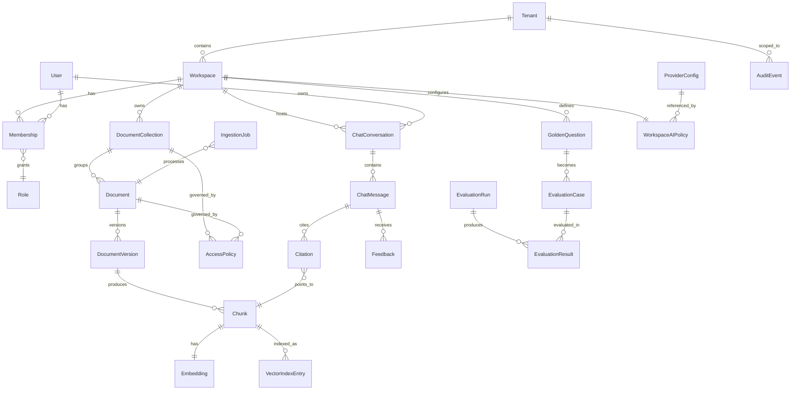
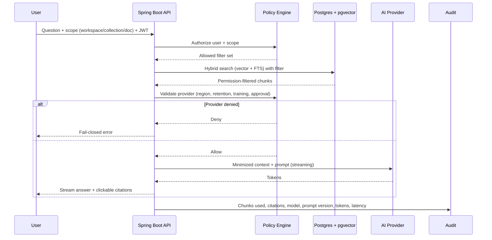

# Business Analysis — AI Knowledge Assistant for FinTech Engineering Teams

**Author:** Senior Business Analyst
**Status:** Draft v1.0 (post-BRD review)
**Source:** [docs/BRD.md](BRD.md) — Draft v1.0, 2026-05-14
**Date:** 2026-05-14

> Scope: Multi-tenant, permission-aware RAG platform (Java 21 / Spring Boot + React + PostgreSQL/pgvector). MVP-focused, with explicit roadmap items deferred. This document consolidates roles, entities, workflows, rules, edge cases, and **proposed resolutions** for every ambiguity surfaced from the BRD.

Reading order:
1. §1–§5 — structured analysis of the BRD.
2. §6 — every ambiguity, each tagged `[CLARIFICATION NEEDED]`.
3. §7 — **proposed resolutions** for each ambiguity, intended to seed the PRD/architecture phase. These are recommendations from BA; final sign-off rests with Product, Security, Compliance.
4. §8 — next-step deliverables (PRDs + Solution Architecture).

---

## 1. User Roles & Permissions

### 1.1 Role Catalogue (BRD §2.1)

The BRD names five roles for the long term but commits MVP to four. "Auditor / Compliance Viewer" is referenced in audit-visibility tables (BRD §2.5) yet is not in the MVP role list.

- **Platform Admin** (post-MVP split): manages tenants, global settings, provider registry, integrations, audit configuration.
- **Workspace Admin** (post-MVP split): manages one workspace — users, roles, collections, access rules, evaluation sets, workspace AI policy.
- **ADMIN (MVP)**: collapsed Platform + Workspace Admin. Holds an internal `platform:admin` capability that grants cross-tenant powers; without it, the same role behaves as Workspace Admin.
- **CONTRIBUTOR**: uploads/maintains documents, triggers reindexing, authors golden questions, reviews indexing/eval-related logs.
- **USER**: searches and chats over permitted content; can see only their own activity history.
- **VIEWER**: read-only access to documents, answers, and citations. In MVP, an "audit-capable" subset of VIEWER (a separate capability flag) covers the Auditor / Compliance Viewer use case until the role is split out post-MVP.

### 1.2 Permission Surface

Two enforcement layers (BRD §2.2):
- **Workspace RBAC** — controls workspace entry and the general role inside it.
- **Document / Collection ACL** — controls which collections / documents a user can search or chat over.

Hard rules (BRD §2.2, §5.4):
- Retrieval **must pre-filter** by `tenant_id`, `workspace_id`, `collection_id`/`document_id`, access policy, user role *before* context construction.
- Unauthorized chunks **must never** appear in results or in LLM context (fail-closed).

### 1.3 Permissions Matrix (consolidated, MVP)

- Manage tenants / global config / provider registry: **ADMIN** + `platform:admin` capability.
- Manage workspace settings / users / role assignments / collections: **ADMIN**.
- Upload / version / reindex / delete documents: **CONTRIBUTOR**, **ADMIN**.
- Create / edit golden questions, run evaluations: **CONTRIBUTOR**, **ADMIN**.
- Search over permitted content: **VIEWER**, **USER**, **CONTRIBUTOR**, **ADMIN**.
- Chat over permitted content: **USER**, **CONTRIBUTOR**, **ADMIN**.
- Read documents / citations: **VIEWER**, **USER**, **CONTRIBUTOR**, **ADMIN**.
- View audit logs cross-tenant: **ADMIN** with `platform:admin`. Per-workspace: **ADMIN** (workspace-scoped) and **VIEWER** with `audit:read` capability. Indexing/eval logs only: **CONTRIBUTOR**. Own activity history: **USER**.
- Configure workspace AI policy: **ADMIN**. Provider registry approval: **ADMIN** with `platform:admin`.

---

## 2. Core Entities & Relationships

### 2.1 Logical Model

### 2.2 Entity Notes

- **Tenant / Workspace**: logical multi-tenancy via `tenant_id` + `workspace_id` row isolation (BRD §2.3).
- **User**: linked to external IdP subject; profile fields only (email, display name, IdP, status, last login). No passwords stored (BRD §2.4).
- **Membership**: `(user, workspace, role, capabilities[])`. At most one role per workspace (see §7.1). Capabilities are orthogonal flags (`platform:admin`, `audit:read`, `cross_border_opt_in`).
- **AccessPolicy**: governs collection/document visibility — see §7.1 for proposed binding model.
- **DocumentVersion**: previous active version remains searchable until new version is fully indexed (BRD §3.1, §4.4). Identified by `(document_id, version_no, embedding_profile_id)`.
- **Chunk / Embedding**: keyed by `embedding_profile_id` so a new embedding model produces a parallel index family until cutover.
- **WorkspaceAIPolicy**: declares which approved providers may receive document content, retrieved chunks, prompts, embeddings.
- **AuditEvent**: append-only from the application layer (not full WORM in MVP, BRD §2.5).

---

## 3. Feature Workflows

### 3.1 Document Ingestion (BRD §3.1, §4.4, §5.4)

Happy path:
1. CONTRIBUTOR/ADMIN uploads a file via UI drag-and-drop or REST.
2. Backend validates: format (PDF/MD/TXT), size, MIME, virus scan, permission, tenant/workspace.
3. Original file + metadata + ingestion job persisted durably → upload acknowledgement < 2 s.
4. Background workers run: `uploaded -> parsing -> chunking -> embedding -> indexed`. Per-job retry up to 3x; manual retry permitted.
5. New version becomes searchable **only after successful index**; previous version remains active until then.
6. Audit events emitted: `document.uploaded`, `text.extracted`, `chunks.created`, `embeddings.generated`, `document.indexed`, `ingestion.failed`.

Rules:
- TXT/MD ≤ 5 MB indexed within 2 min (p95). Text PDF ≤ 25 MB within 10 min (p95).
- Scanned PDFs / OCR out of scope (BRD §3.4).
- Pre-call validation against AI provider policy before any embedding call (BRD §4.3).
- No acknowledged upload may be lost (durable storage before ack).

### 3.2 Search (BRD §3.2)

1. USER issues semantic or keyword query within a workspace.
2. Policy engine resolves allowed `(tenant, workspace, collection, document)` filter set.
3. Hybrid vector + FTS search runs over only allowed chunks.
4. Result snippet shows: document title, section/page, similarity score (visible to CONTRIBUTOR+), with filters (workspace, collection, type, tags).
5. Latency p95 < 1.5 s on indexed accessible documents.

### 3.3 Chat (BRD §3.3, §7)

Rules:
- "I don't know" refusal when retrieval insufficient — never hallucinate. Threshold defined in §7.4.
- Short conversational memory within a `ChatConversation` only (see §7.4).
- Per-answer feedback (thumbs ±, comment) feeds the evaluation set.
- p95: full answer < 8 s; TTFT < 2 s streaming; retrieval + prompt construction < 1.5 s.

### 3.4 Evaluation (BRD §3.5)

1. CONTRIBUTOR/ADMIN defines a golden Q&A: question, scope, expected answer, expected sources, required/forbidden keywords, expected refusal behavior.
2. Evaluation runner reuses the **same permission-aware RAG pipeline** as live chat.
3. Per-case records: retrieved chunks, citations, answer text, latency, token usage, pass/fail per check.
4. Dashboard surfaces: retrieval pass rate, citation match rate, answer correctness, refusal-behavior correctness, regression delta.
5. User feedback can be promoted into golden questions (workflow in §7.5).
6. Stale golden questions auto-marked when underlying source doc is deleted/replaced (BRD §4.5).

### 3.5 Admin Workflows (BRD §3.6, §5.1)

- Workspace + user + role management (manual assignment in MVP).
- Document collection CRUD + ACL changes.
- Ingestion-job monitor + reindex/retry.
- Evaluation run trigger + golden-question authoring.
- Audit log viewer (scoped by role).
- Workspace AI policy configuration (which providers permitted).

### 3.6 Deletion / Lifecycle (BRD §4.5)

On document delete:
1. Remove from search + chat immediately.
2. Deactivate/delete related chunks + embeddings.
3. Remove vector index entries (**hard requirement**).
4. Delete extracted text.
5. Schedule deletion of original file.
6. Minimal audit metadata retained.
7. Dependent golden questions marked stale.
8. Backups retain copies until expiry but cannot be restored to active indexes without explicit authorization.

---

## 4. Business Rules & Validation Constraints

### 4.1 Authorization & Tenancy
- All queries scoped by `tenant_id` + `workspace_id`. MVP: shared schema, row isolation.
- Final authorization is application-enforced regardless of IdP claims.
- Fail-closed on any policy ambiguity.

### 4.2 AI Provider Policy (BRD §4.3, §5.3)
- Pre-call validation: approval status, region, residency, retention, training behavior, workspace policy.
- Fail-closed if provider is not approved, region-incompatible, or has unknown retention/training behavior for a sensitive workspace.
- Only permission-filtered, minimized context may leave the perimeter.
- Prompt/response logging + provider-side training disabled by default.
- Every AI call audited with: provider, region, model, prompt version, chunk IDs, token usage, cross-border flag.

### 4.3 Data Residency (BRD §4.2)
- All customer data (documents, text, chunks, embeddings, indexes, chat, eval, audit, backups) stays in the configured EU/EEA region unless cross-border processing is explicitly enabled.
- Provider configs declare processing region; validated against tenant residency policy.

### 4.4 Performance Targets (per tenant)
- 50 concurrent users; 10 concurrent chats; 5 concurrent ingestion jobs.
- 1,000 documents; ~100,000 chunks.
- Latency p95 as listed above (§3).
- Availability 99.5% monthly (excluding planned maintenance and AI-provider outages).
- Backups daily; RPO 24 h, RTO 4 h.

### 4.5 Durability & Correctness
- Acknowledged uploads must not be lost.
- Reindex preserves previous searchable version until success.
- Retries up to 3x with manual retry option.
- Permission enforcement is mandatory and fails closed.

### 4.6 Retention Defaults
- Uploaded documents: while active.
- Superseded versions: 30 days.
- Chunks/embeddings/index entries: tied to active or superseded window.
- Chat content: **disabled by default**; 30 days if enabled.
- Chat metadata & retrieval diagnostics: 90 days.
- Eval runs: 180 days. Audit logs: 1 year. Operational logs: 30 days.
- Backups: 30 days rolling, same residency.

### 4.7 Validation Constraints (explicit)
- File types: PDF (text only), Markdown, plain text — others rejected at upload.
- File size + indexing throughput SLOs as in §3.1; hard maximum sizes proposed in §7.3.
- Operational logs must not contain document text, full prompts, chunks, LLM responses, secrets, or sensitive personal data unless explicitly enabled by workspace policy.

---

## 5. Edge Cases & Error Scenarios

### 5.1 Ingestion
- Scanned PDF uploaded (text extraction yields empty/garbage): fail with reason `OCR_REQUIRED`; near-empty PDFs treated identically.
- Duplicate upload (same content hash within `(workspace, collection, document name)`): treated as no-op + audit event (see §7.3).
- Mid-pipeline failure after embedding partially completes: partial chunks must not become searchable; whole-version cutover only.
- Embedding provider outage during ingestion: jobs queue / retry; existing indexed content remains searchable (BRD §4.4).
- Reindex with a different embedding model/dimension: new `embedding_profile` index family built in parallel; cutover after success.
- File integrity / antivirus scan: required (see §7.3); positive AV detection quarantines + audits.

### 5.2 Search & Chat
- Empty retrieval (no permitted chunks above threshold) → "I don't know" refusal (criterion in §7.4).
- Permission revoked mid-session: filter is recomputed per request; effective immediately.
- Provider region mismatch detected at runtime: fail-closed; standardized error wording proposed in §7.4.
- Streaming interruption / partial answer: audit record still produced; citations partial; user sees "answer interrupted" banner.
- Long conversation exceeding session memory limits: oldest turns truncated to keep within token budget; banner indicates truncation.

### 5.3 Evaluation
- Source document of a golden question deleted → mark stale (BRD §4.5). Review workflow in §7.5.
- Eval run against an unavailable provider: case `SKIPPED`; run summary indicates partial result.
- "Answer correctness" oracle: layered (deterministic + LLM-as-judge + optional human) — see §7.5.

### 5.4 Multi-Tenancy / Identity
- User deprovisioned from IdP: JWT remains valid until short TTL expires; on next call user is denied if disabled flag set via webhook (see §7.2).
- User member of multiple workspaces: at most one role per workspace; cross-workspace role conflicts impossible.
- Cross-tenant user (consultant scenario): explicitly OUT of MVP.
- IdP claim → role conflict: app-assigned role takes precedence; claim-mapped role applied only on first JIT provisioning.

### 5.5 Deletion & Lifecycle
- Failed deletion job: surfaced as admin alert + ops metric; auto-retry policy in §7.7.
- Restore from backup containing already-deleted content: always requires Platform Admin authorization + audit reason.
- GDPR right-to-be-forgotten for user-generated data: DSAR + erasure flow in §7.7.

### 5.6 Observability & Audit
- Append-only enforcement: DB-level grants + trigger; tamper-evidence post-MVP (§7.8).
- Audit log export format + cadence: NDJSON, on-demand by Platform Admin in MVP (§7.8).
- Notification delivery failure (SMTP down): retry + in-app fallback (§7.8).

---

## 6. Ambiguities & Missing Requirements

> Every item below is flagged for resolution before architecture sign-off. Proposed resolutions are in §7 with matching IDs.

### 6.1 Roles & Permissions
- **[CLARIFICATION NEEDED] 6.1.a** MVP role mapping: is the BRD's "Auditor / Compliance Viewer" equivalent to MVP `VIEWER`, or a separate scope only available post-MVP?
- **[CLARIFICATION NEEDED] 6.1.b** ACL binding granularity at collection/document level: per-user, per-role, per-group, tag/label-based, or some mix?
- **[CLARIFICATION NEEDED] 6.1.c** Role precedence when a user holds different roles in different workspaces and whether multiple roles per single workspace are allowed.
- **[CLARIFICATION NEEDED] 6.1.d** Whether USERs can see their own activity history in MVP.
- **[CLARIFICATION NEEDED] 6.1.e** Who can create new workspaces in MVP — only the collapsed ADMIN? Self-service?
- **[CLARIFICATION NEEDED] 6.1.f** Configurability of workspace AI policy — Workspace Admin only, or Platform Admin gate?

### 6.2 Tenancy & Identity
- **[CLARIFICATION NEEDED] 6.2.a** How users get assigned to tenants/workspaces (manual pre-creation? JIT provisioning on first SSO? IdP claim?).
- **[CLARIFICATION NEEDED] 6.2.b** Token-claim → role mapping configuration: which claim, where configured, precedence vs app-assigned roles.
- **[CLARIFICATION NEEDED] 6.2.c** JWT revocation / refresh strategy on permission change or deprovisioning.
- **[CLARIFICATION NEEDED] 6.2.d** Cross-tenant user support — in or out of MVP?

### 6.3 Document Ingestion
- **[CLARIFICATION NEEDED] 6.3.a** Hard maximum file sizes (BRD gives throughput SLOs only).
- **[CLARIFICATION NEEDED] 6.3.b** Duplicate handling (same content hash): dedupe, new version, or reject?
- **[CLARIFICATION NEEDED] 6.3.c** Detection + handling of scanned/image-only PDFs (reject at upload vs fail mid-pipeline).
- **[CLARIFICATION NEEDED] 6.3.d** Antivirus / file scanning requirement.
- **[CLARIFICATION NEEDED] 6.3.e** Chunking strategy parameters (size, overlap, sectioning) — business constraints or pure implementation?
- **[CLARIFICATION NEEDED] 6.3.f** Connector "local folder/repo-style import" mechanics: one-shot upload vs sync vs watch?
- **[CLARIFICATION NEEDED] 6.3.g** Who marks a new upload as "supersedes existing document" — automatic by name/hash, or user-selected?

### 6.4 Search & Chat
- **[CLARIFICATION NEEDED] 6.4.a** Hybrid vs separate modes for semantic + keyword; ranking strategy at MVP.
- **[CLARIFICATION NEEDED] 6.4.b** Visibility of similarity score to end users vs only to contributors/admins.
- **[CLARIFICATION NEEDED] 6.4.c** Pagination limits, max results per query.
- **[CLARIFICATION NEEDED] 6.4.d** Default chat scope (workspace? last-used collection?) and how user changes it.
- **[CLARIFICATION NEEDED] 6.4.e** "Session" definition for short conversation memory: time window, browser session, explicit conversation thread? Memory turn limit / token cap?
- **[CLARIFICATION NEEDED] 6.4.f** Criterion that triggers "I don't know" refusal (min retrieval count? similarity threshold? confidence?).
- **[CLARIFICATION NEEDED] 6.4.g** Whether streaming is mandatory or feature-flagged; behavior when SSE is unavailable (client/proxy/environment constraints).
- **[CLARIFICATION NEEDED] 6.4.h** Feedback workflow: can users edit/withdraw feedback? One per answer per user, or multi?

### 6.5 Evaluation
- **[CLARIFICATION NEEDED] 6.5.a** "Answer correctness" oracle: deterministic keyword checks only, LLM-as-judge, human review, or all three?
- **[CLARIFICATION NEEDED] 6.5.b** Scheduled eval runs vs ad-hoc only in MVP.
- **[CLARIFICATION NEEDED] 6.5.c** Regression-alert threshold and notification recipients.
- **[CLARIFICATION NEEDED] 6.5.d** Workflow for promoting user feedback to golden questions (approval? edit step?).
- **[CLARIFICATION NEEDED] 6.5.e** Eval behavior when target provider is unavailable (skip / retry / fail).
- **[CLARIFICATION NEEDED] 6.5.f** Stale-eval review owner and SLA.

### 6.6 AI Provider & Residency
- **[CLARIFICATION NEEDED] 6.6.a** Provider registry ownership and approval workflow — Platform Admin only?
- **[CLARIFICATION NEEDED] 6.6.b** Multi-provider per workspace: failover/preference rules.
- **[CLARIFICATION NEEDED] 6.6.c** Behavior when embedding provider changes (dimension change → full reindex policy + user-facing impact).
- **[CLARIFICATION NEEDED] 6.6.d** "Sensitive workspace" definition — what flag/policy makes a workspace strict?
- **[CLARIFICATION NEEDED] 6.6.e** Cross-border processing opt-in flow (who can enable, audit gate).

### 6.7 Data Lifecycle
- **[CLARIFICATION NEEDED] 6.7.a** Soft-delete grace period vs immediate hard delete for original files.
- **[CLARIFICATION NEEDED] 6.7.b** GDPR DSAR / right-to-erasure flow for user-generated data (chat, feedback, audit references).
- **[CLARIFICATION NEEDED] 6.7.c** Data export: format, scope, who can trigger, retention of export artifacts.
- **[CLARIFICATION NEEDED] 6.7.d** Deletion-request approval workflow (single-step or four-eyes for sensitive collections?).
- **[CLARIFICATION NEEDED] 6.7.e** Restore-from-backup authorization workflow and audit gating.

### 6.8 Audit & Observability
- **[CLARIFICATION NEEDED] 6.8.a** Append-only enforcement mechanism (DB role grants, time-partitioning, hash chaining?).
- **[CLARIFICATION NEEDED] 6.8.b** Audit log export to SIEM in MVP (BRD lists SIEMs only on roadmap; is any export required at MVP?).
- **[CLARIFICATION NEEDED] 6.8.c** Notification fallback / delivery guarantees.
- **[CLARIFICATION NEEDED] 6.8.d** Per-tenant vs global capacity for the "50 concurrent active users" target.

### 6.9 Internal Consistency Issues in the BRD
- **[CLARIFICATION NEEDED] 6.9.a** Role list inconsistency: §2.1 names five roles + an "Auditor" referenced in §2.5; MVP commits to four.
- **[CLARIFICATION NEEDED] 6.9.b** §2.5 audit visibility table distinguishes Platform Admin vs Workspace Admin, but §2.1 says the split is post-MVP.

---

## 7. Proposed Resolutions

> BA recommendations for every `[CLARIFICATION NEEDED]` flag. Each item references the original ID. These are proposed defaults to unblock PRD/architecture work; Product, Security, and Compliance will confirm or amend.

### 7.1 Roles & Permissions (resolves §6.1)

- **7.1.a — Auditor vs Viewer.** In MVP, `VIEWER` is the only read-only role. Audit-log read is gated by an orthogonal capability flag `audit:read` that may be granted to a VIEWER membership. Post-MVP, split into dedicated `AUDITOR` role with built-in capability set.
- **7.1.b — ACL binding granularity.** Collection-level ACL is **mandatory**; document-level ACL is an **optional override** (deny or allow). Bindings supported in MVP:
  - (1) Workspace role default (broad).
  - (2) Explicit user grant.
  - (3) IdP group grant (read-only stub in MVP; full sync via SCIM post-MVP).
  Tags/labels are metadata only, **not** security boundaries. Resolution algorithm: most-specific binding wins; explicit deny beats explicit allow; otherwise inherit collection default.
- **7.1.c — Role precedence.** At most **one role per workspace** per user. Across workspaces, memberships are independent. Capability flags are additive.
- **7.1.d — Own activity in MVP.** Yes. USER can view their own chat conversations (metadata only by default) and their own search history within the configured retention window.
- **7.1.e — Workspace creation.** ADMIN with `platform:admin` only in MVP. No self-service; ticket-based onboarding via Platform Admin.
- **7.1.f — Workspace AI policy.** Configured by workspace **ADMIN**. May only reference providers already approved by Platform Admin in the global registry. Enabling cross-border processing requires Platform Admin co-sign (see 7.6.e).

### 7.2 Tenancy & Identity (resolves §6.2)

- **7.2.a — User provisioning.** MVP: pre-invitation by ADMIN (email-based). JIT provisioning on first SSO is allowed **only** if the IdP issuer is bound to a tenant AND the email domain matches a tenant-configured allow-list; otherwise denied. Provisioned user starts with no workspace memberships until ADMIN grants them.
- **7.2.b — Claim → role mapping.** Per-IdP configuration. Default claim path = `groups` (configurable). Mapping rules `idp_group → app_role` evaluated **only at first JIT provisioning**; subsequent role changes are app-managed. App-assigned role always wins on conflict.
- **7.2.c — JWT revocation.** Short token TTL (default 15 min). Backend caches resolved permissions for ≤ 60 s keyed by `(user, workspace)`. On deprovisioning event (IdP webhook when available or admin action) user is flagged `disabled` → all subsequent requests denied even with still-valid JWT. Cache invalidation broadcast across nodes via Postgres `LISTEN/NOTIFY` (no Redis dependency required).
- **7.2.d — Cross-tenant user.** OUT of MVP. Same email in two tenants = two independent user records.

### 7.3 Document Ingestion (resolves §6.3)

- **7.3.a — Hard max sizes (MVP).** PDF 50 MB, MD/TXT 10 MB. Larger uploads rejected at validation. Configurable per tenant by Platform Admin.
- **7.3.b — Duplicate handling.** Within `(workspace, collection, document.name)`: if content hash matches the active version, return the existing document (`no-op`) with an audit event `document.upload.duplicate_ignored`. If content hash matches an older version, treat as restore (new version pointing to existing object). Across different document names: independent documents.
- **7.3.c — Scanned PDFs.** Detect at parse stage: if extracted text below 200 characters AND extracted-character density < 0.1 chars/KB, fail with `OCR_REQUIRED` reason. Image-only MIME types rejected upfront.
- **7.3.d — Antivirus.** Required. **Superseded by async AV gate in PRD 01 / SAD:** scan runs as first worker stage after durable upload to pending-av storage. Positive detection → quarantine bucket, audit event `document.av.blocked`, no further processing.
- **7.3.e — Chunking parameters.** Implementation detail with the following **business constraints** (workspace-configurable by ADMIN within bounds):
  - Default chunk size: 800 tokens. Min 200, max 1500.
  - Default overlap: 120 tokens. Min 0, max 250.
  - Prefer semantic boundaries (markdown headings, paragraph breaks, PDF page breaks); fall back to fixed-size on unstructured content.
- **7.3.f — Local folder import.** One-shot recursive upload only in MVP (`POST /import/folder` with filtering rules). No watch/sync.
- **7.3.g — Supersede semantics.** **User-initiated.** Default for a new upload = new document. To create a new version, user explicitly uses "Upload new version of <document>" action. Same-hash dedupe (7.3.b) catches accidental re-uploads.

### 7.4 Search & Chat (resolves §6.4)

- **7.4.a — Hybrid ranking.** Single hybrid search by default: dense (pgvector) + sparse (PostgreSQL `tsvector`) fused via Reciprocal Rank Fusion (RRF). MVP filter exposes "exact phrase" toggle that bypasses dense and uses FTS only.
- **7.4.b — Similarity score visibility.** Hidden from USER and VIEWER by default. Visible to CONTRIBUTOR and ADMIN. Configurable per workspace (ADMIN may opt to show to all roles).
- **7.4.c — Pagination.** 20 results per page, hard max 200 results per query. RAG retrieval top-K = 8 chunks by default (configurable per workspace, 3–20).
- **7.4.d — Default chat scope.** Workspace-wide by default. Last-used scope remembered per user per workspace. Scope-picker in the chat input lets user narrow to one or more collections or a single document.
- **7.4.e — Session / memory.** Memory is bound to a `ChatConversation` (explicit object, user can create / archive). A conversation's working memory window = the smaller of (last 10 turns) OR (2,000 tokens). After 30 min of inactivity, a new conversation is started automatically (configurable). Conversations are listed in the chat UI; content persistence is governed by workspace chat-content retention setting (default disabled, metadata only).
- **7.4.f — "I don't know" criterion.** Refuse when either:
  - (a) zero permitted chunks returned, OR
  - (b) all top-K chunks below similarity threshold (default cosine 0.55, workspace-configurable 0.4–0.8), OR
  - (c) total retrieved-context token count below 200.
  Refusal is a templated answer with a help link, an audit-logged outcome `refused.insufficient_context`, and a "submit feedback" affordance.
- **7.4.g — Streaming (SSE).** Streaming is **mandatory** in MVP via **React → Spring Boot SSE** direct. If SSE is unavailable in a client/proxy environment, the system may fall back to non-streaming responses behind a feature flag (with TTFT and UX degradation recorded in observability).
- **7.4.h — Feedback workflow.** One feedback per `(user, answer)`. User may edit within 24 h; locked thereafter. No deletion. Feedback rows are immutable after lock and feed evaluation set via the promotion workflow (7.5.d).

### 7.5 Evaluation (resolves §6.5)

- **7.5.a — Correctness oracle.** Layered ("evaluation pipeline"):
  1. **Deterministic checks** (always): required keywords present, forbidden keywords absent, expected citation overlap ≥ configured threshold (default 1 expected source cited), refusal-behavior match.
  2. **LLM-as-judge** (semantic correctness): a separate evaluator model + structured rubric (factual alignment, citation grounding, refusal appropriateness). Evaluator model must be an approved provider/model distinct from the answer-generating model wherever possible. Output: pass / fail / partial + rationale stored on `EvaluationResult`.
  3. **Optional human review queue** for cases marked failing or partial. Reviewer (CONTRIBUTOR/ADMIN) can confirm/override the judge.
- **7.5.b — Run scheduling.** Ad-hoc only in MVP, via UI button and REST. Scheduled runs and CI integration are roadmap.
- **7.5.c — Regression alerts.** Trigger when overall pass rate drops by > 5 absolute percentage points vs the previous run on the same suite, or when retrieval pass rate drops by > 10. Recipients: workspace ADMINs + suite owner CONTRIBUTORs.
- **7.5.d — Feedback → golden.** Workflow:
  - USER submits feedback on an answer.
  - CONTRIBUTOR/ADMIN sees feedback in a review queue.
  - Reviewer edits to add expected answer + expected sources + keywords + scope.
  - Reviewer publishes; case becomes a golden question. Audit recorded.
- **7.5.e — Provider unavailable.** Case status `SKIPPED` with reason; run summary shows partial completion. Re-run resumes only the skipped cases.
- **7.5.f — Stale-eval review.** Default owners = suite creator + workspace ADMIN. SLA: review within 14 days. After 30 days unreviewed, the case is auto-`disabled` (not deleted) and flagged in observability dashboard.

### 7.6 AI Provider & Residency (resolves §6.6)

- **7.6.a — Registry ownership.** Global, configured by ADMIN with `platform:admin`. Workspaces may only select from the approved registry.
- **7.6.b — Multi-provider per workspace.** Workspaces declare:
  - one primary chat provider (with optional secondary failover);
  - one primary embedding provider (no automatic failover; embedding switch requires reindex).
  Failover provider must satisfy the workspace's residency + retention + training policy. Embedding failover only allowed within the same `embedding_profile` family (same model/dimension).
- **7.6.c — Embedding provider change.** Triggers a parallel reindex into a new `embedding_profile`. Old profile remains active until new index reaches 100% coverage; cutover is an explicit ADMIN action. During the transition, search uses the active profile. Audit events `embedding_profile.created`, `embedding_profile.activated`.
- **7.6.d — Sensitive-workspace definition.** A workspace has a classification level: `standard` / `restricted` / `strict`.
  - `standard` (default): approved providers; default retention; cross-border allowed if tenant opts in.
  - `restricted`: requires approved-region provider; provider retention must be `none`; training behavior must be `disallowed`.
  - `strict`: forbids cross-border; requires private / self-hosted provider; prompt/response logging always disabled.
  Classification is set by ADMIN at workspace creation and changeable only by Platform Admin with audit reason.
- **7.6.e — Cross-border opt-in.** Cross-border processing requires (1) workspace classification = `standard`, (2) ADMIN toggle with mandatory text justification, (3) Platform Admin co-sign (four-eyes) for any workspace that has ever held `restricted+` data. All events audited.

### 7.7 Data Lifecycle (resolves §6.7)

- **7.7.a — Soft-delete grace.** 7-day soft-delete window for documents. ADMIN can restore within the window. After 7 days, hard-delete proceeds: chunks, embeddings, vector entries, extracted text, and the original file. Audit retains a tombstone (id, hash, deleter, reason).
- **7.7.b — DSAR / erasure.**
  - **Access (DSAR):** `GET /me/export` provides user profile + own activity history + own chat conversations + own feedback as NDJSON+zip.
  - **Erasure:** ADMIN-triggered (with verified user request). PII fields nulled out; audit references replaced with a one-way hashed user ID. Chat content is deleted if retention enabled; feedback content is anonymized but retained for eval integrity.
- **7.7.c — Data export.** NDJSON (one JSON object per line) bundled in zip. Triggered by ADMIN. Scope: collection / workspace / user. Export artifacts stored in object storage with 7-day expiry, encrypted at rest, audit-logged. Cross-tenant export only by Platform Admin.
- **7.7.d — Deletion approval.**
  - Standard collection: single-step delete by CONTRIBUTOR or ADMIN.
  - Sensitive collection (flag set): four-eyes — initiator + second ADMIN approval before hard-delete schedule.
- **7.7.e — Restore from backup.** Always requires Platform Admin + recorded reason. Restored content goes into a quarantine collection until ACLs are re-validated by ADMIN.

### 7.8 Audit & Observability (resolves §6.8)

- **7.8.a — Append-only enforcement.**
  - DB-level: application role has `INSERT` only on `audit_events`; `UPDATE` and `DELETE` revoked.
  - Trigger: `BEFORE UPDATE OR DELETE` raises an exception.
  - Time-partitioned monthly. Old partitions detached at end of retention.
  - Post-MVP: hash-chain over each partition for tamper-evidence.
- **7.8.b — SIEM export at MVP.** Manual NDJSON export by Platform Admin (UI + REST). Streaming export via webhook is roadmap.
- **7.8.c — Notification fallback.** Primary channel: in-app. Secondary: SMTP. SMTP failures retried 5x with exponential backoff up to 30 min. Persistent failure surfaces as an in-app admin banner + ops metric `notifications.delivery.failed`.
- **7.8.d — Concurrency scope.** Targets in BRD §4.4 are **per tenant**. Whole-system capacity = tenant target × number of active tenants, sized at deployment. Platform Admin sees per-tenant gauges in observability dashboard.

### 7.9 BRD Internal Consistency (resolves §6.9)

- **7.9.a — Canonical MVP roles.** `ADMIN`, `CONTRIBUTOR`, `USER`, `VIEWER`. "Auditor / Compliance Viewer" use cases handled by VIEWER + `audit:read` capability until the dedicated role lands.
- **7.9.b — Pre-split audit visibility.** ADMIN is workspace-scoped by default. The `platform:admin` capability extends ADMIN to all tenants/workspaces for audit and configuration. Audit-log read by non-ADMIN roles requires `audit:read` capability.

---

## 8. Next-Step Deliverables

The following follow-on documents are produced from this analysis and live alongside in `docs/`:

- [PRD — Document Ingestion](prd/01_Ingestion.md)
- [PRD — Search](prd/02_Search.md)
- [PRD — Chat](prd/03_Chat.md)
- [PRD — Evaluation Framework](prd/04_Evaluation.md)
- [PRD — Admin & RBAC](prd/05_Admin.md)
- [PRD — Observability & Audit](prd/06_Observability.md)
- [Solution Architecture — Initial Draft](Solution_Architecture.md)

---

## Appendix A — Glossary

- **ACL** — Access Control List, bound to collection or document.
- **Chunk** — A sub-document text segment indexed for retrieval.
- **Embedding profile** — A `(provider, model, dimension, normalization)` tuple keying an index family.
- **Fail-closed** — On any policy ambiguity, deny rather than allow.
- **Hybrid search** — Combination of dense vector search and sparse keyword (FTS) search.
- **JIT provisioning** — Just-in-time user record creation on first successful SSO.
- **RAG** — Retrieval-Augmented Generation.
- **RBAC** — Role-Based Access Control at the workspace level.
- **RRF** — Reciprocal Rank Fusion, used to merge dense + sparse rankings.
- **WORM** — Write-Once-Read-Many storage. MVP audit is append-only (app + DB layer), not full WORM.
