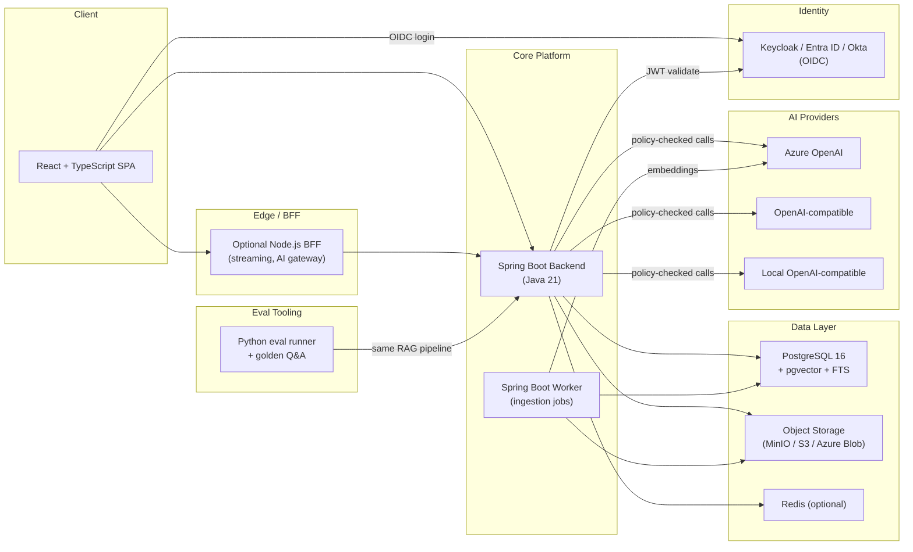
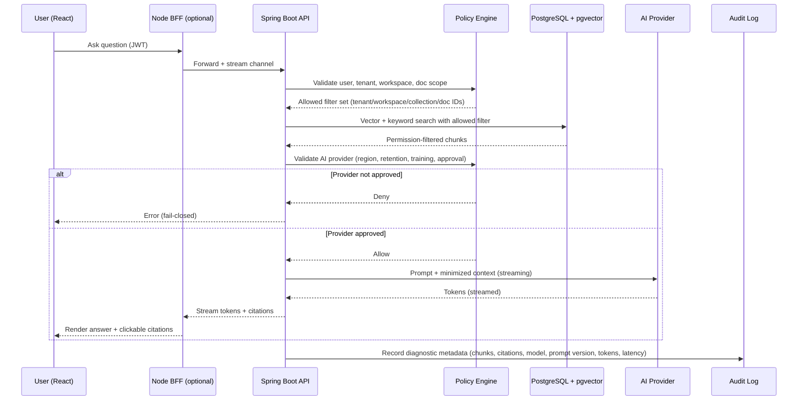

# Business Requirements Document — AI Knowledge Assistant for FinTech Engineering Teams

**Status:** Draft v1.0
**Date:** 2026-05-14

---

## 1. Product Vision

A multi-tenant, permission-aware **RAG (Retrieval-Augmented Generation)** platform that lets FinTech engineering, product, compliance, and support teams upload technical, compliance, and financial-domain documents, then ask questions over them with grounded, cited answers.

**Positioning.** Internal **decision-support and knowledge-retrieval tool**. Not an autonomous agent. Does **not** make financial, credit, AML/KYC, employment, or compliance decisions. All AI-generated answers are grounded in retrieved documents, include citations, and remain subject to human review.

**Architecture pillars (MVP)**

- Java 21 + Spring Boot backend: document management, search, chat orchestration, RBAC, evaluation APIs, enterprise reliability
- React + TypeScript frontend: upload, semantic search, chat with citations, admin/RBAC, observability dashboards
- Optional Node.js BFF / AI Gateway: streaming chat responses, frontend-shaped APIs, AI provider integration
- Python tooling: document preprocessing experiments, evaluation runner, golden-question quality checks
- **PostgreSQL 16 + pgvector + PostgreSQL full-text search** as the single primary store. The MVP shall use PostgreSQL with pgvector as both the relational store and vector index, and PostgreSQL FTS as the keyword index, to minimize infrastructure cost and operational complexity. Dedicated managed vector databases (e.g., Pinecone, Weaviate) and managed search services (e.g., OpenSearch, Elasticsearch) are **out of scope** for MVP.
- Object storage abstraction (MinIO local, S3 / Azure Blob cloud). Document-management SaaS or "intelligent document" services are out of scope for MVP.
- **MVP runtime: single VM, Azure Container Apps, AWS App Runner, App Service, or Docker Compose on a VM.** Kubernetes (AKS / EKS / GKE) is **out of scope for MVP** and reserved for production hardening or multi-tenant scale-out.

**MVP cost-control rule.** Kubernetes, dedicated managed vector databases, managed OpenSearch/Elasticsearch, enterprise SIEM, multi-region deployment, high-availability database replicas, hot-standby AI provider pools, and managed observability stacks (Prometheus + Grafana + Loki + OTel collector + APM) are out of scope for MVP unless explicitly approved by the product owner. The pilot must validate product value, RAG quality, RBAC, ingestion, evaluation, and admin workflows on the cheapest viable infrastructure footprint.

---

## 2. User Roles and Permissions

### 2.1 Roles

The system is used by engineering, product, compliance, and support teams inside a FinTech organization. The first version supports five roles, simplified to four for MVP.

| Role             | Purpose                                                                                                                |
| ---------------- | ---------------------------------------------------------------------------------------------------------------------- |
| Platform Admin   | Manages the whole platform, tenants/workspaces, global settings, integrations, and audit configuration.                |
| Workspace Admin  | Manages one workspace: users, roles, document collections, access rules, and evaluation sets.                          |
| Contributor      | Uploads and maintains documents, runs indexing, creates golden questions, and improves knowledge quality.              |
| User             | Searches documents and uses the AI chat assistant with access only to permitted content.                               |
| Viewer / Auditor | Read-only access to documents, answers, citations, and audit logs depending on permissions.                            |

**MVP simplification.** `ADMIN`, `CONTRIBUTOR`, `USER`, `VIEWER`. Post-MVP, `ADMIN` is split into `Platform Admin` and `Workspace Admin`.

### 2.2 Permission Model

Workspace-level RBAC **plus** document/collection-level access control. No field-level permissions in MVP.

Hierarchy:

```
Tenant
  -> Workspace
      -> Document Collection
          -> Document
              -> Chunk
```

Permissions apply at:

- **Workspace level** — controls whether a user can enter a workspace and what general role they have there.
  Examples: Alex is `CONTRIBUTOR` in *Payments Platform*; Maria is `VIEWER` in *Compliance Docs*.
- **Document / collection level** — controls whether a user can search or chat over specific documents.
  Example: a user can access public engineering docs and Payments API docs, but not AML investigation procedures, incident postmortems, or customer-sensitive reports.

**Critical RAG rule (hard requirement).** Retrieval must respect permissions **before** sending context to the LLM. Vector search filters by:

- `tenant_id`
- `workspace_id`
- `collection_id` / `document_id`
- access policy
- user role

Unauthorized chunks must never appear in search results or LLM context.

### 2.3 Tenancy

Multi-tenant with **logical isolation** (MVP). Not separate databases per tenant — logically isolated by `tenant_id` and `workspace_id`.

**MVP**

- Single database
- Shared schema
- Rows isolated by `tenant_id` + `workspace_id`

Examples:

```
tenant_id = "fintech-company-a"  workspace_id = "payments-platform"
tenant_id = "fintech-company-a"  workspace_id = "compliance"
tenant_id = "fintech-company-b"  workspace_id = "treasury-tools"
```

**Roadmap**

- Enterprise: separate schemas or separate databases per tenant
- High-compliance: physically isolated deployment per client

### 2.4 Authentication

Enterprise SSO first; local accounts only for development / demo mode.

- **Production:** OIDC / OAuth2 via Keycloak, Azure AD / Entra ID, or Okta
- **Local development:** Keycloak in Docker Compose with seeded demo users and roles

**MVP cloud deployment options for the IdP (cost-driven):**

- **Option A (default for cost-bound pilots):** run a single small Keycloak container on the same VM as the rest of the stack. No managed Keycloak service, no HA, no separate database.
- **Option B (preferred for tenants that already have Entra ID / Okta):** point the MVP at the tenant's managed external IdP and **do not host Keycloak in the cloud at all**.
- **Option C (cheapest for demo-only deployments):** keep Keycloak only in local Docker Compose; in the cloud MVP use a minimal dev-grade OIDC mock that issues compatible JWTs.

In all options the platform architecture remains OIDC-compatible; the choice is only about where the IdP runs and at what cost in MVP.

**Authentication flow**

```
React frontend
  -> redirects to Keycloak / Azure AD
  -> receives token
  -> sends JWT to backend
  -> Spring Security (OAuth2 Resource Server) validates token
  -> backend extracts user, roles, tenant, workspace permissions
```

- App does **not** store passwords. Only application user profiles linked to external IdP subjects (email, display name, IdP, status, last login).
- IdP claims may map to application roles, but **final authorization is enforced by the app** using workspace RBAC and document/collection ACLs.
- MFA, password policy, and primary user lifecycle are delegated to the enterprise IdP.

### 2.5 Audit and Compliance Visibility

Audit logs are **immutable from the application layer and append-only** (not full WORM in MVP).

**Audit events**

- User login (including failed attempts and MFA challenges)
- Document uploaded
- Document deleted
- Document access changed
- Document indexed / reindexed
- Chat question asked
- Documents / chunks retrieved for an answer
- Answer generated
- Citation clicked / viewed
- Evaluation test executed
- User role changed
- Workspace settings changed
- AI-provider call (with provider, region, model, prompt version, token usage, perimeter-crossing flag)
- Access denied attempt
- Data export
- Deletion request

**AI-specific rule.** The audit log stores **which documents/chunks were used** to generate an answer. Sensitive prompt/response payloads are **not** stored unless explicitly configured by workspace policy.

**Audit visibility**

| Role                        | Audit access                                                              |
| --------------------------- | ------------------------------------------------------------------------- |
| Platform Admin              | All audit logs across tenants/workspaces.                                 |
| Workspace Admin             | Audit logs for their workspace.                                           |
| Auditor / Compliance Viewer | Read-only access to audit logs (scoped by permissions).                   |
| Contributor                 | Indexing/evaluation-related logs.                                         |
| User                        | No global audit logs; may see their own activity history.                 |

**Retention.** See Section 4.5 (Data Lifecycle, Retention, and Deletion). Audit logs default to **1 year** for FinTech-grade traceability; operational logs to 30 days.

---

## 3. Core Features and Workflows

### 3.1 Document Ingestion

- **MVP formats:** PDF (text-based), Markdown, plain text (`.txt`)
- **MVP sources:** manual UI upload (drag-and-drop + REST API) and local folder/repo-style import
- **Pipeline properties:** asynchronous, observable, permission-aware
  - Upload acknowledges fast after validation and durable storage of the original file, metadata, and ingestion job record
  - Background workers run: parsing -> chunking -> embedding -> indexing
  - Per-document status: `uploaded -> parsing -> chunking -> embedding -> indexed | failed`
  - Retries up to 3x with clear failure reasons and manual retry by authorized users
  - **Versioning:** previous version remains active and searchable until the new version finishes indexing successfully
  - **Connector framework:** every future source produces normalized `DocumentSourceItem`s feeding the standard ingestion pipeline (extract -> chunk -> embed -> index -> audit -> eval-impact)

### 3.2 Search

- Semantic search over accessible documents
- Basic keyword query support (PostgreSQL full-text search)
- Filters: workspace, collection, document type, tags
- Permission-aware results (mandatory)
- Snippets show: document title, section/page, similarity score

### 3.3 Chat

- Scoped Q&A over workspace, collection, or single document
- RAG-grounded answers with **clickable inline citations** to source document and highlighted chunk
- **"I don't know"** behavior when retrieval context is insufficient (no hallucinated answers)
- **Short conversation memory within a session only** (no long-term personal memory)
- Per-answer feedback (thumbs up/down + comment) — feeds evaluation set
- Per-answer observability: latency, token usage, retrieved chunks

### 3.4 Out of Scope (MVP)

- Autonomous agents and multi-step tool execution
- Write actions to external systems
- Slack / Teams bot, voice interface
- Long-term personal memory
- Cross-tenant analytics
- Field-level redaction
- Fine-tuning
- Automated compliance decisions
- Scanned PDFs / OCR

### 3.5 Evaluation Framework

- **Golden Q&A sets:** each item defines the question, scope, expected answer, expected sources, required/forbidden keywords, expected behavior (including refusal)
- Evaluation runner uses the **same permission-aware RAG pipeline** as live chat
- Records: retrieved chunks, citations, answer text, latency, token usage, pass/fail per check
- Dashboard metrics: retrieval pass rate, citation match rate, answer correctness, insufficient-context refusal behavior, run-over-run regression
- Real user feedback can be promoted into new golden questions

**Principle.** Quality is judged across the whole chain — permissions -> retrieval -> citations -> answer -> refusal behavior -> feedback. Not just the final answer text.

### 3.6 Admin & Observability

**Admin UI**

- Workspace management
- User-role assignment
- Document collection management
- Ingestion job monitoring
- Reindex / retry actions
- Golden-question evaluation
- Audit log viewer

**Observability**

- Ingestion success/failure
- Search latency and no-result rate
- Chat latency
- Token usage
- Retrieved / cited chunks
- User feedback
- Evaluation pass rates
- Access-control events

**Inspectability principle.** Every chat answer stores enough diagnostic metadata to explain **which chunks were retrieved, which were cited, what prompt/model configuration was used, and whether the answer passed feedback or evaluation checks**. The system makes AI behavior inspectable, not opaque.

---

## 4. Business Rules and Constraints

### 4.1 Regulatory & Compliance Posture

**Designed to accommodate (not certify in MVP):**

- GDPR
- EU AI Act transparency / human oversight expectations
- DORA-style operational resilience
- Enterprise auditability
- NIS2-style security posture

**Out of scope for MVP**

- Full legal compliance certification
- Automated financial decisioning, credit scoring, AML/KYC decision automation
- PCI-DSS cardholder-data processing
- Formal ISO 27001 / SOC 2 certification

### 4.2 Data Residency (EU/EEA by Default)

- All customer-controlled data — uploaded documents, extracted text, chunks, embeddings, vector indexes, chat history, evaluation data, audit logs, backups — must remain in the configured EU/EEA region unless the tenant explicitly enables an approved cross-border processing mode.
- LLM and embedding providers are treated as **region-bound ICT dependencies**. Each provider configuration declares its processing region, validated against the tenant/workspace residency policy before any document content, retrieved context, or user question is sent.
- Strict-regulated workspaces support EU-only processing and can be extended to private/self-hosted providers.
- Prompt/response logging is disabled by default; operational logs are content-minimized; backups and logs follow the same residency policy as primary data.

**Out of scope for MVP**

- Formal legal transfer-impact assessment workflow
- Automated SCC / BCR contract management
- Customer-managed encryption keys
- Multi-region active-active deployment
- Full Schrems II legal assessment automation
- Automated DORA Register of Information generation

### 4.3 LLM / AI Provider Rules

LLM and embedding providers are **controlled external ICT dependencies**.

**Provider registry**

Each provider must declare: region, retention behavior, customer-data training policy, logging behavior, approval status, capabilities (chat / embedding / rerank), model/deployment names, streaming support, embedding dimensions, authentication method, and cross-border transfer flag.

**Workspace AI policy** controls which providers may receive document content, retrieved chunks, user questions, prompts, and embeddings.

**Pre-call validation.** Before any AI provider call, the backend validates:

- Provider approval status
- Region
- Data residency
- Retention behavior
- Workspace policy

**Fail-closed.** If provider is not approved, region-incompatible, or has unknown retention/training behavior for a sensitive workspace, the system fails closed and does not call the provider.

**Other rules**

- Only permission-filtered and minimized context is sent to providers.
- Prompt/response logging and provider-side training are disabled by default.
- Every AI call is audited with metadata: provider, region, model, prompt version, chunk IDs, token usage, perimeter-crossing flag.

### 4.4 Performance & Reliability Targets (MVP)

**Scale per tenant**

- 50 concurrent active users
- 10 concurrent chat requests
- 5 concurrent ingestion jobs
- 1,000 documents
- ~100,000 indexed chunks

**Latency (p95)**

- Search over already-indexed, permission-accessible documents: **< 1.5 s**
- RAG retrieval and prompt construction: **< 1.5 s**
- Full non-streaming chat answer: **< 8 s** (normal LLM provider conditions)
- Time-to-first-token (streaming): **< 2 s**
- Document upload acknowledgement (after validation and durable storage): **< 2 s**

**Ingestion throughput (p95)**

- TXT / MD up to 5 MB indexed within **2 minutes**
- Text-based PDF up to 25 MB indexed within **10 minutes**
- Scanned PDFs and OCR out of scope for MVP

**Availability**

- **99.5% monthly** for core application APIs (excluding planned maintenance and external AI-provider outages)

**Degraded mode**

- LLM provider outage: chat returns clear provider-unavailable response; document management, admin, audit review, and existing search remain available where possible.
- Embedding provider outage: ingestion jobs queued or retrying; already-indexed content remains searchable.

**Durability & correctness**

- No acknowledged upload may be lost.
- Transient ingestion failures retried up to 3 times with clear failure reasons; authorized users can manually retry.
- A document version becomes searchable only after successful full indexing. During reindexing, the previous active version remains searchable until the new version succeeds.
- Permission enforcement is mandatory and **fails closed**. Unauthorized chunks must never be returned or sent to an LLM provider.

**Backups.** Daily. RPO 24 h, RTO 4 h.

**MVP cost trade-off (explicit).** The 99.5% monthly availability target, the latency p95 ceilings (search 1.5 s, TTFT 2 s, full answer 8 s), and the RPO/RTO above are deliberately set so the pilot can run on the cheapest viable footprint (single VM / container-app / app-service, single AZ, no HA replicas, no hot-standby providers, lightweight observability). The platform shall not over-invest in higher availability, lower latency, deeper observability, or richer model tiers in MVP. Tightening any of these targets is a production-launch concern, not an MVP concern.

### 4.5 Data Lifecycle, Retention, and Deletion

**Scope.** Lifecycle rules apply to: original documents, extracted text, chunks, embeddings, vector indexes, chat interactions, citations, feedback, evaluation data, audit logs, operational logs, backups.

**Inheritance.** Derived AI artifacts (chunks, embeddings, prompts, retrieved context, evaluation results) follow the **same residency, access-control, retention, and deletion rules** as their source documents.

**Retention defaults**

| Data category                                          | Default retention                          |
| ------------------------------------------------------ | ------------------------------------------ |
| Uploaded documents                                     | While active or until deleted              |
| Superseded document versions                           | 30 days                                    |
| Extracted text, chunks, embeddings, index entries      | While source version active or within superseded window |
| Chat content (disabled by default)                     | 30 days if enabled (workspace-configurable) |
| Chat metadata and retrieval diagnostics                | 90 days                                    |
| Golden questions                                       | Until deleted                              |
| Evaluation run results                                 | 180 days                                   |
| Audit logs                                             | 1 year                                     |
| Operational logs                                       | 30 days (content-minimized)                |
| Backups                                                | 30 days rolling, same residency as primary |

**Audit logs cover (must be retained 1 year by default)**

Security-relevant events, role changes, document lifecycle events, access-denied events, AI-provider calls, provider-policy blocks, evaluation runs, data export events, deletion requests.

**Deletion semantics**

When a document is deleted:

1. Remove from search and chat immediately
2. Deactivate or delete related chunks and embeddings
3. Remove vector index entries
4. Delete extracted text
5. Schedule deletion of the original file
6. Minimal audit metadata may be retained for security and compliance traceability

Deleted content may remain in encrypted backups until backup expiry but **must not be restored into active search indexes without explicit authorization**.

**Hard requirement.** Deletion must propagate to the vector index.

**Stale evaluation cases.** If a source document used by a golden question is deleted or replaced, dependent evaluation cases must be marked stale until reviewed.

**Admin visibility.** Retention settings, deletion status, failed deletion jobs, stale evaluation cases, and data categories retained per workspace must be visible to authorized admins.

---

## 5. Integration Requirements

### 5.1 Identity & Directory

**MVP**

- Keycloak-compatible OIDC / OAuth2
- JWT validation in Spring Security OAuth2 Resource Server
- React login / logout
- Internal workspace RBAC
- Manual user-role assignment
- Basic token-claim role mapping

**Roadmap (in priority order)**

- Microsoft Entra ID
- Okta
- SCIM 2.0 user/group provisioning
- Group-to-role synchronization
- Automatic deprovisioning
- LDAP federation through Keycloak
- SAML via IdP bridge

### 5.2 Document Connectors

- **MVP:** manual UI upload + local folder/repo-style import (Markdown, text PDF, plain text)
- **Architecture:** connector framework producing normalized `DocumentSourceItem`s -> standard ingestion pipeline
- **Metadata preserved by every connector:** source URL, owner, last modified, version, content hash, source type, sync status
- **Include/exclude rules** and **permission mapping** (or app-side ACL) per connector

**Hard rule.** No connector may make content searchable or chatable unless the user has permission.

**Roadmap connectors (broad list)**

- Source code/docs: GitHub, GitLab, Bitbucket, GitBook, OpenAPI/AsyncAPI, Postman, ADR folders, architecture diagrams
- Enterprise repos: SharePoint, OneDrive, Google Drive, Confluence, Notion
- Issue trackers: Jira, Azure DevOps, GitHub Issues
- Comms: Slack, Microsoft Teams (read-only ingestion)
- Ops & support: ServiceNow, PagerDuty, Opsgenie, Zendesk, Salesforce Knowledge
- Data: data catalogs, curated DB schema documentation

### 5.3 AI / LLM & Embedding Providers

Pluggable provider abstraction for chat, embeddings, and (future) rerankers. Provider SDKs are isolated from RAG / ingestion / evaluation / observability / policy layers.

**Provider declares**

- Supported operations (chat / embedding / rerank)
- Model / deployment names
- Processing region
- Retention behavior
- Customer-data training policy
- Streaming support
- Embedding dimensions
- Authentication method
- Approval status
- Cross-border transfer flag

**Pre-call validation.** Workspace AI policy + residency policy + approved-provider registry. **Fail-closed** if not approved, region-incompatible, or retention/training behavior unknown for a sensitive workspace.

**MVP adapters**

- Azure OpenAI / Azure AI Foundry (preferred for EU residency)
- OpenAI-compatible API
- Local OpenAI-compatible provider (sovereignty-sensitive)

**Roadmap adapters (placeholders defined)**

- AWS Bedrock
- Google Vertex AI / Gemini
- Anthropic Claude direct API
- Cohere
- Mistral
- HuggingFace / self-hosted inference
- Enterprise private AI gateways

### 5.4 Storage & Messaging

**System of record.** PostgreSQL 16 stores: tenants, workspaces, users, roles, document metadata, document versions, chunk metadata, chat metadata, citations, evaluation sets/runs, provider configuration, workspace policies, ingestion jobs, audit events.

**Vector search.** pgvector with mandatory pre-filter on tenant / workspace / collection / document / version / permission **before** results are returned or used for LLM context construction.

**Keyword / hybrid search.** PostgreSQL full-text search baseline.

**Object storage abstraction.** MinIO or local filesystem in dev; S3-compatible or Azure Blob in cloud. DB stores file metadata, content hashes, and object references rather than large binary payloads.

**Async ingestion.** Durable database-backed job queue (`ingestion_jobs` table) processed by Spring Boot workers. The architecture remains event-oriented and migration-ready.

**Roadmap events**

`document.uploaded`, `text.extracted`, `chunks.created`, `embeddings.generated`, `document.indexed`, `ingestion.failed` — with retry and dead-letter handling.

**Optional infrastructure**

- Redis for short-lived caching, rate limiting, distributed coordination — **never required for core correctness**

**Local stack (Docker Compose)**

- PostgreSQL + pgvector
- Keycloak
- MinIO
- Spring Boot backend
- React frontend
- Optional Node.js BFF

**Cloud deployment target**

Managed PostgreSQL, managed object storage, managed queue/broker, managed identity, secret management, Kubernetes or container platform.

### 5.5 Observability, SIEM & Notifications

**MVP — lightweight, low-cost observability only:**

- Structured JSON application logs written to stdout, captured by the host runtime (Docker / Container App / App Service log stream). **Limited log retention** (default 7-14 days for operational logs in the cheapest pilot footprint; the 30-day operational target applies at production launch).
- Spring Boot Actuator health checks: backend, PostgreSQL, vector search, object storage, IdP, LLM provider, embedding provider, ingestion worker.
- **Basic operational metrics aggregated and stored in PostgreSQL** (counters and rolling aggregates for ingestion, search, chat, evaluation, provider calls, token usage, latency buckets, errors, access-control events). Metrics are exposed via Actuator and via the React admin observability dashboard. **No Prometheus, Grafana, Loki, ELK, or external time-series store in MVP.**
- Per-answer diagnostics: provider, model, prompt version, retrieval configuration, retrieved chunk IDs, cited chunk IDs, latency, token usage, status, failure reason.
- PostgreSQL `audit_events` table (append-only).
- React admin observability dashboard.
- In-app admin notifications + email (SMTP or mock mailer) for: failed ingestion, failed deletion, provider outage, provider-policy block, reindex failure, evaluation pass-rate regression.

**Roadmap (post-MVP, when business case justifies the spend):** OpenTelemetry tracing, Prometheus + Grafana, managed Grafana / Azure Monitor / Log Analytics, Loki / ELK / OpenSearch, enterprise SIEM (Microsoft Sentinel, Splunk, Datadog, Elastic Security, IBM QRadar), PagerDuty / Opsgenie / ServiceNow, generic webhooks, streaming audit-event export.

**Operational vs audit separation**

- Operational logs (30 days) must not contain full document text, full prompts, retrieved chunks, LLM responses, secrets, access tokens, or sensitive personal data unless explicitly enabled by workspace policy.
- Audit logs (1 year) record security / document-lifecycle / AI-provider / access-control / evaluation / export / deletion events.

(See **Roadmap** subsection above for the full list of post-MVP observability and SIEM integrations.)

---

## 6. Tech Stack Summary



---

## 7. RAG Request Flow (Permission-Aware)



---

## 8. Acceptance Criteria for the BRD Phase

1. Roles, permission granularity, tenancy, authentication, and audit scope are documented and agreed.
2. MVP feature scope is explicit, with out-of-scope items confirmed.
3. Performance, residency, and lifecycle constraints are quantified and testable.
4. Integration surface (identity, connectors, AI providers, storage, observability) is defined with a clear MVP-vs-roadmap split.
5. The connector framework, AI provider abstraction, and policy engine are recognized as **architectural primitives**, not optional features.
6. Permission-aware retrieval and fail-closed provider validation are recorded as **hard requirements**.
7. Audit logging, append-only constraints, and deletion propagation (including to the vector index) are recorded as **hard requirements**.

---

## 9. Suggested Next Steps (After BRD Sign-off)

- Produce a Product Requirements Document (PRD) per feature area: ingestion, search, chat, evaluation, admin, observability
- Produce a Solution Architecture Document with module boundaries, ERD, sequence diagrams, deployment topology
- Define API contracts (OpenAPI) and a domain model glossary
- Stand up the Docker Compose local stack as the first vertical slice
- Draft an evaluation strategy document with the initial golden Q&A taxonomy
