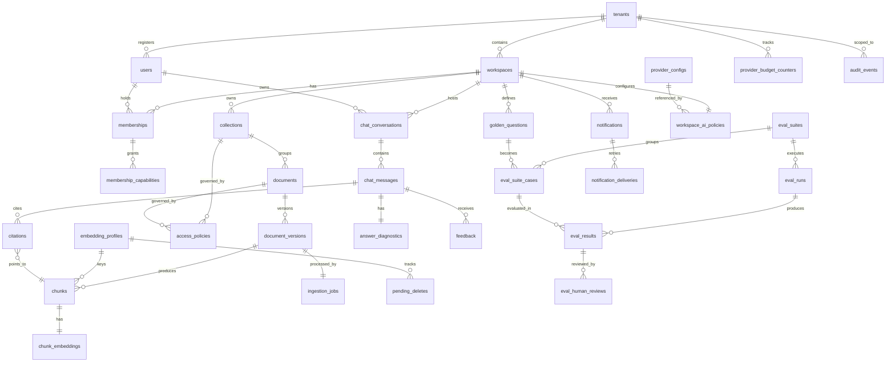

# Database Schema — AI Knowledge Assistant for FinTech Engineering Teams

**Status:** Draft v1.0
**Author:** Solution Architect
**Source inputs:** [BRD.md](BRD.md), [Solution_Architecture.md](Solution_Architecture.md), [Module_Boundaries.md](Module_Boundaries.md), [PRD 01-06](prd/)
**Date:** 2026-06-19

> **Scope.** PostgreSQL 16 + pgvector + FTS schema for the MVP. No code exists yet — this is a pre-build schema design. Single logical database, logical tenant isolation via row-level `tenant_id`. Schema-per-tenant and DB-per-tenant are roadmap (BRD §2.3).

---

## 1. ERD (Mermaid)



---

## 2. Table-by-Table Schema

### 2.1 Multi-Tenancy & RBAC

#### `tenants`

| Aspect | Detail |
|--------|--------|
| **Purpose** | Root organizational unit. All data scoped here. |
| **Owner module** | `admin` |
| **PK** | `id UUID DEFAULT gen_random_uuid()` |
| **FKs** | None |
| **Key columns** | `name TEXT NOT NULL`, `residency_region TEXT NOT NULL DEFAULT 'eu-west'`, `default_classification tenant_classification NOT NULL DEFAULT 'standard'`, `idp_issuer TEXT[]`, `status tenant_status NOT NULL DEFAULT 'active'`, `created_at TIMESTAMPTZ NOT NULL DEFAULT now()`, `updated_at TIMESTAMPTZ` |
| **Indexes** | `UNIQUE(name)` |
| **Tenant isolation** | Self-scoping root |
| **Retention** | Indefinite; archive sets `status='archived'` |
| **Audit** | `tenant.created`, `tenant.updated`, `tenant.archived` |
| **Immutable** | `id`, `created_at` |

```sql
CREATE TYPE tenant_status AS ENUM ('active', 'archived', 'suspended');
CREATE TYPE tenant_classification AS ENUM ('standard', 'restricted', 'strict');

CREATE TABLE tenants (
    id UUID PRIMARY KEY DEFAULT gen_random_uuid(),
    name TEXT NOT NULL UNIQUE,
    residency_region TEXT NOT NULL DEFAULT 'eu-west',
    default_classification tenant_classification NOT NULL DEFAULT 'standard',
    idp_issuer TEXT[],
    status tenant_status NOT NULL DEFAULT 'active',
    created_at TIMESTAMPTZ NOT NULL DEFAULT now(),
    updated_at TIMESTAMPTZ
);
```

---

#### `workspaces`

| Aspect | Detail |
|--------|--------|
| **Purpose** | Logical container for documents, collections, users. Second-level isolation. |
| **Owner module** | `admin` |
| **PK** | `id UUID` |
| **FKs** | `tenant_id → tenants(id)` |
| **Key columns** | `name`, `classification`, `cross_border_enabled`, `status` |
| **Indexes** | `(tenant_id, name) UNIQUE`, `(tenant_id, status)` |
| **Tenant isolation** | `WHERE tenant_id = :tid` on every query |
| **Retention** | Archive sets `status='archived'`; data follows retention rules |
| **Audit** | `workspace.created`, `workspace.updated`, `workspace.archived` |

```sql
CREATE TYPE workspace_status AS ENUM ('active', 'archived');

CREATE TABLE workspaces (
    id UUID PRIMARY KEY DEFAULT gen_random_uuid(),
    tenant_id UUID NOT NULL REFERENCES tenants(id),
    name TEXT NOT NULL,
    classification tenant_classification NOT NULL DEFAULT 'standard',
    cross_border_enabled BOOLEAN NOT NULL DEFAULT FALSE,
    status workspace_status NOT NULL DEFAULT 'active',
    created_at TIMESTAMPTZ NOT NULL DEFAULT now(),
    updated_at TIMESTAMPTZ,
    UNIQUE (tenant_id, name)
);

CREATE INDEX idx_workspaces_tenant_status ON workspaces(tenant_id, status);
```

---

#### `users`

| Aspect | Detail |
|--------|--------|
| **Purpose** | Application user profile linked to external IdP subject. No passwords stored. |
| **Owner module** | `admin` |
| **PK** | `id UUID` |
| **FKs** | `tenant_id → tenants(id)` |
| **Key columns** | `idp_subject`, `email`, `display_name`, `status`, `last_login_at` |
| **Indexes** | `(tenant_id, idp_subject) UNIQUE`, `(tenant_id, email) UNIQUE`, `(tenant_id, status)` |
| **Tenant isolation** | `WHERE tenant_id = :tid` |
| **Retention** | Disabled users retained for audit; hard-delete on explicit request + retention |
| **Audit** | `user.created`, `user.updated`, `user.disabled` |

```sql
CREATE TYPE user_status AS ENUM ('active', 'disabled', 'pending_invite');

CREATE TABLE users (
    id UUID PRIMARY KEY DEFAULT gen_random_uuid(),
    tenant_id UUID NOT NULL REFERENCES tenants(id),
    idp_subject TEXT NOT NULL,
    email TEXT NOT NULL,
    display_name TEXT,
    status user_status NOT NULL DEFAULT 'active',
    last_login_at TIMESTAMPTZ,
    created_at TIMESTAMPTZ NOT NULL DEFAULT now(),
    updated_at TIMESTAMPTZ,
    UNIQUE (tenant_id, idp_subject),
    UNIQUE (tenant_id, email)
);

CREATE INDEX idx_users_tenant_status ON users(tenant_id, status);
```

---

#### `memberships`

| Aspect | Detail |
|--------|--------|
| **Purpose** | User-workspace binding with exactly one role per workspace. |
| **Owner module** | `admin` |
| **PK** | `id UUID` |
| **FKs** | `user_id → users(id)`, `workspace_id → workspaces(id)` |
| **Key columns** | `role`, `status` |
| **Indexes** | `(user_id, workspace_id) UNIQUE`, `(workspace_id, role, status)` |
| **Tenant isolation** | Derived via `workspace_id → tenant_id` |
| **Retention** | Disabled memberships kept for audit; purge on user hard-delete |
| **Audit** | `membership.created`, `membership.role_changed`, `membership.disabled` |

```sql
CREATE TYPE workspace_role AS ENUM ('admin', 'contributor', 'user', 'viewer');
CREATE TYPE membership_status AS ENUM ('active', 'disabled');

CREATE TABLE memberships (
    id UUID PRIMARY KEY DEFAULT gen_random_uuid(),
    user_id UUID NOT NULL REFERENCES users(id),
    workspace_id UUID NOT NULL REFERENCES workspaces(id),
    role workspace_role NOT NULL,
    status membership_status NOT NULL DEFAULT 'active',
    created_at TIMESTAMPTZ NOT NULL DEFAULT now(),
    updated_at TIMESTAMPTZ,
    UNIQUE (user_id, workspace_id)
);

CREATE INDEX idx_memberships_workspace_role ON memberships(workspace_id, role, status);
```

---

#### `membership_capabilities`

| Aspect | Detail |
|--------|--------|
| **Purpose** | Additive capability flags on membership (e.g., `platform:admin`, `audit:read`). |
| **Owner module** | `admin` |
| **PK** | `(membership_id, capability)` composite |
| **FKs** | `membership_id → memberships(id)` |
| **Indexes** | PK covers lookups |
| **Tenant isolation** | Via membership |
| **Audit** | `capability.granted`, `capability.revoked` |

```sql
CREATE TABLE membership_capabilities (
    membership_id UUID NOT NULL REFERENCES memberships(id) ON DELETE CASCADE,
    capability TEXT NOT NULL,
    granted_at TIMESTAMPTZ NOT NULL DEFAULT now(),
    PRIMARY KEY (membership_id, capability)
);
```

---

#### `perm_cache_version`

| Aspect | Detail |
|--------|--------|
| **Purpose** | Single-row version counter for permission cache invalidation across API replicas. |
| **Owner module** | `policy` |
| **PK** | `id = 1` (singleton) |
| **Indexes** | None needed |
| **Mechanism** | Increment on any ACL/role/membership change; replicas compare on cache miss |

```sql
CREATE TABLE perm_cache_version (
    id INT PRIMARY KEY DEFAULT 1 CHECK (id = 1),
    version BIGINT NOT NULL DEFAULT 0,
    updated_at TIMESTAMPTZ NOT NULL DEFAULT now()
);

INSERT INTO perm_cache_version (id, version) VALUES (1, 0);
```

---

### 2.2 Documents & Collections

#### `collections`

| Aspect | Detail |
|--------|--------|
| **Purpose** | Logical grouping of documents within a workspace. ACL attachment point. |
| **Owner module** | `documents` (mgmt) |
| **PK** | `id UUID` |
| **FKs** | `workspace_id → workspaces(id)` |
| **Key columns** | `name`, `sensitive`, `status` |
| **Indexes** | `(workspace_id, name) UNIQUE`, `(workspace_id, status)` |
| **Tenant isolation** | Via `workspace_id` |
| **Audit** | `collection.created`, `collection.updated`, `collection.archived` |

```sql
CREATE TYPE collection_status AS ENUM ('active', 'archived');

CREATE TABLE collections (
    id UUID PRIMARY KEY DEFAULT gen_random_uuid(),
    workspace_id UUID NOT NULL REFERENCES workspaces(id),
    name TEXT NOT NULL,
    description TEXT,
    sensitive BOOLEAN NOT NULL DEFAULT FALSE,
    status collection_status NOT NULL DEFAULT 'active',
    created_at TIMESTAMPTZ NOT NULL DEFAULT now(),
    updated_at TIMESTAMPTZ,
    UNIQUE (workspace_id, name)
);

CREATE INDEX idx_collections_workspace_status ON collections(workspace_id, status);
```

---

#### `documents`

| Aspect | Detail |
|--------|--------|
| **Purpose** | Logical document entity. Versioned. Soft-delete with 7-day grace. |
| **Owner module** | `documents` (mgmt) |
| **PK** | `id UUID` |
| **FKs** | `collection_id → collections(id)`, `workspace_id → workspaces(id)` |
| **Key columns** | `name`, `mime_type`, `content_hash`, `active_version_id`, `deleted_at` |
| **Indexes** | `(workspace_id, collection_id, name)`, `(workspace_id, content_hash)`, `(deleted_at) WHERE deleted_at IS NOT NULL` (partial for hard-delete job) |
| **Tenant isolation** | Via `workspace_id` |
| **Retention** | Soft-delete 7 days → hard-delete |
| **Audit** | `document.uploaded`, `document.updated`, `document.deleted`, `document.restored`, `document.hard_deleted` |
| **Immutable** | `id`, `workspace_id`, `created_at` |

```sql
CREATE TABLE documents (
    id UUID PRIMARY KEY DEFAULT gen_random_uuid(),
    workspace_id UUID NOT NULL REFERENCES workspaces(id),
    collection_id UUID NOT NULL REFERENCES collections(id),
    name TEXT NOT NULL,
    mime_type TEXT NOT NULL,
    content_hash TEXT NOT NULL,
    size_bytes BIGINT NOT NULL,
    active_version_id UUID,  -- FK added after document_versions created
    deleted_at TIMESTAMPTZ,
    deleted_by UUID,
    created_at TIMESTAMPTZ NOT NULL DEFAULT now(),
    created_by UUID NOT NULL,
    updated_at TIMESTAMPTZ
);

CREATE INDEX idx_documents_workspace_collection ON documents(workspace_id, collection_id, name);
CREATE INDEX idx_documents_content_hash ON documents(workspace_id, content_hash);
CREATE INDEX idx_documents_deleted ON documents(deleted_at) WHERE deleted_at IS NOT NULL;
```

---

#### `document_versions`

| Aspect | Detail |
|--------|--------|
| **Purpose** | Immutable snapshot of a document at a point in time. Cutover semantics. |
| **Owner module** | `documents` (mgmt) |
| **PK** | `id UUID` |
| **FKs** | `document_id → documents(id)` |
| **Key columns** | `version_no`, `object_storage_key`, `extracted_text_key`, `status` |
| **Indexes** | `(document_id, version_no) UNIQUE`, `(document_id, status)` |
| **Tenant isolation** | Via `document_id → workspace_id` |
| **Retention** | Superseded versions: 30 days |
| **Audit** | `version.created`, `version.activated`, `version.superseded` |
| **Immutable** | Entire row after creation (except `status`) |

```sql
CREATE TYPE version_status AS ENUM ('pending_av', 'av_blocked', 'queued', 'parsing', 'chunking', 'embedding', 'indexed', 'active', 'superseded', 'failed');

CREATE TABLE document_versions (
    id UUID PRIMARY KEY DEFAULT gen_random_uuid(),
    document_id UUID NOT NULL REFERENCES documents(id),
    version_no INT NOT NULL,
    object_storage_key TEXT NOT NULL,
    extracted_text_key TEXT,
    content_hash TEXT NOT NULL,
    size_bytes BIGINT NOT NULL,
    status version_status NOT NULL DEFAULT 'pending_av',
    chunk_count INT,
    created_at TIMESTAMPTZ NOT NULL DEFAULT now(),
    created_by UUID NOT NULL,
    activated_at TIMESTAMPTZ,
    superseded_at TIMESTAMPTZ,
    UNIQUE (document_id, version_no)
);

CREATE INDEX idx_versions_document_status ON document_versions(document_id, status);

-- Add FK from documents.active_version_id
ALTER TABLE documents ADD CONSTRAINT fk_active_version 
    FOREIGN KEY (active_version_id) REFERENCES document_versions(id);
```

---

### 2.3 Embeddings & Vector Index

#### `embedding_profiles`

| Aspect | Detail |
|--------|--------|
| **Purpose** | Keys index families. Enables zero-downtime embedding model migration. |
| **Owner module** | `admin` (registry), `documents` (writes), `search` (reads) |
| **PK** | `id UUID` |
| **FKs** | `tenant_id → tenants(id)` |
| **Key columns** | `provider`, `model`, `dimensions`, `status` |
| **Indexes** | `(tenant_id, status)` |
| **Tenant isolation** | `WHERE tenant_id = :tid` |
| **Audit** | `embedding_profile.created`, `embedding_profile.activated`, `embedding_profile.deprecated` |

```sql
CREATE TYPE profile_status AS ENUM ('building', 'active', 'deprecated');

CREATE TABLE embedding_profiles (
    id UUID PRIMARY KEY DEFAULT gen_random_uuid(),
    tenant_id UUID NOT NULL REFERENCES tenants(id),
    provider TEXT NOT NULL,
    model TEXT NOT NULL,
    dimensions INT NOT NULL,
    status profile_status NOT NULL DEFAULT 'building',
    created_at TIMESTAMPTZ NOT NULL DEFAULT now(),
    activated_at TIMESTAMPTZ,
    deprecated_at TIMESTAMPTZ
);

CREATE INDEX idx_profiles_tenant_status ON embedding_profiles(tenant_id, status);
```

---

#### `chunks`

| Aspect | Detail |
|--------|--------|
| **Purpose** | Semantic unit for retrieval. Inherits document ACL. |
| **Owner module** | `documents` (pipeline writes), `search` (reads) |
| **PK** | `id UUID` |
| **FKs** | `document_version_id → document_versions(id)`, `embedding_profile_id → embedding_profiles(id)` |
| **Key columns** | `content`, `token_count`, `chunk_index`, `metadata` (section, page, headings) |
| **Indexes** | `(document_version_id, chunk_index)`, GIN on `content_tsv` for FTS |
| **Tenant isolation** | Via version → document → workspace → tenant |
| **Retention** | Deleted with parent version |
| **Immutable** | All columns (chunks are never updated, only deleted) |

```sql
CREATE TABLE chunks (
    id UUID PRIMARY KEY DEFAULT gen_random_uuid(),
    document_version_id UUID NOT NULL REFERENCES document_versions(id) ON DELETE CASCADE,
    embedding_profile_id UUID NOT NULL REFERENCES embedding_profiles(id),
    chunk_index INT NOT NULL,
    content TEXT NOT NULL,
    content_tsv TSVECTOR GENERATED ALWAYS AS (to_tsvector('english', content)) STORED,
    token_count INT NOT NULL,
    start_char INT NOT NULL,
    end_char INT NOT NULL,
    metadata JSONB,  -- section, page, headings, etc.
    created_at TIMESTAMPTZ NOT NULL DEFAULT now()
);

CREATE INDEX idx_chunks_version ON chunks(document_version_id, chunk_index);
CREATE INDEX idx_chunks_profile ON chunks(embedding_profile_id);
CREATE INDEX idx_chunks_fts ON chunks USING GIN(content_tsv);
```

---

#### `chunk_embeddings`

| Aspect | Detail |
|--------|--------|
| **Purpose** | Vector representation for semantic search. HNSW indexed. |
| **Owner module** | `search` |
| **PK** | `chunk_id` (1:1 with chunks) |
| **FKs** | `chunk_id → chunks(id)` |
| **Key columns** | `embedding vector(1536)` (dimension configurable per profile) |
| **Indexes** | HNSW on `embedding` with pre-filter support |
| **Tenant isolation** | Via chunk |
| **Immutable** | All columns |

```sql
CREATE TABLE chunk_embeddings (
    chunk_id UUID PRIMARY KEY REFERENCES chunks(id) ON DELETE CASCADE,
    embedding vector(1536) NOT NULL,  -- dimension matches profile; 1536 = OpenAI ada-002
    created_at TIMESTAMPTZ NOT NULL DEFAULT now()
);

-- HNSW index with configurable parameters (SAD §9.1)
CREATE INDEX idx_embeddings_hnsw ON chunk_embeddings 
    USING hnsw (embedding vector_cosine_ops)
    WITH (m = 16, ef_construction = 128);
```

---

#### `pending_deletes`

| Aspect | Detail |
|--------|--------|
| **Purpose** | Track deletes during reindex so building profiles can consume them before cutover. |
| **Owner module** | `documents` (mgmt writes), `documents` (pipeline reads) |
| **PK** | `id UUID` |
| **FKs** | `embedding_profile_id → embedding_profiles(id)` |
| **Key columns** | `document_id`, `processed` |
| **Indexes** | `(embedding_profile_id, processed)` |
| **Mechanism** | Builder drains unprocessed rows before cutover |

```sql
CREATE TABLE pending_deletes (
    id UUID PRIMARY KEY DEFAULT gen_random_uuid(),
    embedding_profile_id UUID NOT NULL REFERENCES embedding_profiles(id),
    document_id UUID NOT NULL,
    created_at TIMESTAMPTZ NOT NULL DEFAULT now(),
    processed BOOLEAN NOT NULL DEFAULT FALSE,
    processed_at TIMESTAMPTZ
);

CREATE INDEX idx_pending_deletes_unprocessed ON pending_deletes(embedding_profile_id, processed) 
    WHERE processed = FALSE;
```

---

### 2.4 Access Control

#### `access_policies`

| Aspect | Detail |
|--------|--------|
| **Purpose** | ACL bindings: workspace-role-default, explicit user grant, IdP group grant. |
| **Owner module** | `admin` (writes), `policy` (reads for resolution) |
| **PK** | `id UUID` |
| **FKs** | `workspace_id`, optional `collection_id`, `document_id`, `user_id` |
| **Key columns** | `scope_type`, `scope_id`, `subject_type`, `subject_id`, `action` |
| **Indexes** | Composite for resolution queries |
| **Resolution** | Most-specific wins; explicit deny beats explicit allow |
| **Audit** | `access_policy.created`, `access_policy.updated`, `access_policy.deleted` |

```sql
CREATE TYPE scope_type AS ENUM ('workspace', 'collection', 'document');
CREATE TYPE subject_type AS ENUM ('role', 'user', 'group');
CREATE TYPE access_action AS ENUM ('allow', 'deny');

CREATE TABLE access_policies (
    id UUID PRIMARY KEY DEFAULT gen_random_uuid(),
    workspace_id UUID NOT NULL REFERENCES workspaces(id),
    scope_type scope_type NOT NULL,
    scope_id UUID NOT NULL,  -- workspace_id, collection_id, or document_id
    subject_type subject_type NOT NULL,
    subject_id TEXT NOT NULL,  -- role name, user_id, or group name
    action access_action NOT NULL,
    created_at TIMESTAMPTZ NOT NULL DEFAULT now(),
    created_by UUID NOT NULL,
    updated_at TIMESTAMPTZ
);

-- Resolution query: find all policies for a user in a workspace
CREATE INDEX idx_policies_resolution ON access_policies(workspace_id, scope_type, subject_type, subject_id);
CREATE INDEX idx_policies_scope ON access_policies(scope_type, scope_id);
```

---

### 2.5 Ingestion

#### `ingestion_jobs`

| Aspect | Detail |
|--------|--------|
| **Purpose** | Durable job queue for async ingestion pipeline. |
| **Owner module** | `documents` (mgmt creates), `worker.runtime` (dequeues) |
| **PK** | `id UUID` |
| **FKs** | `document_version_id → document_versions(id)` |
| **Key columns** | `status`, `current_stage`, `retry_count`, `dead_letter`, `worker_id` |
| **Indexes** | `(status, tenant_id)` for fair dequeue, `(dead_letter)` partial |
| **Tenant isolation** | Via version → document → workspace → tenant; explicit `tenant_id` for fairness |
| **Retention** | Completed jobs: 30 days |
| **Idempotency** | `last_completed_step` checkpoint for resume-on-retry |

```sql
CREATE TYPE job_status AS ENUM ('pending_av', 'av_blocked', 'queued', 'processing', 'completed', 'failed');
CREATE TYPE pipeline_stage AS ENUM ('av_scan', 'parse', 'chunk', 'embed', 'index', 'cutover');

CREATE TABLE ingestion_jobs (
    id UUID PRIMARY KEY DEFAULT gen_random_uuid(),
    tenant_id UUID NOT NULL,  -- denormalized for fair dequeue
    workspace_id UUID NOT NULL,
    document_version_id UUID NOT NULL REFERENCES document_versions(id),
    status job_status NOT NULL DEFAULT 'pending_av',
    current_stage pipeline_stage,
    last_completed_step pipeline_stage,
    retry_count INT NOT NULL DEFAULT 0,
    max_retries INT NOT NULL DEFAULT 3,
    dead_letter BOOLEAN NOT NULL DEFAULT FALSE,
    dead_letter_reason TEXT,
    worker_id TEXT,
    started_at TIMESTAMPTZ,
    completed_at TIMESTAMPTZ,
    error_message TEXT,
    created_at TIMESTAMPTZ NOT NULL DEFAULT now(),
    updated_at TIMESTAMPTZ
);

-- Fair dequeue: FOR UPDATE SKIP LOCKED with tenant round-robin
CREATE INDEX idx_jobs_dequeue ON ingestion_jobs(status, tenant_id, created_at) 
    WHERE status IN ('pending_av', 'queued');
CREATE INDEX idx_jobs_dead_letter ON ingestion_jobs(dead_letter, tenant_id) 
    WHERE dead_letter = TRUE;
CREATE INDEX idx_jobs_tenant ON ingestion_jobs(tenant_id, status);
```

---

### 2.6 Chat

#### `chat_conversations`

| Aspect | Detail |
|--------|--------|
| **Purpose** | Conversation container per (user, workspace). 30-min inactivity auto-creates new. |
| **Owner module** | `chat` |
| **PK** | `id UUID` |
| **FKs** | `user_id → users(id)`, `workspace_id → workspaces(id)` |
| **Key columns** | `last_active_at`, `last_scope`, `status` |
| **Indexes** | `(user_id, workspace_id, status)` |
| **Tenant isolation** | Via `workspace_id` |
| **Retention** | Configurable; default metadata-only (content not stored) |

```sql
CREATE TYPE conversation_status AS ENUM ('active', 'archived');

CREATE TABLE chat_conversations (
    id UUID PRIMARY KEY DEFAULT gen_random_uuid(),
    user_id UUID NOT NULL REFERENCES users(id),
    workspace_id UUID NOT NULL REFERENCES workspaces(id),
    last_active_at TIMESTAMPTZ NOT NULL DEFAULT now(),
    last_scope JSONB,  -- {type: 'workspace'|'collections'|'document', ids: [...]}
    status conversation_status NOT NULL DEFAULT 'active',
    created_at TIMESTAMPTZ NOT NULL DEFAULT now()
);

CREATE INDEX idx_conversations_user_ws ON chat_conversations(user_id, workspace_id, status);
CREATE INDEX idx_conversations_active ON chat_conversations(last_active_at);
```

---

#### `chat_messages`

| Aspect | Detail |
|--------|--------|
| **Purpose** | Question or answer in a conversation. Content optionally stored per workspace policy. |
| **Owner module** | `chat` |
| **PK** | `id UUID` |
| **FKs** | `conversation_id → chat_conversations(id)` |
| **Key columns** | `role`, `content` (nullable if retention disabled), `refusal`, `diagnostics_id` |
| **Indexes** | `(conversation_id, created_at)` |
| **Retention** | Content: workspace policy (default disabled); metadata: 90 days |

```sql
CREATE TYPE message_role AS ENUM ('user', 'assistant');

CREATE TABLE chat_messages (
    id UUID PRIMARY KEY DEFAULT gen_random_uuid(),
    conversation_id UUID NOT NULL REFERENCES chat_conversations(id),
    role message_role NOT NULL,
    content TEXT,  -- NULL if content retention disabled
    content_stored BOOLEAN NOT NULL DEFAULT FALSE,
    refusal BOOLEAN NOT NULL DEFAULT FALSE,
    scope JSONB,
    diagnostics_id UUID,  -- FK to answer_diagnostics
    created_at TIMESTAMPTZ NOT NULL DEFAULT now()
);

CREATE INDEX idx_messages_conversation ON chat_messages(conversation_id, created_at);
```

---

#### `answer_diagnostics`

| Aspect | Detail |
|--------|--------|
| **Purpose** | Full RAG pipeline diagnostics for every answer. Inspectability requirement. |
| **Owner module** | `rag` (private entity; projections exposed) |
| **PK** | `id UUID` |
| **FKs** | `message_id → chat_messages(id)` (nullable for eval-only diagnostics) |
| **Key columns** | `provider`, `model`, `prompt_version`, `retrieved_chunk_ids`, `cited_chunk_ids`, `latency_ms`, `token_usage` |
| **Indexes** | `(message_id)`, `(created_at)` for retention purge |
| **Retention** | 90 days |
| **Immutable** | All columns |

```sql
CREATE TABLE answer_diagnostics (
    id UUID PRIMARY KEY DEFAULT gen_random_uuid(),
    message_id UUID REFERENCES chat_messages(id),
    eval_result_id UUID,  -- FK to eval_results for eval-generated answers
    tenant_id UUID NOT NULL,
    workspace_id UUID NOT NULL,
    user_id UUID,
    provider TEXT NOT NULL,
    region TEXT NOT NULL,
    model TEXT NOT NULL,
    prompt_version TEXT NOT NULL,
    scope JSONB NOT NULL,
    allowed_filter_snapshot JSONB NOT NULL,  -- AllowedFilterSet at query time
    retrieved_chunk_ids UUID[] NOT NULL,
    cited_chunk_ids UUID[],
    refusal BOOLEAN NOT NULL DEFAULT FALSE,
    refusal_reason TEXT,
    prompt_tokens INT NOT NULL,
    completion_tokens INT NOT NULL,
    total_tokens INT NOT NULL,
    retrieval_latency_ms INT NOT NULL,
    generation_latency_ms INT NOT NULL,
    total_latency_ms INT NOT NULL,
    ttft_ms INT,
    error_code TEXT,
    error_message TEXT,
    created_at TIMESTAMPTZ NOT NULL DEFAULT now()
);

CREATE INDEX idx_diagnostics_message ON answer_diagnostics(message_id);
CREATE INDEX idx_diagnostics_retention ON answer_diagnostics(created_at);
CREATE INDEX idx_diagnostics_tenant ON answer_diagnostics(tenant_id, created_at);
```

---

#### `citations`

| Aspect | Detail |
|--------|--------|
| **Purpose** | Link answer to source chunk with position info. |
| **Owner module** | `chat` |
| **PK** | `id UUID` |
| **FKs** | `message_id → chat_messages(id)`, `chunk_id → chunks(id)` |
| **Key columns** | `citation_index`, `document_id`, `version_id`, `highlight_start`, `highlight_end` |
| **Indexes** | `(message_id, citation_index)` |
| **Audit** | `citation.clicked` on user click |

```sql
CREATE TABLE citations (
    id UUID PRIMARY KEY DEFAULT gen_random_uuid(),
    message_id UUID NOT NULL REFERENCES chat_messages(id),
    chunk_id UUID NOT NULL REFERENCES chunks(id),
    citation_index INT NOT NULL,
    document_id UUID NOT NULL,
    document_version_id UUID NOT NULL,
    document_name TEXT NOT NULL,
    section_path TEXT,
    page_number INT,
    highlight_start INT,
    highlight_end INT,
    created_at TIMESTAMPTZ NOT NULL DEFAULT now()
);

CREATE INDEX idx_citations_message ON citations(message_id, citation_index);
```

---

#### `feedback`

| Aspect | Detail |
|--------|--------|
| **Purpose** | User feedback on answers. Feeds evaluation promotion queue. |
| **Owner module** | `chat` |
| **PK** | `id UUID` |
| **FKs** | `message_id → chat_messages(id)`, `user_id → users(id)` |
| **Key columns** | `rating`, `comment`, `editable_until`, `promoted_to_golden_id` |
| **Indexes** | `(message_id, user_id) UNIQUE` |
| **Retention** | 90 days or until promoted |

```sql
CREATE TYPE feedback_rating AS ENUM ('positive', 'negative');

CREATE TABLE feedback (
    id UUID PRIMARY KEY DEFAULT gen_random_uuid(),
    message_id UUID NOT NULL REFERENCES chat_messages(id),
    user_id UUID NOT NULL REFERENCES users(id),
    rating feedback_rating NOT NULL,
    comment TEXT,
    editable_until TIMESTAMPTZ NOT NULL,
    locked BOOLEAN NOT NULL DEFAULT FALSE,
    promoted_to_golden_id UUID,
    created_at TIMESTAMPTZ NOT NULL DEFAULT now(),
    updated_at TIMESTAMPTZ,
    UNIQUE (message_id, user_id)
);

CREATE INDEX idx_feedback_promotion ON feedback(promoted_to_golden_id) WHERE promoted_to_golden_id IS NULL;
```

---

### 2.7 Evaluation

#### `golden_questions`

| Aspect | Detail |
|--------|--------|
| **Purpose** | Ground truth for evaluation. Expected answer, sources, behavior. |
| **Owner module** | `evaluation` |
| **PK** | `id UUID` |
| **FKs** | `workspace_id → workspaces(id)`, `created_by → users(id)` |
| **Key columns** | `question`, `scope`, `expected_answer`, `expected_sources`, `expected_behavior`, `status` |
| **Indexes** | `(workspace_id, status)`, `(status)` for stale monitoring |
| **Retention** | Until deleted; auto-stale on source deletion |

```sql
CREATE TYPE golden_status AS ENUM ('active', 'stale', 'disabled');
CREATE TYPE expected_behavior AS ENUM ('answer', 'refuse');

CREATE TABLE golden_questions (
    id UUID PRIMARY KEY DEFAULT gen_random_uuid(),
    workspace_id UUID NOT NULL REFERENCES workspaces(id),
    question TEXT NOT NULL,
    scope JSONB NOT NULL,
    expected_answer TEXT,
    expected_sources JSONB,  -- [{documentId, chunkId?, required: bool}]
    required_keywords TEXT[],
    forbidden_keywords TEXT[],
    expected_behavior expected_behavior NOT NULL DEFAULT 'answer',
    tags TEXT[],
    status golden_status NOT NULL DEFAULT 'active',
    stale_reason TEXT,
    created_by UUID NOT NULL REFERENCES users(id),
    created_at TIMESTAMPTZ NOT NULL DEFAULT now(),
    updated_at TIMESTAMPTZ
);

CREATE INDEX idx_golden_workspace_status ON golden_questions(workspace_id, status);
CREATE INDEX idx_golden_stale ON golden_questions(status) WHERE status = 'stale';
```

---

#### `eval_suites`

| Aspect | Detail |
|--------|--------|
| **Purpose** | Named grouping of evaluation cases. |
| **Owner module** | `evaluation` |
| **PK** | `id UUID` |
| **FKs** | `workspace_id → workspaces(id)` |
| **Key columns** | `name`, `status` |

```sql
CREATE TYPE suite_status AS ENUM ('active', 'archived');

CREATE TABLE eval_suites (
    id UUID PRIMARY KEY DEFAULT gen_random_uuid(),
    workspace_id UUID NOT NULL REFERENCES workspaces(id),
    name TEXT NOT NULL,
    description TEXT,
    status suite_status NOT NULL DEFAULT 'active',
    created_by UUID NOT NULL,
    created_at TIMESTAMPTZ NOT NULL DEFAULT now(),
    updated_at TIMESTAMPTZ,
    UNIQUE (workspace_id, name)
);
```

---

#### `eval_suite_cases`

| Aspect | Detail |
|--------|--------|
| **Purpose** | M:N link between suites and golden questions. |
| **Owner module** | `evaluation` |
| **PK** | `(suite_id, golden_question_id)` |

```sql
CREATE TABLE eval_suite_cases (
    suite_id UUID NOT NULL REFERENCES eval_suites(id) ON DELETE CASCADE,
    golden_question_id UUID NOT NULL REFERENCES golden_questions(id),
    added_at TIMESTAMPTZ NOT NULL DEFAULT now(),
    PRIMARY KEY (suite_id, golden_question_id)
);
```

---

#### `eval_runs`

| Aspect | Detail |
|--------|--------|
| **Purpose** | Execution of a suite. Aggregates results. |
| **Owner module** | `evaluation` |
| **PK** | `id UUID` |
| **FKs** | `suite_id → eval_suites(id)` |
| **Key columns** | `status`, `pass_count`, `fail_count`, `skip_count`, `regression_detected` |
| **Retention** | 180 days |

```sql
CREATE TYPE run_status AS ENUM ('pending', 'running', 'completed', 'incomplete', 'failed');

CREATE TABLE eval_runs (
    id UUID PRIMARY KEY DEFAULT gen_random_uuid(),
    suite_id UUID NOT NULL REFERENCES eval_suites(id),
    tenant_id UUID NOT NULL,  -- denormalized for worker fairness
    status run_status NOT NULL DEFAULT 'pending',
    total_cases INT NOT NULL DEFAULT 0,
    pass_count INT NOT NULL DEFAULT 0,
    fail_count INT NOT NULL DEFAULT 0,
    partial_count INT NOT NULL DEFAULT 0,
    skip_count INT NOT NULL DEFAULT 0,
    pass_rate NUMERIC(5,2),
    retrieval_pass_rate NUMERIC(5,2),
    regression_detected BOOLEAN NOT NULL DEFAULT FALSE,
    regression_delta NUMERIC(5,2),
    started_at TIMESTAMPTZ,
    completed_at TIMESTAMPTZ,
    started_by UUID NOT NULL,
    created_at TIMESTAMPTZ NOT NULL DEFAULT now()
);

CREATE INDEX idx_runs_suite ON eval_runs(suite_id, created_at DESC);
CREATE INDEX idx_runs_status ON eval_runs(status) WHERE status IN ('pending', 'running');
CREATE INDEX idx_runs_retention ON eval_runs(created_at);
```

---

#### `eval_results`

| Aspect | Detail |
|--------|--------|
| **Purpose** | Per-case result within a run. Full diagnostics. |
| **Owner module** | `evaluation` |
| **PK** | `id UUID` |
| **FKs** | `run_id → eval_runs(id)`, `golden_question_id → golden_questions(id)`, `diagnostics_id → answer_diagnostics(id)` |
| **Key columns** | `verdict`, `deterministic_checks`, `llm_judge_verdict`, `rationale` |
| **Retention** | 180 days |

```sql
CREATE TYPE eval_verdict AS ENUM ('pass', 'fail', 'partial', 'skipped');

CREATE TABLE eval_results (
    id UUID PRIMARY KEY DEFAULT gen_random_uuid(),
    run_id UUID NOT NULL REFERENCES eval_runs(id),
    golden_question_id UUID NOT NULL REFERENCES golden_questions(id),
    diagnostics_id UUID REFERENCES answer_diagnostics(id),
    actual_answer TEXT,
    verdict eval_verdict NOT NULL,
    deterministic_checks JSONB,  -- {keywords_pass, forbidden_pass, citations_pass, refusal_pass}
    llm_judge_verdict eval_verdict,
    llm_judge_rationale TEXT,
    llm_judge_model TEXT,
    llm_judge_prompt_version TEXT,
    skip_reason TEXT,
    latency_ms INT,
    created_at TIMESTAMPTZ NOT NULL DEFAULT now()
);

CREATE INDEX idx_results_run ON eval_results(run_id);
CREATE INDEX idx_results_verdict ON eval_results(run_id, verdict);
```

---

#### `eval_human_reviews`

| Aspect | Detail |
|--------|--------|
| **Purpose** | Human override of LLM-as-judge verdict. |
| **Owner module** | `evaluation` |
| **PK** | `id UUID` |
| **FKs** | `result_id → eval_results(id)`, `reviewer_id → users(id)` |

```sql
CREATE TABLE eval_human_reviews (
    id UUID PRIMARY KEY DEFAULT gen_random_uuid(),
    result_id UUID NOT NULL REFERENCES eval_results(id),
    reviewer_id UUID NOT NULL REFERENCES users(id),
    original_verdict eval_verdict NOT NULL,
    override_verdict eval_verdict NOT NULL,
    comment TEXT,
    created_at TIMESTAMPTZ NOT NULL DEFAULT now()
);

CREATE INDEX idx_human_reviews_result ON eval_human_reviews(result_id);
```

---

### 2.8 Policy & Providers

#### `provider_configs`

| Aspect | Detail |
|--------|--------|
| **Purpose** | Registry of approved AI providers with capabilities and policy declarations. |
| **Owner module** | `admin` (Platform Admin manages) |
| **PK** | `id UUID` |
| **Key columns** | `name`, `provider_type`, `region`, `retention_behavior`, `training_policy`, `approval_status` |
| **Indexes** | `(approval_status)` |
| **Audit** | `provider.created`, `provider.approved`, `provider.revoked` |

```sql
CREATE TYPE provider_type AS ENUM ('chat', 'embedding', 'rerank');
CREATE TYPE retention_behavior AS ENUM ('none', 'transient', 'persistent');
CREATE TYPE training_policy AS ENUM ('disallowed', 'allowed');
CREATE TYPE approval_status AS ENUM ('pending', 'approved', 'revoked');

CREATE TABLE provider_configs (
    id UUID PRIMARY KEY DEFAULT gen_random_uuid(),
    name TEXT NOT NULL UNIQUE,
    provider_type provider_type[] NOT NULL,
    model_names TEXT[] NOT NULL,
    region TEXT NOT NULL,
    retention_behavior retention_behavior NOT NULL,
    training_policy training_policy NOT NULL,
    streaming_support BOOLEAN NOT NULL DEFAULT TRUE,
    embedding_dimensions INT,
    auth_method TEXT NOT NULL,  -- 'managed_identity', 'api_key'
    api_endpoint TEXT,
    cross_border_flag BOOLEAN NOT NULL DEFAULT FALSE,
    approval_status approval_status NOT NULL DEFAULT 'pending',
    approved_by UUID,
    approved_at TIMESTAMPTZ,
    created_at TIMESTAMPTZ NOT NULL DEFAULT now(),
    updated_at TIMESTAMPTZ
);

CREATE INDEX idx_providers_status ON provider_configs(approval_status);
```

---

#### `workspace_ai_policies`

| Aspect | Detail |
|--------|--------|
| **Purpose** | Per-workspace AI policy: which providers, retention settings, logging. |
| **Owner module** | `admin` |
| **PK** | `workspace_id` (1:1 with workspace) |
| **FKs** | `workspace_id → workspaces(id)`, `chat_provider_id → provider_configs(id)`, `embedding_provider_id → provider_configs(id)` |

```sql
CREATE TABLE workspace_ai_policies (
    workspace_id UUID PRIMARY KEY REFERENCES workspaces(id),
    chat_provider_id UUID NOT NULL REFERENCES provider_configs(id),
    chat_failover_provider_id UUID REFERENCES provider_configs(id),
    embedding_provider_id UUID NOT NULL REFERENCES provider_configs(id),
    allowed_regions TEXT[] NOT NULL DEFAULT ARRAY['eu-west'],
    prompt_response_logging BOOLEAN NOT NULL DEFAULT FALSE,
    chat_content_retention BOOLEAN NOT NULL DEFAULT FALSE,
    chat_content_retention_days INT DEFAULT 30,
    cross_border_approved BOOLEAN NOT NULL DEFAULT FALSE,
    cross_border_approved_by UUID,
    cross_border_approved_at TIMESTAMPTZ,
    updated_at TIMESTAMPTZ NOT NULL DEFAULT now(),
    updated_by UUID NOT NULL
);
```

---

#### `provider_budget_counters`

| Aspect | Detail |
|--------|--------|
| **Purpose** | Per-tenant token budget tracking. Fail-closed on cap. |
| **Owner module** | `policy` |
| **PK** | `(tenant_id, period_start)` |
| **Key columns** | `tokens_used`, `budget_cap`, `cap_exceeded` |
| **Hot path** | Incremented on every provider call |

```sql
CREATE TABLE provider_budget_counters (
    tenant_id UUID NOT NULL REFERENCES tenants(id),
    period_start DATE NOT NULL,
    tokens_used BIGINT NOT NULL DEFAULT 0,
    budget_cap BIGINT NOT NULL,
    cap_exceeded BOOLEAN NOT NULL DEFAULT FALSE,
    cap_exceeded_at TIMESTAMPTZ,
    updated_at TIMESTAMPTZ NOT NULL DEFAULT now(),
    PRIMARY KEY (tenant_id, period_start)
);

CREATE INDEX idx_budget_tenant ON provider_budget_counters(tenant_id, period_start DESC);
```

---

### 2.9 Audit & Observability

#### `audit_events`

| Aspect | Detail |
|--------|--------|
| **Purpose** | Append-only security/compliance audit log. |
| **Owner module** | `audit` (sole write path) |
| **PK** | `id UUID` |
| **Partitioning** | Monthly by `created_at` |
| **Key columns** | `event_type`, `actor_user_id`, `tenant_id`, `workspace_id`, `subject_type`, `subject_id`, `payload` |
| **Indexes** | `(tenant_id, created_at)`, `(workspace_id, event_type, created_at)`, `(actor_user_id, created_at)` |
| **Tenant isolation** | `WHERE tenant_id = :tid` |
| **Retention** | 1 year default; partitions detached after retention |
| **Immutable** | ALL columns — enforced by INSERT-only role + trigger |

```sql
CREATE TYPE severity_level AS ENUM ('info', 'warn', 'error', 'critical');

CREATE TABLE audit_events (
    id UUID NOT NULL DEFAULT gen_random_uuid(),
    event_type TEXT NOT NULL,
    severity severity_level NOT NULL DEFAULT 'info',
    actor_user_id UUID,
    actor_role TEXT,
    tenant_id UUID NOT NULL,
    workspace_id UUID,
    subject_type TEXT,
    subject_id UUID,
    payload JSONB NOT NULL DEFAULT '{}',
    ip_address INET,
    user_agent_hash TEXT,
    correlation_id UUID,
    created_at TIMESTAMPTZ NOT NULL DEFAULT now(),
    PRIMARY KEY (id, created_at)
) PARTITION BY RANGE (created_at);

-- Create initial partitions
CREATE TABLE audit_events_2026_06 PARTITION OF audit_events
    FOR VALUES FROM ('2026-06-01') TO ('2026-07-01');
CREATE TABLE audit_events_2026_07 PARTITION OF audit_events
    FOR VALUES FROM ('2026-07-01') TO ('2026-08-01');

-- Indexes on partitioned table
CREATE INDEX idx_audit_tenant_time ON audit_events(tenant_id, created_at);
CREATE INDEX idx_audit_workspace_type ON audit_events(workspace_id, event_type, created_at);
CREATE INDEX idx_audit_actor ON audit_events(actor_user_id, created_at);

-- Append-only enforcement
CREATE OR REPLACE FUNCTION audit_prevent_mutation() RETURNS TRIGGER AS $$
BEGIN
    RAISE EXCEPTION 'audit_events is append-only: UPDATE and DELETE are forbidden';
END;
$$ LANGUAGE plpgsql;

CREATE TRIGGER trg_audit_immutable
    BEFORE UPDATE OR DELETE ON audit_events
    FOR EACH ROW EXECUTE FUNCTION audit_prevent_mutation();
```

---

#### `metrics_aggregates`

| Aspect | Detail |
|--------|--------|
| **Purpose** | Operational metrics stored in PG (no external time-series DB at MVP). |
| **Owner module** | `metrics` |
| **PK** | `(metric_name, tenant_id, bucket_start)` |
| **Key columns** | `count`, `sum`, `min`, `max`, `p50`, `p95`, `p99` |
| **Retention** | 30 days |

```sql
CREATE TABLE metrics_aggregates (
    metric_name TEXT NOT NULL,
    tenant_id UUID NOT NULL,
    workspace_id UUID,
    bucket_start TIMESTAMPTZ NOT NULL,
    bucket_size_minutes INT NOT NULL DEFAULT 5,
    count BIGINT NOT NULL DEFAULT 0,
    sum_value NUMERIC,
    min_value NUMERIC,
    max_value NUMERIC,
    p50_value NUMERIC,
    p95_value NUMERIC,
    p99_value NUMERIC,
    tags JSONB,
    created_at TIMESTAMPTZ NOT NULL DEFAULT now(),
    PRIMARY KEY (metric_name, tenant_id, bucket_start)
);

CREATE INDEX idx_metrics_tenant_time ON metrics_aggregates(tenant_id, bucket_start DESC);
CREATE INDEX idx_metrics_retention ON metrics_aggregates(created_at);
```

---

#### `notifications`

| Aspect | Detail |
|--------|--------|
| **Purpose** | In-app + email notifications for ops events. |
| **Owner module** | `admin` (NotificationService) |
| **PK** | `id UUID` |
| **FKs** | `workspace_id → workspaces(id)` |

```sql
CREATE TYPE notification_category AS ENUM (
    'ingestion_failed', 'deletion_failed', 'provider_outage', 
    'provider_policy_block', 'reindex_failed', 'eval_regression',
    'four_eyes_pending', 'av_detection'
);
CREATE TYPE notification_status AS ENUM ('pending', 'delivered', 'failed');

CREATE TABLE notifications (
    id UUID PRIMARY KEY DEFAULT gen_random_uuid(),
    workspace_id UUID NOT NULL REFERENCES workspaces(id),
    category notification_category NOT NULL,
    subject TEXT NOT NULL,
    body TEXT NOT NULL,
    payload JSONB,
    recipients UUID[] NOT NULL,
    status notification_status NOT NULL DEFAULT 'pending',
    created_at TIMESTAMPTZ NOT NULL DEFAULT now()
);

CREATE INDEX idx_notifications_status ON notifications(status, created_at);
```

---

#### `notification_deliveries`

| Aspect | Detail |
|--------|--------|
| **Purpose** | Per-recipient delivery tracking with retry. |
| **Owner module** | `admin` (NotificationService) |
| **PK** | `id UUID` |
| **FKs** | `notification_id → notifications(id)` |

```sql
CREATE TYPE delivery_channel AS ENUM ('in_app', 'email');
CREATE TYPE delivery_status AS ENUM ('pending', 'sent', 'failed');

CREATE TABLE notification_deliveries (
    id UUID PRIMARY KEY DEFAULT gen_random_uuid(),
    notification_id UUID NOT NULL REFERENCES notifications(id),
    recipient_user_id UUID NOT NULL REFERENCES users(id),
    channel delivery_channel NOT NULL,
    status delivery_status NOT NULL DEFAULT 'pending',
    retry_count INT NOT NULL DEFAULT 0,
    last_error TEXT,
    sent_at TIMESTAMPTZ,
    created_at TIMESTAMPTZ NOT NULL DEFAULT now()
);

CREATE INDEX idx_deliveries_pending ON notification_deliveries(status, retry_count) 
    WHERE status = 'pending';
```

---

## 3. Indexing Strategy

### 3.1 Hot Query Paths

| Query | Tables | Index Strategy |
|-------|--------|----------------|
| **Hybrid search** (vector + FTS) | `chunks`, `chunk_embeddings` | HNSW on `embedding`; GIN on `content_tsv`; composite filter on `(workspace_id, collection_id, document_id)` via join |
| **Permission resolution** | `memberships`, `access_policies` | Composite on resolution path; cache-backed |
| **Fair job dequeue** | `ingestion_jobs`, `eval_runs` | `(status, tenant_id, created_at)` with `SKIP LOCKED` |
| **Conversation load** | `chat_messages`, `citations` | `(conversation_id, created_at)` |
| **Audit filter** | `audit_events` | Partition pruning + `(tenant_id, created_at)` |
| **Golden question lookup** | `golden_questions` | `(workspace_id, status)` |

### 3.2 Partial Indexes

```sql
-- Only unprocessed pending_deletes matter
CREATE INDEX idx_pending_deletes_unprocessed ON pending_deletes(embedding_profile_id) 
    WHERE processed = FALSE;

-- Only pending/running jobs need dequeue
CREATE INDEX idx_jobs_dequeue ON ingestion_jobs(status, tenant_id, created_at) 
    WHERE status IN ('pending_av', 'queued');

-- Only pending deliveries need retry
CREATE INDEX idx_deliveries_pending ON notification_deliveries(status, retry_count) 
    WHERE status = 'pending';
```

### 3.3 Vector Index Parameters (SAD §9.1)

```sql
-- HNSW defaults; tune via benchmark gate before ingestion-slice merge
-- m = 16, ef_construction = 128, ef_search = 64 (set at query time)
SET hnsw.ef_search = 64;
```

---

## 4. Transaction Boundaries

### 4.1 Atomic Writes (same transaction)

| Operation | Tables | Why Atomic |
|-----------|--------|------------|
| **Document upload** | `documents`, `document_versions`, `ingestion_jobs`, `audit_events` | Ack implies all persisted |
| **Ingestion cutover** | `document_versions` (status), `documents` (active_version_id), `audit_events` | Searchability flip |
| **ACL change** | `access_policies`, `perm_cache_version`, `audit_events` | Permission + invalidation + audit |
| **Role change** | `memberships`, `perm_cache_version`, `audit_events` | Same |
| **Provider call** | `provider_budget_counters`, `audit_events` | Budget correctness |
| **Soft delete** | `documents` (deleted_at), `audit_events` | Delete + audit |
| **Eval case stale** | `golden_questions` (status), `audit_events` | On source doc delete |

### 4.2 Eventually Consistent

| Operation | Mechanism |
|-----------|-----------|
| **Embedding generation** | Async pipeline; status visible |
| **Metrics aggregation** | Background rollup; 5-min buckets |
| **Notification delivery** | Retry queue |
| **Hard delete propagation** | Scheduled job; checkpointed |
| **Audit partition detach** | Scheduled maintenance |

### 4.3 Idempotency Requirements

| Operation | Idempotency Key | Handling |
|-----------|-----------------|----------|
| **Ingestion retry** | `ingestion_jobs.id` + `last_completed_step` | Resume from checkpoint |
| **Hard delete** | `document_id` + step checkpoint | Each step idempotent (double-delete = no-op) |
| **Budget increment** | `(tenant_id, period_start, call_id)` | Dedup by call_id if needed |
| **Notification delivery** | `notification_deliveries.id` | Retry same row |

---

## 5. Data Lifecycle

### 5.1 Retention Summary

| Data Category | Retention | Owner | Purge Method |
|---------------|-----------|-------|--------------|
| Active documents | Until deleted | `documents` | User action |
| Superseded versions | 30 days | `documents` | `purgeExpired()` |
| Soft-deleted docs | 7 days → hard-delete | `documents` | Worker job |
| Chat content (if enabled) | 30 days (configurable) | `chat` | `purgeExpired()` |
| Chat metadata | 90 days | `chat` | `purgeExpired()` |
| Answer diagnostics | 90 days | `rag` | `purgeExpired()` |
| Evaluation results | 180 days | `evaluation` | `purgeExpired()` |
| Audit events | 1 year | `audit` | Partition detach |
| Operational metrics | 30 days | `metrics` | Delete old buckets |
| Completed jobs | 30 days | `worker.runtime` | Delete rows |

### 5.2 Hard Delete Sequence

1. `documents.deleted_at` + 7 days triggers job
2. Delete `chunks` + `chunk_embeddings` for ALL embedding profiles
3. Delete extracted text from object storage
4. Delete original file from object storage
5. Mark dependent `golden_questions` as `stale`
6. Record `document.hard_deleted` audit
7. Checkpoint each step in delete-job row

---

## 6. Security Analysis

### 6.1 Tenant Isolation

**Every query path** must include `WHERE tenant_id = :tid` (or join through workspace).

**Risk:** Cross-tenant data leak via:
- Missing filter in custom query
- Embedding search returning wrong tenant's chunks

**Mitigations:**
1. `AllowedFilterSet` mandatory param on all `SearchReader` methods (ArchUnit)
2. Per-tenant canary chunk — alert if ever returned (SAD §2.3)
3. Consider RLS (see below)

### 6.2 Row-Level Security (RLS) — Recommendation

**MVP:** Application-enforced tenant isolation via `Policy` module.

**Production hardening:** Enable RLS as defense-in-depth:

```sql
ALTER TABLE documents ENABLE ROW LEVEL SECURITY;
CREATE POLICY tenant_isolation ON documents
    USING (workspace_id IN (
        SELECT id FROM workspaces WHERE tenant_id = current_setting('app.tenant_id')::uuid
    ));
```

**Trade-off:** RLS adds ~5-10% overhead on filtered queries. Worth it for multi-tenant financial data.

### 6.3 Audit Tamper Resistance

**MVP:**
- INSERT-only DB role on `audit_events`
- `BEFORE UPDATE OR DELETE` trigger raises exception
- Monthly partitions

**Post-MVP:**
- Per-partition hash chain (hash of previous partition's final hash)
- External tamper-evident log (append-only object storage)

---

## 7. Vector Search Design

### 7.1 Embedding Versioning

- `embedding_profiles` table keys each index family
- `chunks.embedding_profile_id` links chunk to profile
- Multiple profiles can coexist (active + building)

### 7.2 Re-indexing Flow

1. Create new `embedding_profile` with `status='building'`
2. Worker iterates all active documents, generates new embeddings
3. `pending_deletes` consumed before cutover
4. Set new profile `status='active'`, old profile `status='deprecated'`
5. Background job removes deprecated profile's chunks

### 7.3 Delete Propagation

- Delete applied to ALL profiles (active + building)
- Building profile's cutover blocked while `pending_deletes` has unprocessed rows
- Each delete step idempotent

### 7.4 Query-Time Filter

```sql
SELECT c.id, c.content, ce.embedding <=> :query_vector AS distance
FROM chunks c
JOIN chunk_embeddings ce ON ce.chunk_id = c.id
JOIN document_versions dv ON dv.id = c.document_version_id
JOIN documents d ON d.id = dv.document_id
WHERE d.workspace_id = :workspace_id
  AND d.collection_id = ANY(:allowed_collection_ids)
  AND d.id = ANY(:allowed_document_ids)
  AND d.id != ALL(:denied_document_ids)
  AND dv.status = 'active'
  AND c.embedding_profile_id = :active_profile_id
ORDER BY distance
LIMIT :top_k;
```

---

## 8. Risks and Alternatives

### 8.1 What Breaks at Scale

| Scenario | Breaking Point | Mitigation |
|----------|----------------|------------|
| **Large doc volume (>1M chunks/tenant)** | HNSW build time, query latency | Partitioned HNSW per collection; IVFFlat at 2M+ |
| **Many tenants (>100)** | Connection pool exhaustion | PgBouncer; consider schema-per-tenant |
| **High audit volume** | Partition size, query slowdown | Monthly partitions; archive to object storage |
| **Budget counter hot writes** | Lock contention | Batch increments; consider Redis counter + periodic sync |
| **Metrics aggregation** | PG write pressure | Reduce resolution; consider TimescaleDB extension |

### 8.2 Normalization Decisions

| Choice | Rationale |
|--------|-----------|
| **Normalized:** `documents` → `document_versions` → `chunks` | Clear lifecycle, version cutover semantics |
| **Normalized:** `access_policies` separate | Flexible ACL model, most-specific-wins resolution |
| **Denormalized:** `ingestion_jobs.tenant_id` | Fair dequeue requires tenant in job row |
| **Denormalized:** `answer_diagnostics` contains snapshot | Point-in-time audit; original chunk may be deleted |
| **Denormalized:** `citations.document_name` | Display without join; original doc may be deleted |

### 8.3 Alternatives Considered

| Current | Alternative | Why Current |
|---------|-------------|-------------|
| Single DB, row isolation | Schema-per-tenant | MVP simplicity; migrate at enterprise tier |
| pgvector HNSW | Dedicated vector DB | Cost, operational simplicity; pgvector 0.7+ competitive |
| PG FTS | Elasticsearch | Cost, single-store simplicity |
| PG metrics | TimescaleDB / InfluxDB | MVP cost constraint |
| Soft-delete 7 days | Immediate hard-delete | Recovery window; compliance |

---

## 9. Migration Recommendations

### 9.1 Foundation Slice (Week 1-2)

```sql
-- Core multi-tenancy
CREATE TABLE tenants ...;
CREATE TABLE workspaces ...;
CREATE TABLE users ...;
CREATE TABLE memberships ...;
CREATE TABLE membership_capabilities ...;
CREATE TABLE perm_cache_version ...;

-- Audit (append-only from day 1)
CREATE TABLE audit_events ...;
-- Role + trigger for INSERT-only

-- Provider registry
CREATE TABLE provider_configs ...;
CREATE TABLE workspace_ai_policies ...;
CREATE TABLE provider_budget_counters ...;
```

### 9.2 Ingestion Slice (Week 3-4)

```sql
-- Documents
CREATE TABLE collections ...;
CREATE TABLE documents ...;
CREATE TABLE document_versions ...;
CREATE TABLE embedding_profiles ...;
CREATE TABLE chunks ...;
CREATE TABLE chunk_embeddings ...;
CREATE TABLE pending_deletes ...;
CREATE TABLE ingestion_jobs ...;

-- Access control
CREATE TABLE access_policies ...;

-- Run SAD §9.1 benchmark gate before merge
```

### 9.3 Chat Slice (Week 5-6)

```sql
CREATE TABLE chat_conversations ...;
CREATE TABLE chat_messages ...;
CREATE TABLE answer_diagnostics ...;
CREATE TABLE citations ...;
CREATE TABLE feedback ...;
```

### 9.4 Evaluation Slice (Week 7-8)

```sql
CREATE TABLE golden_questions ...;
CREATE TABLE eval_suites ...;
CREATE TABLE eval_suite_cases ...;
CREATE TABLE eval_runs ...;
CREATE TABLE eval_results ...;
CREATE TABLE eval_human_reviews ...;
```

### 9.5 Operational Hardening (Week 9+)

```sql
CREATE TABLE metrics_aggregates ...;
CREATE TABLE notifications ...;
CREATE TABLE notification_deliveries ...;

-- Add retention purge jobs
-- Add hard-delete job
-- Add partition maintenance
```

---

## 10. Open Questions

| # | Question | Affected Tables | Owner |
|---|----------|-----------------|-------|
| 1 | RLS at MVP or production launch? | All tenant-scoped | Architecture |
| 2 | Redis for budget counters under high write load? | `provider_budget_counters` | Architecture |
| 3 | TimescaleDB extension for metrics? | `metrics_aggregates` | Architecture |
| 4 | Separate read replica for audit queries? | `audit_events` | Architecture |
| 5 | Per-collection HNSW partitions? | `chunk_embeddings` | Architecture |

---

## 11. Appendix: DB Role Setup

```sql
-- Application role (normal operations)
CREATE ROLE app_user WITH LOGIN PASSWORD '...';
GRANT SELECT, INSERT, UPDATE, DELETE ON ALL TABLES IN SCHEMA public TO app_user;
REVOKE UPDATE, DELETE ON audit_events FROM app_user;
GRANT INSERT ON audit_events TO app_user;

-- Audit role (read-only for export)
CREATE ROLE audit_reader WITH LOGIN PASSWORD '...';
GRANT SELECT ON audit_events TO audit_reader;

-- Migration role (schema changes)
CREATE ROLE migrator WITH LOGIN PASSWORD '...';
GRANT ALL ON SCHEMA public TO migrator;
```
