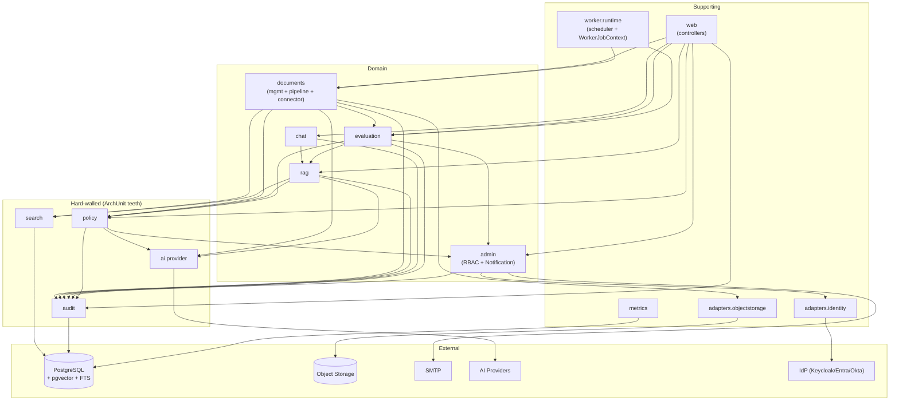

# Module Boundaries — AI Knowledge Assistant for FinTech Engineering Teams

**Status:** Draft v2.1 (aligned with Shared_Abstractions v1.1)
**Author:** Solution Architect
**Source inputs:** [docs/BRD.md](BRD.md), [docs/BA_Analysis.md](BA_Analysis.md), [docs/Solution_Architecture.md](Solution_Architecture.md), [docs/prd/](prd/), [docs/NFR.md](NFR.md), [docs/Shared_Abstractions.md](Shared_Abstractions.md)
**Date:** 2026-06-19

> **Scope note.** This analyzes the *intended* design of the Spring Boot backend (shared codebase, split across `api` and `worker` profiles). No implementation exists yet — this is a pre-build boundary definition. Shared value-object contracts are defined in [Shared_Abstractions.md](Shared_Abstractions.md).

> **Process-boundary rule.** `api` and `worker` are **separate JVMs** (SAD §9.2). Cross-process handoff = PostgreSQL job rows + object-storage keys only — not in-memory objects or stream handles. See Shared_Abstractions §S04 (`DocumentSourceItem` is api in-process only).

> **Unit of boundary.** A *module* here = a **Java package (or package subtree) governed by ArchUnit rules**, inside a single Gradle/Maven module. This is deliberately *not* a separate build artifact per module — at MVP that adds build overhead with no payoff. The wall is logical (ArchUnit, CI-blocking), not physical (separate jars). Four modules carry hard enforcement teeth; the rest are convention-enforced.

---

## 1. Consolidation Summary (v1 → v2)

v1 of this document proposed 15 modules. That over-decomposed for a 5-tenant MVP with a small team. v2 collapses to **9 domain/core modules** plus a thin supporting layer. Rationale per merge:

| v1 modules | v2 module | Why merged |
|---|---|---|
| M03 Ingestion + M04 Document Management + M12 Connector | `documents` | One bounded context (the document lifecycle). Connector Framework was a premature abstraction at MVP (only 2 trivial connectors). Process split (api vs worker) is preserved by internal sub-packages, not by a module wall. |
| M09 Tenant/Workspace/RBAC + M14 Notification | `admin` | Notification is one `notify()` method — a class, not a module. It lives where it is most used (admin events: four-eyes pending, provider outage, regression). |
| M01 Controllers | `web` (supporting) | Controllers carry no business logic; per-domain controller packages, not a standalone module. |
| M02 Worker Scheduler | `worker.runtime` (supporting) | Dequeue/retry/dead-letter infrastructure, not a domain. |
| M15 Metrics | `metrics` (supporting) | Best-effort operational data; infra, not domain. |

Four modules **keep hard walls** because they have structural enforcement (ArchUnit rules already specified in SAD §2.3): `policy`, `audit`, `search`, `ai.provider`.

One split was **explicitly NOT done**: `rag` stays separate from `chat`. The Evaluation Engine reuses the RAG pipeline but has no concept of conversations. Merging RAG into Chat would drag conversation state into the evaluation path — violating the "same pipeline, no chat dependency" requirement (BRD §3.5).

---

## 2. Module Map (9 domain/core + supporting)

```
HARD-WALLED (ArchUnit CI-blocking, bypass structurally impossible)
  ├─ policy        Policy Engine: AuthZ + provider validation + token budget
  ├─ audit         Append-only audit, INSERT-only role, txn-coupled
  ├─ search        PermissionAwareSearchRepository: sole pgvector/FTS path
  └─ ai.provider   Provider adapters (package-private), SDK isolation wall

DOMAIN
  ├─ documents     Upload, validation, lifecycle + ingestion pipeline + connectors
  │    ├─ documents.mgmt       (api profile: validation, metadata, delete lifecycle)
  │    ├─ documents.pipeline   (worker profile: AV→parse→chunk→embed→index)
  │    └─ documents.connector  (DocumentSourceItem producers: upload, folder)
  ├─ rag           RAG Orchestrator: retrieve→validate→prompt→stream→diagnostics
  │    ├─ RagOrchestrator, RefusalCriterion
  │    ├─ PromptRegistry              (MVP: classpath templates; eval injects this)
  │    ├─ AnswerDiagnosticsEntity     (private — full diagnostics record)
  │    └─ projections: DiagnosticRef, RetrievalTrace, DiagnosticsView
  ├─ chat          Conversation/session state, memory window, feedback
  ├─ evaluation    Golden Q&A, suite runner, correctness oracle, regression
  └─ admin         Tenant/workspace/user/RBAC, AI policy, registry + Notification

SUPPORTING (infra packages, not domain modules)
  ├─ web           REST/SSE controllers (per-domain, no business logic)
  ├─ worker.runtime  Job scheduler + WorkerJobContext (explicit tenant from job row)
  ├─ metrics       Operational metrics aggregation → PostgreSQL
  └─ adapters      objectstorage, identity (IdP)
```

**Shared contracts** (cross-package VOs, exceptions, naming): [Shared_Abstractions.md](Shared_Abstractions.md) — seven VOs in `shared.model` (S01–S07), `DomainException` hierarchy in `shared.exception`. No `DomainResult<T>`. No separate `prompts/` package at MVP.

---

## 3. Module Responsibility Table

### `policy` — Policy Engine (hard-walled)

| Aspect | Detail |
|---|---|
| **Responsibility** | Single runtime authority for: (1) RBAC + ACL resolution → `AllowedFilterSet`; (2) AI-provider pre-call validation → `ProviderDecision`; (3) per-tenant token-budget enforcement (SAD §7.8 Concern 3). |
| **Owns** | `AllowedFilterSet`, ACL resolution algorithm (most-specific-wins, explicit-deny precedence), provider validation rules, `ProviderDecision`, permission cache (TTL ≤ 60s, `LISTEN/NOTIFY` invalidation, `perm_cache_version` row). |
| **Must NOT own** | Authentication (Identity adapter), provider SDK calls (`ai.provider`), membership CRUD (`admin`), audit writes (`audit`). |
| **Public interface** | `resolvePermissions(userId, workspaceId, scope): AllowedFilterSet`; `callProvider(ProviderRequest): ProviderResponse` (validates + budget-checks, delegates to `ai.provider`, then **records token usage to the budget counter**). |
| **Internal structure** | **Two logical groups in one `policy` package, sharing one `PermissionCache` bean.** Grouped by *reason to fail*, not by outcome: <br>• **`policy.access`** — `AuthzResolver`. Fires on every read path (search/chat). **Degrade-on-failure:** cache/`LISTEN` down → resolve from PG directly (latency↑, correctness held). Never denies a legitimately-permitted request just because infra is degraded. <br>• **`policy.providergate`** — `ProviderValidator` + `BudgetChecker`. Fires only before an AI call (chat gen, embedding); the two always fire together. **Deny-on-failure:** validation fail or budget store unreachable → fail-closed deny (no AI call). <br>Each bean separately unit-testable. The two groups exist so the degrade-stance and the deny-stance live in clearly separate, separately-tested code — they are not bundled merely because both can say "deny." |
| **Budget counter ownership** | `policy` owns budget counter **read AND write**, so budget state is not smeared across `rag`/`documents`/`metrics`. After `callProvider` gets a provider response, `BudgetChecker` increments the per-`(tenant, period)` budget counter in PG transactionally. This is distinct from the best-effort token-usage *metric* (`metrics`) and from the *audit* of the call (`audit`): the budget counter is the correctness-bearing cost-safety state, owned solely here. |
| **Dependencies** | → `admin` (reads membership/roles/ACL/classification/AI policy), → `ai.provider` (delegates call after validation), → `audit`. |
| **Reads** | `memberships`, `capabilities`, `access_policies`, `workspace_ai_policies`, `provider_configs`, budget counters. |
| **Writes** | Budget counters (`(tenant, period)` token consumption), transactionally on each provider response. Audit via `audit`. |
| **Failure modes** | **access:** cache stale → version-mismatch re-resolve from PG; `LISTEN` drop → flush + PG-direct (degrade, correctness held). **providergate:** budget store unreachable → fail-closed deny; validation fail → `ProviderDecision.deny`; budget over cap → fail-closed deny. |

### `audit` — Audit Module (hard-walled)

| Aspect | Detail |
|---|---|
| **Responsibility** | Sole write path to `audit_events`. Structured record API. Append-only enforcement. |
| **Owns** | `audit_events` schema, append-only invariant (INSERT-only DB role + `BEFORE UPDATE OR DELETE` trigger), monthly partitioning, partition detach at retention, NDJSON export. |
| **Must NOT own** | Decision of *what* to audit (each caller decides). Audit viewer UI (`web`). |
| **Public interface** | `record(AuditEvent): void` — runs in the caller's DB transaction (PRD §06 §10 criteria 7-8). `export(filter): InputStream`. |
| **Internal structure** | Transactionally coupled: if the parent action rolls back, the audit row rolls back. No orphan/missing rows. |
| **Dependencies** | → PostgreSQL only. Leaf module. |
| **Reads / Writes** | `audit_events` (INSERT only; SELECT for export/viewer). |
| **Failure modes** | INSERT fail → parent txn rolls back. Partition exhaustion → ops alert. Large export → streamed NDJSON. |

### `search` — PermissionAwareSearchRepository (hard-walled)

| Aspect | Detail |
|---|---|
| **Responsibility** | Sole code path to pgvector (HNSW) and FTS. Every retrieval method requires `AllowedFilterSet` — no overload without it. Hybrid search via RRF. |
| **Owns** | Vector + FTS query construction, RRF fusion (k=60), cursor pagination, HNSW params (`m=16`, `ef_construction=128`, `ef_search=64`), per-tenant canary-chunk check. |
| **Must NOT own** | Permission resolution (`policy` builds the `AllowedFilterSet`). Chunk/vector write lifecycle decisions (`documents` owns when to write/delete; this module executes). Ranking beyond RRF (future reranker = separate). |
| **Public interface** | `SearchReader`: `hybridSearch`, `ftsOnly` (requires `AllowedFilterSet`). `SearchWriter`: `insertChunksAndVectors`, `deleteByDocument`, `deleteByProfile` (requires `EmbeddingProfile` + tenant context, no filter set). Intentional split — read and write paths have different security contexts (see Shared_Abstractions §6 anti-pattern #3). |
| **Internal structure** | ArchUnit: no class outside this package may call `EntityManager.createNativeQuery`, pgvector funcs, or `tsvector` funcs (SAD §2.3). |
| **Dependencies** | → PostgreSQL. |
| **Reads / Writes** | `chunks`, `embeddings`, `vector_index` (filtered reads; bulk insert from pipeline; delete on hard-delete/reindex). |
| **Failure modes** | PG loss → 503 to caller. Query timeout → bounded by `statement_timeout`. Canary in results → P1 alert (permission bypass detected). |

### `ai.provider` — AI Provider Abstraction (hard-walled)

| Aspect | Detail |
|---|---|
| **Responsibility** | Pluggable adapters for provider SDKs (chat, embedding, future rerank). Normalize requests/responses. Declare provider capabilities. |
| **Owns** | Adapter interfaces, SDK wrappers (Azure OpenAI, OpenAI-compatible, local), `EmbeddingProfile`, capability declarations, response normalization (tokens, streaming). |
| **Must NOT own** | Pre-call validation (`policy`), provider selection (`admin` workspace AI policy), business-level retry/circuit-breaker (caller). |
| **Public interface** | `embed(chunks, profile)`; `chatComplete(prompt, config): Stream<Token>`; `getCapabilities(providerId)`. **Reachable only via `PolicyEngine.callProvider()`.** |
| **Internal structure** | Adapter classes **package-private** (SAD §2.3). ArchUnit: any import of a provider SDK class outside `ai.provider.adapter` fails the build. Adapters handle low-level transient retry only. |
| **Dependencies** | External SDKs. Internal: none (leaf). |
| **Reads / Writes** | Reads `provider_configs`. Writes nothing — returns token usage to caller, who audits. |
| **Failure modes** | Timeout → `ProviderUnavailableException`. 429 → propagate `Retry-After`. Auth fail → config error. Stream cut → partial + truncation flag. |

### `documents` — Document lifecycle + ingestion + connectors (domain)

| Aspect | Detail |
|---|---|
| **Responsibility** | Full document lifecycle: upload validation, metadata CRUD, dedupe, versioning, soft/hard delete, AND the async ingestion pipeline (AV → parse → chunk → embed → index → cutover), AND connector adapters producing `DocumentSourceItem`s. |
| **Owns** | Document/version/collection model, upload validation, content-hash dedupe, 7-day soft-delete window, hard-delete job with deletion propagation to *all* embedding profiles (SAD §3.2), stale golden-question flagging, chunking algorithm, parse/extract logic, cutover semantics, `DocumentSourceItem` contract. |
| **Must NOT own** | Vector index structure (`search`), permission rules (`policy`), provider SDK calls (`ai.provider`), dequeue strategy (`worker.runtime`). |
| **Public interface** | `documents.mgmt`: `uploadDocument`, `supersede`, `softDelete`, `restore`, `hardDeleteExpired`, collection CRUD. `documents.pipeline`: `ingest(jobId): IngestionResult`. `documents.connector`: `importFromFolder`, `adaptUpload`. |
| **Internal structure** | **Three sub-packages with an internal wall:** `documents.mgmt` (api profile), `documents.pipeline` (worker profile), `documents.connector`. ArchUnit (from SAD §9.2): no `documents.mgmt` (api) class may import `documents.pipeline` (worker). They communicate only via `ingestion_jobs` rows. Package merge does NOT drop the process-isolation rule. |
| **Dependencies** | → `ai.provider` (embedding, via `policy.callProvider`), → `search` (write/delete chunks+vectors), → `policy` (authz + provider pre-check), → `objectstorage`, → `audit`, → `evaluation` (stale-flag golden questions on delete). |
| **Reads** | `documents`, `document_versions`, `collections`, `embedding_profiles`, object storage. |
| **Writes** | `documents`, `document_versions`, `collections`, `ingestion_jobs`, `chunks`/`embeddings`/`vector_index` (via `search`), object storage areas (pending-av → primary/quarantine). |
| **Failure modes** | Dup → no-op + audit. AV positive → `av_blocked` + quarantine. Parse fail → `OCR_REQUIRED`. Embedding outage → retry/dead-letter. Partial chunk write → rollback, no partial visibility. Hard-delete partial failure → resume from `last_completed_step` checkpoint (idempotent steps). Delete-during-reindex → profile set read at execution time, so building profiles are cleaned (SAD §3.2). |

### `rag` — RAG Orchestrator (domain)

| Aspect | Detail |
|---|---|
| **Responsibility** | Execute retrieve → refusal-check → validate → prompt → stream → diagnostics. **Single code path** shared by `chat` and `evaluation`. Persists full diagnostics internally; exposes narrow projections outward. **Resolves its own permission filter** — no caller may supply a hand-built `AllowedFilterSet`. |
| **Owns** | Pipeline workflow, **permission-filter resolution** (`policy.access`), **`PromptRegistry`** (classpath templates at MVP; answer + judge-rubric families), refusal criterion, citation extraction, **`AnswerDiagnosticsEntity`** (private), projections (`DiagnosticRef`, `RetrievalTrace`, `DiagnosticsView`). |
| **Must NOT own** | Conversation state (`chat`), vector search execution (`search`), provider SDK calls (`ai.provider`), membership/ACL CRUD (`admin`), evaluation verdicts (`evaluation`). |
| **Public interface** | `executeRag(userId, question, scope, priorTurns, aiPolicy): RagResult` — `RagResult.streamed` for chat, `executeAndCollect(...)` / `RagResult.completed` for evaluation. Returns `diagnosticId` + answer shape; not the full diagnostics record. Resolves `AllowedFilterSet` internally. |
| **Dependencies** | → `policy` (`access` + `providergate`), → `search` (`SearchReader`), → `ai.provider` (via `policy.callProvider`), → `audit`. |
| **Reads** | Chunks via `search`; templates via internal `PromptRegistry`. |
| **Writes** | `answer_diagnostics` (private entity), audit events. Does NOT write chat messages. |
| **Failure modes** | Permission denied → 403. Zero/low retrieval → refusal. Provider denied / budget exceeded → fail-closed. Timeout → `provider.outage`. Stream cut → partial diagnostics persisted. |

### `chat` — Chat / Session Manager (domain)

| Aspect | Detail |
|---|---|
| **Responsibility** | `ChatConversation` lifecycle: creation, 30-min inactivity auto-create, memory window computation, message persistence (when enabled), feedback. Delegates Q&A (including permission resolution) to `rag`. |
| **Owns** | Conversation state machine, memory window (last 10 turns / 2000 tokens), inactivity timer, feedback CRUD (24h lock), chat-content retention enforcement + purge. |
| **Must NOT own** | Retrieval/prompt/provider (`rag`), permission resolution (`rag` → `policy`), citation rendering (frontend). |
| **Public interface** | `createConversation`, `ask(convId, question, scope): StreamHandle`, `submitFeedback`, `getConversationHistory`. |
| **Dependencies** | → `rag`, → `audit`. **No longer depends on `policy` directly** — permission resolution is `rag`'s job. |
| **Reads / Writes** | `chat_conversations`, `chat_messages`, `citations`, `feedback`. |
| **Failure modes** | Conv not found → 404. Perm revoked mid-session → denied on next `ask()` (≤ 60s, via `rag` → `policy.access`). RAG fail → error propagated, partial audit held. |

> **Design note.** `chat.ask()` computes the memory window (prior turns), then passes `(userId, question, scope, priorTurns)` to `rag.executeRag()`. It no longer calls `policy` for permission resolution — `rag` does that internally. This eliminates the convention-based bypass risk where a caller could supply a hand-built `AllowedFilterSet`. Every path through `rag` — live chat and evaluation alike — goes through the same `policy.access` resolution. `chat`'s orchestration is now: load conversation → compute prior turns → delegate to `rag` → persist message + citations.

### `evaluation` — Evaluation Engine (domain)

| Aspect | Detail |
|---|---|
| **Responsibility** | Suite execution: per case, invoke `rag` (same pipeline as live chat), run layered oracle (deterministic → LLM-as-judge → optional human), persist results, compute regression alerts. |
| **Owns** | Golden-question schema, suite/case/run/result model, oracle logic, LLM-judge rubric template *content* (loaded via `rag.PromptRegistry`, `"judge-rubric"` family), regression detection (>5pp drop), stale/disabled lifecycle, feedback→golden promotion. |
| **Must NOT own** | The RAG pipeline (`rag`), provider calls (via `rag`/`policy`), search execution (`search`), permission resolution (`rag` → `policy`). |
| **Public interface** | `createGoldenQuestion`, `runSuite(suiteId): EvalRun`, `promoteFromFeedback`, `humanReview`. |
| **Internal structure** | Each case calls `rag.executeAndCollect(...)` (or `executeRag` with `RagResult.completed`) — same pipeline as live chat, no streaming plumbing in eval. `rag` resolves permissions internally. Oracle consumes `RetrievalTrace` projection from `rag`, not full diagnostics entity. LLM-as-judge via `policy.callProvider()`. |
| **Dependencies** | → `rag` (pipeline + `PromptRegistry` for judge templates), → `policy` (LLM-as-judge `callProvider` only), → `audit`, → `admin` (Notification for regression alerts). |
| **Reads / Writes** | `golden_questions`, `eval_suites`, `eval_cases`, `eval_runs`, `eval_results`, `eval_human_reviews`. |
| **Failure modes** | Provider down → case `SKIPPED`, run partial. Source deleted → case auto-`stale`. Regression → notify. All skipped → run `INCOMPLETE`. |

### `admin` — Tenant/Workspace/RBAC + Notification (domain)

| Aspect | Detail |
|---|---|
| **Responsibility** | Organizational entity CRUD: tenants, workspaces, users (profiles), memberships, roles, capabilities, workspace classification, workspace AI policy, provider registry, four-eyes deletion approval. Plus notification delivery (in-app + SMTP) as an internal service class. |
| **Owns** | Org entity model, membership lifecycle (invite, JIT provision, disable, remove), classification (`standard`/`restricted`/`strict`), workspace AI policy, provider registry, four-eyes flow, **`NotificationService`** (retry 5x, SMTP fallback, delivery tracking), **`RetentionPolicy`** config (centralized retention period values from BRD §4.5; each module's purge method reads its applicable period from here). |
| **Must NOT own** | Permission *resolution* (`policy` — `admin` only stores the ACL/role data `policy` reads), authentication (Identity adapter), document CRUD (`documents`). |
| **Public interface** | `createTenant`, `createWorkspace`, `inviteUser`, `assignRole`, `grantCapability`, `updateAIPolicy`, `setClassification`, `approveProvider`, `approveDelete`; `NotificationService.notify(recipients, category, payload)`. |
| **Internal structure** | `NotificationService` is a class within `admin`, not a module. Most notification triggers are admin/ops events; `evaluation` and `documents` call it for regression / ingestion-failure alerts. |
| **Dependencies** | → Identity adapter (IdP binding, JIT), → `audit`, → SMTP (external, via NotificationService). |
| **Reads / Writes** | `tenants`, `workspaces`, `users`, `memberships`, `capabilities`, `workspace_ai_policies`, `provider_configs`, `notifications`, `notification_deliveries`. |
| **Failure modes** | IdP binding fail → manual provisioning fallback. Revoke last admin → blocked. SMTP down → retry → in-app fallback + `notifications.delivery.failed`. |

### Supporting layer (infra packages — not domain modules)

| Package | Responsibility | Public interface | Failure modes |
|---|---|---|---|
| `web` | REST/SSE controllers, per-domain. Deserialize, validate shape, delegate, serialize. Rate-limit filter (SAD §7.8 Concern 2). No business logic. | `/api/v1/**`, SSE endpoints. | 400/401/403/429/500/503. |
| `worker.runtime` | Poll `ingestion_jobs`/`eval_runs`/hard-delete/retention-purge jobs. Tenant-fair dequeue, retry, dead-letter. Dispatches with **`WorkerJobContext`** (`tenantId`, `workspaceId`, `jobId`, `jobType`) read from job row — **never** implicit ThreadLocal on worker threads. | Internal scheduler (`worker` profile). | DB loss → pause/resume. Dispatch fail → retry → dead-letter. |
| `metrics` | Aggregate counters/histograms (1-min, 5-min buckets) → PostgreSQL. Expose via Actuator + dashboard. | `record(name, tags, value)`; Actuator `/metrics/*`. | PG pressure → reduce resolution. Flush fail → interval lost (acceptable). |
| `adapters.objectstorage` | MinIO/S3/Azure Blob. pending-av + quarantine + primary areas. | `store`, `read`, `delete`, `move`. All operations **idempotent** (double-delete = no-op). | Store fail → upload error. |
| `adapters.identity` | JWT validation (Spring Security OAuth2 RS), JIT provisioning, IdP binding. | Spring Security auto-config; `resolveSubject(jwt)`. | Invalid token → 401. IdP down → existing JWTs valid until TTL. |

---

## 4. Dependency Diagram



> **Cycle check.** `policy → admin` (reads RBAC/ACL data) and `admin → policy`? No — `admin` does CRUD and calls `audit`/Notification, it does not call `policy` for resolution. `documents → evaluation` (stale-flag) and `evaluation → rag` but not back to `documents` — no cycle. `chat` no longer depends on `policy` (removed edge) — `chat → rag → policy` is the only path. `eval → policy` edge remains for LLM-as-judge `callProvider` only. The one watch item: `documents → evaluation` for stale-flagging. If `evaluation` ever needs to call back into `documents`, extract a small `StaleFlagPort` interface to keep the edge one-way.

---

## 5. Boundary Critique (challenge each)

### Hard-walled four — why they earn physical-grade enforcement

`policy`, `audit`, `search`, `ai.provider` are the only modules with **ArchUnit CI-blocking rules**, because each guards a hard requirement where a single accidental bypass is a security or compliance incident:

- `search` bypass → unauthorized chunk in LLM context (BRD §2.2 violation).
- `ai.provider` bypass → unvalidated provider call, data leaves perimeter (BRD §4.3 violation).
- `audit` bypass → mutable/missing audit trail (BRD §2.5 violation).
- `policy` is the choke point both above route through.

**Why not merge `policy` + `audit`?** Decision-making (stateless, hot path, cached) vs immutable record-keeping (transactional, partitioned). Different change frequency, different failure handling. Merge would couple them.

**Why keep AuthZ + provider + budget in one `policy` package (not 3 modules)?** They share workspace-classification context and one cache. But they do **not** share a failure stance — so the package is split into **two logical groups by reason-to-fail**, not three by outcome: `policy.access` (AuthZ, degrade-on-fail, fires every read) and `policy.providergate` (validation + budget, deny-on-fail, fires only before an AI call). Budget rides with provider-gate because the two always fire together; AuthZ is the odd one out and gets its own group with the opposite (degrade) stance. `policy` owns budget counter read+write so cost-safety state lives in exactly one place. **Coupling risk:** `policy` is everyone's dependency — a god-service by design. Accepted; mitigated by caching and the clean access/provider-gate seam. **Change that breaks it:** ABAC needing document-content evaluation at query time → would create `policy ↔ documents` cycle. Mitigation: push content predicates into `search` as an extra filter composed with `AllowedFilterSet`.

### `documents` — the biggest merge, biggest risk

**Why merge ingestion + management + connector?** One bounded context: the document. v1's three-way split created boundary overhead between modules that always change together (add a file type → touches validation in mgmt AND parsing in pipeline).

**Why not leave them split?** At MVP, no scenario changes ingestion without touching document metadata or vice versa. The split earned its keep only at the *process* level (api vs worker), which is preserved by sub-packages + the SAD §9.2 ArchUnit rule — not by a module wall.

**Coupling risk (real).** This package now spans both Spring profiles. The danger: someone calls `documents.pipeline` code synchronously from `documents.mgmt` (api request thread), defeating SAD §9.2. **Mitigation is non-negotiable:** the ArchUnit rule "no `documents.mgmt` class imports `documents.pipeline`" stays CI-blocking. Communication only via `ingestion_jobs` rows.

**Change that breaks it:** Connector #3 (GitHub/SharePoint) with real complexity (auth, pagination, incremental sync). At that point extract `documents.connector` into its own module with a plugin SPI. The `DocumentSourceItem` contract already makes this clean.

### `rag` vs `chat` — the split I refused to collapse

**Why NOT merge** (the tempting merge): `evaluation` reuses `rag` and must not inherit conversation state. If `rag` lived inside `chat`, the eval path would depend on the chat module — pulling in memory windows, feedback, inactivity timers it never uses. The "same pipeline" requirement (BRD §3.5) is the whole point of the eval framework; merging would erode it.

**v2.1 change — `rag` resolves its own permissions.** `rag.executeRag()` takes `(userId, scope)`, not a pre-resolved `AllowedFilterSet`. It calls `policy.access.resolvePermissions()` internally. This kills the convention-based bypass risk where a future caller could construct a hand-built filter set and skip permission resolution. Now every path through `rag` — chat, evaluation, any future caller — goes through the same structural guarantee. `chat` no longer depends on `policy` at all; `evaluation` depends on `policy` only for LLM-as-judge `callProvider()`. The `rag` API takes `priorTurns` as a generic list of prior context — `chat` fills it from the memory window, `evaluation` passes empty. This keeps `rag` conversation-agnostic while accepting context from any caller.

**Why not split `rag` further** (prompt mgmt, citation extraction, refusal as sub-modules)? They are tightly coupled — the prompt template determines citation format determines extraction. Split when prompt management becomes a user-facing CRUD feature (post-MVP).

**Coupling risk:** `chat` knowing `rag`'s streaming internals. Mitigated by `RagResult` as a clean interface.

### `admin` + Notification — is the merge honest?

**Why Notification is a class here, not a module:** it is one `notify()` method with retry + SMTP fallback. Most triggers are admin/ops events. `evaluation` and `documents` call it cross-module — acceptable, it is a thin shared service.

**Risk:** Notification grows (webhooks, PagerDuty, Slack → multi-channel dispatcher). At 3+ channels, extract `notifications` as its own supporting package. The `notify(recipients, category, payload)` signature already hides the channel, so extraction is non-breaking.

**Why not split `admin` into tenant / workspace / user modules?** Few independent operations each; would yield 3 modules with 2-3 methods. Revisit when SCIM 2.0 provisioning adds user-lifecycle complexity.

### `evaluation` — clean consumer

**Why separate:** own domain model + lifecycle (stale-flag, regression, promotion). It is a *consumer* of `rag`, not part of it. **Coupling risk:** calling `rag` with different params than live chat (e.g., disabling streaming) → violates "same pipeline." Mitigation: `rag.executeRag()` / `executeAndCollect()` share identical pipeline inputs; only workspace AI policy + scope differ. Eval injects `PromptRegistry` from `rag` for judge rubrics — no separate `prompts` package.

---

## 6. Misplaced Responsibilities (spec inconsistencies — no code yet)

Honest framing: these are contradictions *between spec documents*, not shipped-code defects. Three are doc-hygiene; three are genuine boundary questions.

**Genuine boundary questions — RESOLVED:**

| Issue | Resolution | Status |
|---|---|---|
| **B1 — Prompt template ownership.** Referenced in both PRD §03 (RAG) and PRD §04 (eval) with no clear owner. Both use "versioned prompt + version recorded in diagnostics" — same machinery, risk of building it twice. | **`PromptRegistry` in `rag`** (not a separate package at MVP). Single registry loads classpath templates for answer-prompt and judge-rubric families. `evaluation` injects `PromptRegistry` from `rag` (narrow read interface if needed). Template version recorded in private `AnswerDiagnosticsEntity` (answer) and `EvaluationResult` (judge). Extract standalone `prompts/` package when template count > 3 or runtime DB editing lands (Shared_Abstractions §1, §10 trigger below). | **RESOLVED** |
| **B2 — Retention purge.** Versions, chat content, audit partitions referenced in BRD §4.5 + SAD §8 but unassigned. Each module purges its own data — but where do the retention *values* live? Smeared as constants in 3 modules = drift risk. | **Per-module purge logic, centralized retention-policy config.** Each owner exposes a `purgeExpired(Instant before)` method: `documents` (superseded versions, hard-delete past grace), `chat` (chat content past retention window), `audit` (partition detach past 1-year default). Jobs run in `worker` profile via `worker.runtime`. **Retention values** (30 days, 90 days, 180 days, 1 year — BRD §4.5 table) are centralized in a single `RetentionPolicy` config class inside `admin` (where workspace/tenant config lives). Each purge method reads its applicable period from `RetentionPolicy`, not from a local constant. This keeps the policy table in one place while purge *execution* stays with the data owner. | **RESOLVED** |
| **B3 — Deletion failure recovery.** Hard-delete spans `documents` + `search` + `objectstorage` — unclear who owns failure recovery. "Retry whole job" assumes idempotency. Reindex case (SAD §3.2) adds profile-set complexity. | **Idempotent, step-checkpointed delete.** `documents.mgmt` owns the hard-delete job. Steps are: (1) drop chunks/embeddings/vectors from `search` for **every active + building embedding profile**, (2) delete extracted text, (3) delete original file from object storage, (4) mark dependent golden questions stale, (5) record `document.hard_deleted` audit. Each step is **idempotent** (double-delete = no-op, not error). The job records a **`last_completed_step` checkpoint** on the delete-job row, so on retry after partial failure it resumes from the failed step, not from step 1. The profile set is **read at delete-execution time** (not at delete-request time), so a profile created after the delete was scheduled still gets cleaned. This closes the SAD §3.2 reindex gap: a delete that arrives while a new profile is mid-build will hit that profile when the hard-delete job runs (or re-runs), because the job queries all profiles at execution time. | **RESOLVED** |

**Doc-hygiene (stale, not boundary problems):**

| Stale text | Reality | Fix |
|---|---|---|
| SAD §4.1 sequence shows AV scan on the API path. | PRD §01 §5.2 correctly moved AV to worker Phase 1 (async AV resolution). | Update SAD §4.1 diagram. |
| BA §7.3.d "ClamAV synchronously before ack." | Superseded by async AV (PRD §01). | Mark BA §7.3.d superseded. |
| PRD §01 §11 lists "worker pool model" as open. | Resolved in SAD §9.2. | Strike, reference SAD §9.2. |

---

## 7. Premature / Unnecessary Abstractions

| Abstraction | Verdict | Action |
|---|---|---|
| **Connector Framework as a module** | Premature. 2 trivial connectors at MVP. | Folded into `documents.connector`. Keep `DocumentSourceItem` contract. Extract at connector #3. |
| **Separate `prompts` package** | Premature. Two template families, classpath-only at MVP. | `PromptRegistry` inside `rag`; `evaluation` injects it. Extract `prompts/` when template count > 3 or runtime DB editing (§10). |
| **Notification as a module** | Premature. One method, 2 channels. | Class inside `admin`. Extract at channel #3. |
| **Metrics as a domain module** | Mislabeled. It is infra. | Demoted to supporting `metrics` package. |
| **Separate Maven module per logical module (v1 implicit)** | Premature/harmful. 15 jars = build hell for a small team. | One Gradle module; logical walls via ArchUnit. |
| **`EmbeddingProfile` multi-active-profile runtime** | Forward-compat schema is fine; over-engineering the runtime is not. | Keep schema. Test single profile; verify parallel-profile logic in the ingestion benchmark gate (SAD §9.1). |
| **Redis at MVP** | Unnecessary. Single API replica → in-memory cache + rate counters suffice. | Not in MVP Docker Compose. Add at multi-replica production (SAD §7.8). |
| **Node.js BFF as a logic-bearing module** | Optional deploy unit, not a module. | No domain logic in BFF; SSE proxy only. |

---

## 8. Areas Where Boundaries Are Still Vague

| Area | Risk | Status |
|---|---|---|
| `policy` three-concern internals | God-service, hard to test | **RESOLVED.** Two logical groups in one `policy` package, grouped by failure stance: `policy.access` (AuthZ, degrade-on-fail) and `policy.providergate` (validation + budget, deny-on-fail), sharing one `PermissionCache` (§3). `policy` owns budget counter read+write. |
| `documents` cross-profile package | Someone bypasses SAD §9.2 inside the merged package | **RESOLVED.** ArchUnit rule "`documents.mgmt` ⊥ `documents.pipeline` imports" is a **foundation-slice deliverable** (§9 step 1), CI-blocking from first commit. Not deferable. |
| `policy` callers and bypass risk | `rag` took a pre-resolved `AllowedFilterSet` — any caller could hand-build one | **RESOLVED.** `rag` now resolves permissions internally via `policy.access`. No caller may supply a filter set. `callProvider` remains the choke point for AI calls — `rag` and `documents.pipeline` both call it directly. `chat` no longer depends on `policy`. |
| Dashboard query logic | Could drift into `metrics` (infra) | Belongs in `web` (or a thin dashboard service it calls). `metrics` exposes a read API; SLO math lives in `web`. |
| Prompt template storage | Code vs config vs DB | **RESOLVED at MVP.** `PromptRegistry` in `rag`, classpath resources; version in private diagnostics + eval results. Outward-facing projections carry `diagnosticId` only (Shared_Abstractions S05). Runtime DB editing = post-MVP (Open Q1). Extract `prompts/` per §10 trigger. |

---

## 9. Recommended Implementation Sequence

Aligned with SAD §8, annotated with module-build order.

1. **Foundation slice.** Build hard-walled four first as stubs: `policy`, `audit`, `search`, `ai.provider` (one adapter). **Write all ArchUnit rules now, CI-blocking — non-deferrable:**
   - provider-SDK import only inside `ai.provider.adapter` (SAD §2.3);
   - native/pgvector/`tsvector` queries only inside `search` (SAD §2.3);
   - **`documents.mgmt` (api) must not import `documents.pipeline` (worker)** (SAD §9.2) — written even though `documents` is built in slice 2, so the wall exists before any pipeline code lands.
   Seed per-tenant canary chunk. `admin` minimal (tenant/workspace/role bootstrap). Docker Compose: PG + pgvector + Keycloak + MinIO.
2. **Ingestion slice.** Build `documents` (all three sub-packages), `worker.runtime`, `objectstorage`. Run the SAD §9.1 benchmark gate; record ADR. Single embedding profile.
3. **Chat slice.** Build `rag` (`PromptRegistry`, private `AnswerDiagnosticsEntity`, projections `DiagnosticRef`/`RetrievalTrace`/`DiagnosticsView`), then `chat`. Hybrid search via `search.SearchReader`. Refusal behavior. SSE both topologies. `RagResult` with `diagnosticId` (not full diagnostics outward).
4. **Admin slice.** Extend `admin` to full CRUD: collections, ACL, AI policy, registry, four-eyes. NotificationService + SMTP. Rate-limit filter in `web` (SAD §7.8).
5. **Evaluation slice.** Build `evaluation`; extend `worker.runtime` for eval runs.
6. **Operational hardening.** Retention purge jobs (per owner), `metrics` dashboard + per-tenant SLO gauges, notification fallback, audit partition lifecycle.

---

## 10. Open Questions

| # | Question | Affected | Owner |
|---|---|---|---|
| 1 | Prompt templates at production: when to move `PromptRegistry` from classpath to runtime-configurable DB? Trigger: user-facing prompt editing UI, or post-MVP by default? | `rag` (`PromptRegistry`), `evaluation` | Architecture + Product |
| 4 | Retention purge scheduling: dedicated `worker.runtime` job type per data category, or one umbrella purge job that calls each module's `purgeExpired()`? | `worker.runtime`, owners | Architecture |
| 5 | Eval prompt-template version drift: pin rubric version at suite-creation, or always use latest from `rag.PromptRegistry`? | `rag`, `evaluation` | Product + Quality |
| 7 | `DocumentSourceItem`: shared library for external connectors, or internal interface? | `documents` | Architecture |

### Resolved extraction triggers (was Q2 connector, Q6 notification, Q3 policy)

These are no longer open — they have concrete, testable triggers. Extraction is mechanical when a trigger fires; no judgment call at the time.

**`documents.connector` → standalone plugin-SPI module.** Extract when **any one** of:
- a third connector is added (upload + folder = the two MVP connectors), OR
- a connector needs **OAuth / token-refresh** auth (vs MVP's no-auth local sources), OR
- a connector needs **incremental sync state** (cursor, change-token, watermark) vs one-shot, OR
- a connector paginates over a **remote API** (rate limits, retries, backpressure).

GitHub/SharePoint/Confluence trip all four at once — that is the realistic trigger. The `DocumentSourceItem` contract makes the extraction non-breaking.

**`NotificationService` → standalone `notifications` package.** Extract when **any one** of:
- a third delivery channel is added (in-app + SMTP = the two MVP channels), OR
- a channel needs **per-channel delivery semantics** that diverge from the shared retry policy (e.g., webhook signing, PagerDuty incident dedup, Slack rate limits), OR
- delivery becomes **outbound async with its own queue** (vs current in-process retry).

A webhook or PagerDuty integration trips this. The `notify(recipients, category, payload)` signature already hides the channel, so extraction is non-breaking.

**`PromptRegistry` → standalone `prompts/` package.** Extract when **any one** of:
- template count exceeds **3** distinct families or versions under active use, OR
- prompts become **runtime-editable** (DB-backed registry, admin UI), OR
- a third consumer besides `rag` and `evaluation` needs template loading (e.g., a future summarization module).

At MVP, `PromptRegistry` stays in `rag`; `evaluation` injects it. Extraction is non-breaking if the public surface remains `get(family, version) → template body + version string`.

**`policy` internals — RESOLVED (was Q3).** Two logical groups in one `policy` package, grouped by *reason to fail*: `policy.access` (AuthZ, degrade-on-fail, hot read path) and `policy.providergate` (provider validation + budget, deny-on-fail, AI-call path), sharing one `PermissionCache`. `policy` owns budget counter read+write so budget state is not smeared across modules. Split `policy.providergate` to its own package only if provider policy gains content-based routing or model-selection optimization.
