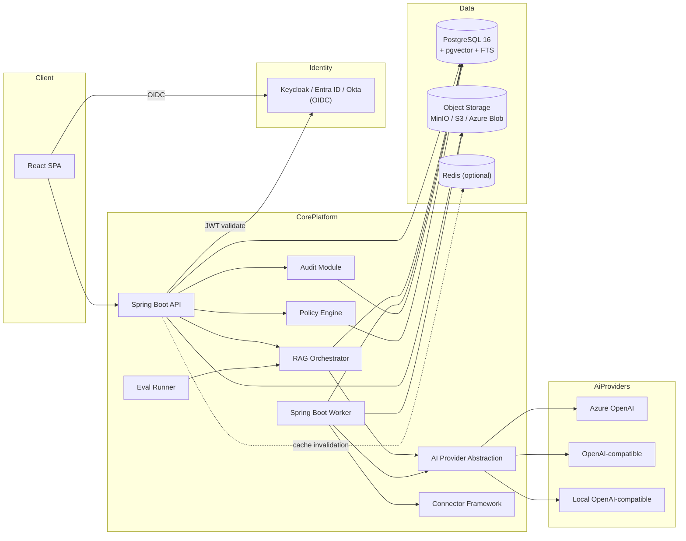
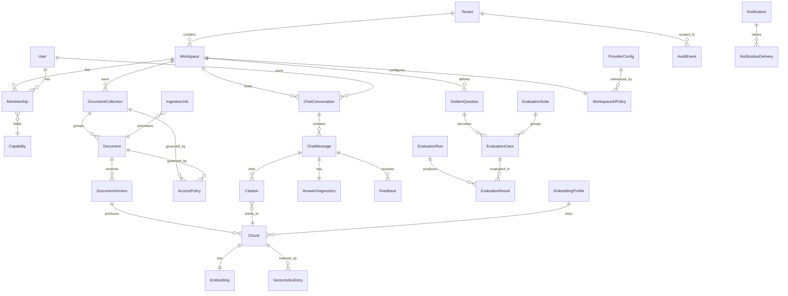
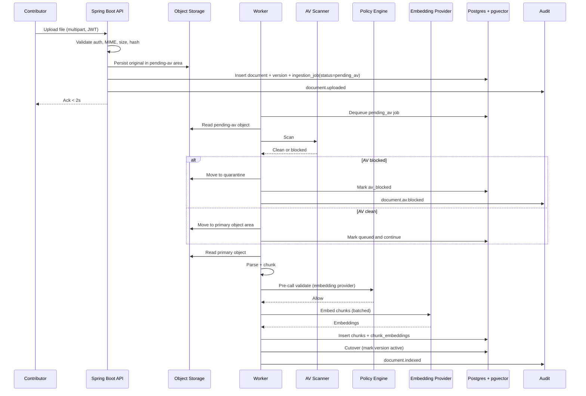
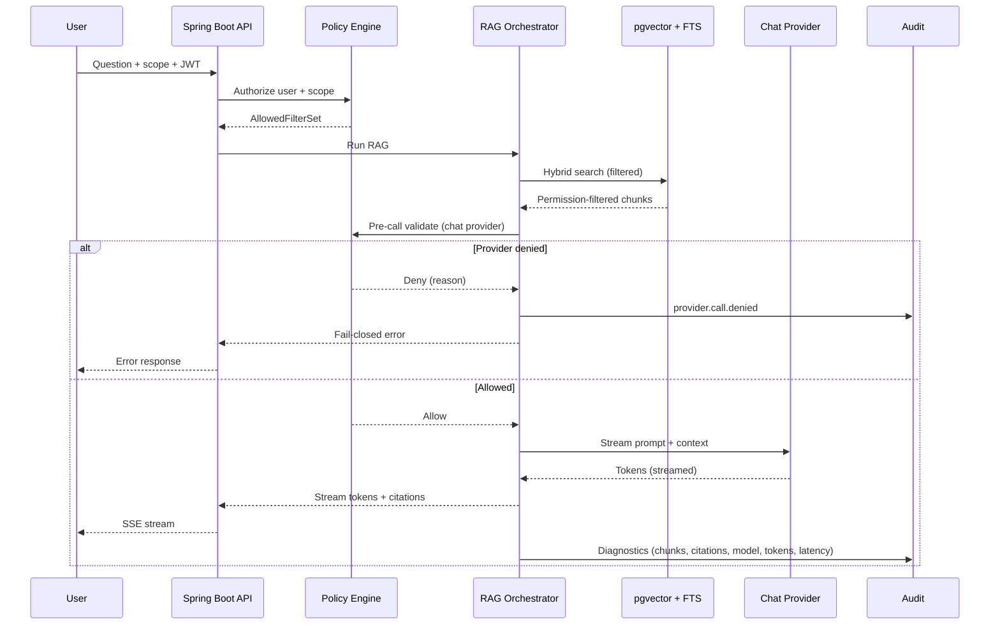
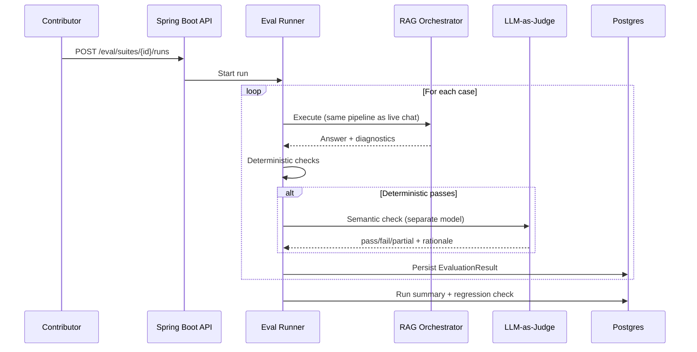
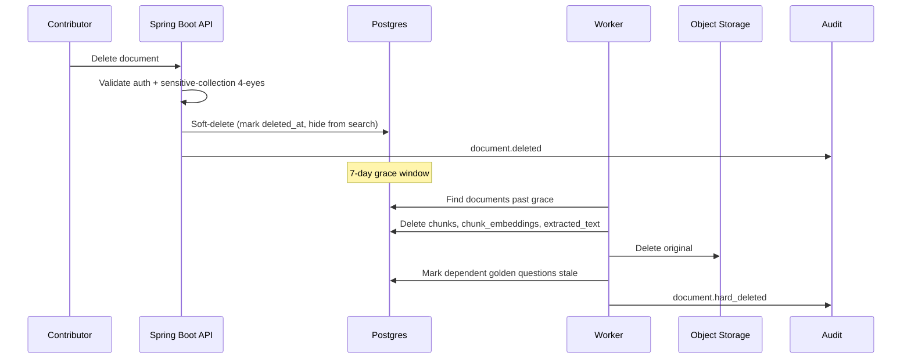
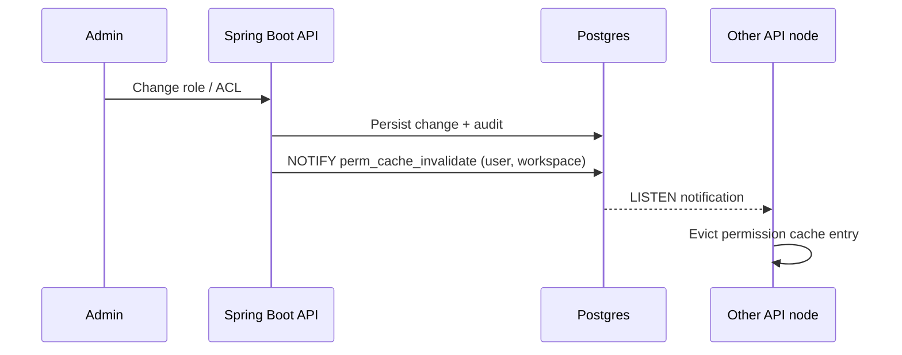
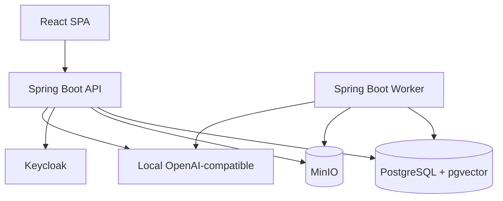
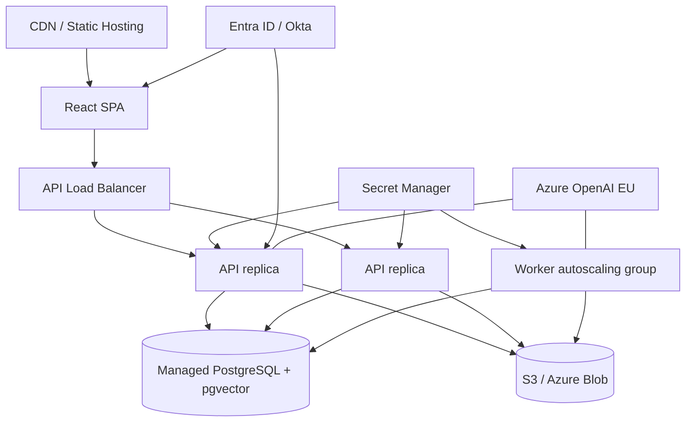

# Solution Architecture — AI Knowledge Assistant for FinTech Engineering Teams

**Status:** Initial Draft v0.1 (post-BRD, post-BA-analysis)
**Author:** Solution Architect (draft seeded by BA)
**Source inputs:** [docs/BRD.md](BRD.md), [docs/BA_Analysis.md](BA_Analysis.md), [docs/prd/](prd/)
**Date:** 2026-05-14

> This document seeds architecture for the MVP. It is intentionally tight: module boundaries, data model, key sequence diagrams, deployment topology. Detailed component design follows in subsequent drafts.

---

## 1. Architectural Goals

- **Permission-aware retrieval** is a first-class architectural primitive — not a cross-cutting concern bolted on top.
- **AI provider abstraction** is a first-class primitive: pre-call policy validation, fail-closed semantics, full audit.
- **Connector framework** as an architectural primitive: every source produces normalized `DocumentSourceItem`s feeding the same pipeline.
- **Observable and inspectable**: every chat answer carries enough metadata to explain itself.
- **Migration-ready**: event-oriented even if MVP uses a DB-backed queue.
- **Operational simplicity for MVP**: Docker Compose first, Kubernetes / cloud later.

## 2. Module Boundaries (Logical)

### 2.1 Modules

- **React SPA** — UI for upload, search, chat, admin, observability.
- **Spring Boot API** — request entry, JWT validation, RBAC, scope resolution, REST + SSE endpoints.
- **Spring Boot Worker** — ingestion pipeline stages (parse → chunk → embed → index), reindex, delete propagation, eval-run executor (or co-deployed eval runner).
- **Policy Engine** — single authority for: workspace RBAC, ACL resolution, AI-provider pre-call validation, residency check. Returns an `AllowedFilterSet` consumed by retrieval.
- **AI Provider Abstraction** — pluggable adapters (Azure OpenAI, OpenAI-compatible, local). Declares capabilities, region, retention, training policy, embedding dimensions. Always called via the Policy Engine pre-check.
- **Connector Framework** — produces normalized `DocumentSourceItem`s. MVP: manual upload + local folder. Roadmap: GitHub, SharePoint, Confluence, etc.
- **RAG Orchestrator** — runs the retrieve-validate-prompt-stream pipeline. Single code path shared by live chat and evaluation runner (key correctness primitive).
- **Eval Runner** — orchestrates suite execution via the RAG Orchestrator + applies the layered correctness oracle (PRD §04).
- **Audit Module** — `audit_events` insertion API; the only write path to the audit table.

### 2.2 Cross-Cutting Architectural Primitives

| Primitive | Owner | Why |
|---|---|---|
| `AllowedFilterSet` | Policy Engine | Encodes `(tenant, workspace, collection, document)` filter that **every** retrieval call must use. Eliminates the bypass risk. Enforced via `PermissionAwareSearchRepository` — see §2.3. |
| `EmbeddingProfile` | Provider Abstraction | Keys index families. Enables zero-downtime embedding-model migration. |
| `DocumentSourceItem` | Connector Framework | Normalized ingestion entry; every connector feeds the same pipeline. |
| `ProviderDecision` | Policy Engine | Result of pre-call validation; carries deny reason for fail-closed audit. |
| `AnswerDiagnostics` | RAG Orchestrator | Single record per answer joining retrieval, generation, policy, and feedback. |

### 2.3 Architectural Enforcement Rules

The following rules must be enforced in CI from the foundation slice onward. They exist because the platform's two hardest requirements — permission-aware retrieval (BRD §2.2) and fail-closed provider validation (BRD §4.3) — are convention in the spec but must be structural in the code.

**Provider Abstraction bypass prevention (Risk #2).**

- All AI provider SDK adapter classes (e.g., Azure OpenAI client, OpenAI-compatible client, local-provider client) are **package-private** (Java default access) inside the `ai.provider.adapter` package. No module outside that package may instantiate or reference them.
- The sole public entry point for any AI call (chat, embedding, rerank) is `PolicyEngine.callProvider(ProviderRequest)`, which runs pre-call validation (region, retention, training, approval, residency) and delegates to the adapter only on success.
- The Python eval runner calls the Spring Boot REST API (the same RAG pipeline as live chat, per PRD §04 §5.2) — never a provider SDK directly.
- **ArchUnit rule (CI-blocking):** any import of a provider SDK class (`com.azure.ai.openai.*`, `dev.ai4j.*`, or equivalent) outside the `ai.provider.adapter` package fails the build.

**Retrieval filter bypass prevention (Risk #4).**

- `PermissionAwareSearchRepository` is the **sole** code path to vector search (pgvector) and keyword search (FTS). All its retrieval methods require an `AllowedFilterSet` parameter; no overload without it exists.
- **ArchUnit rule (CI-blocking):** no class outside the search module may call `EntityManager.createNativeQuery`, pgvector extension functions, or `tsvector` search functions directly.
- **Per-tenant canary chunk.** Each tenant is seeded with a chunk belonging to a forbidden collection. If this chunk ever appears in any search result or chat context, a P1 alert fires. The canary is deployed in the foundation slice (SAD §8 track 1), not deferred.
- These enforcement rules must be in place **before** the ingestion slice (SAD §8 track 2) merges.

---

## 3. Data Model (ERD)

### 3.1 Notable Constraints

- `documents.embedding_profile_id` allows multiple parallel index families during migration.
- `audit_events` is monthly-partitioned; insert-only role; trigger blocks UPDATE/DELETE.
- `chat_conversations.last_active_at` drives the 30-min inactivity rule (PRD §03).
- `access_policies` rows carry `(scope_type, scope_id, subject_type, subject_id, action)`; resolved via most-specific-wins + explicit deny precedence (PRD §05 §5.4).

### 3.2 Deletion Propagation During Reindex (hard requirement)

Deletion must propagate to **every** embedding profile, including a profile that is still being built during a reindex/migration window (BRD §4.5, PRD §01 §5.4). A delete that lands while a new `embedding_profile` is mid-build must not leave orphan vectors in the new profile after cutover.

Rule:

- When a document (or version) is deleted while one or more `embedding_profile` index families are **active** or **building**, the deletion is applied to **all** of them. Implementation may either (a) delete directly from each profile's `chunks` / `chunk_embeddings` rows for that document, or (b) append the deletion to a per-profile `pending_deletes` log that the builder must consume.
- **Cutover is blocked** while a building profile has unconsumed `pending_deletes` for documents that have been removed from the source set. The new profile may be activated only after its pending-delete set is empty (drained).
- The reindex job records `embedding_profile.created` and `embedding_profile.activated` (BA §7.6.c); a delete during the window additionally records that it was applied to the building profile.

This closes the gap where SAD §3.1 / BA §7.6.c describe parallel profiles and cutover but do not define delete semantics inside the build window.

---

## 4. Key Sequence Diagrams

### 4.1 Ingestion (happy path)

### 4.2 Chat / RAG

### 4.3 Evaluation Run

### 4.4 Document Delete (with vector-index propagation)

### 4.5 Permission Cache Invalidation

---

## 5. Service / Process View

- **api**: stateless Spring Boot service exposing REST + SSE; multiple replicas behind a load balancer. Does **not** run ingestion or evaluation workloads — those are isolated in the worker process (see below and §9.2).
- **worker**: same Spring Boot codebase deployed with a `worker` profile; runs as a **separate container/process** from the API, even when co-located on the same VM at MVP. Consumes ingestion jobs and evaluation runs. Horizontally scalable.
  - **Process isolation rule (§9.2).** The API and the worker share a codebase and a database but **never share a JVM, heap, or request-thread pool**. They communicate exclusively through durable job state (`ingestion_jobs`, `eval_runs` tables). No direct method call from the API request path may trigger ingestion or evaluation work synchronously — the API only inserts a job row, and the worker polls/dequeues it. This keeps heavy workloads (PDF parsing, embedding batches, eval suites) from contending with live chat/search latency.
  - **Eval isolation.** Evaluation runs (PRD §04 §6) execute on the worker, not on the API. The eval runner reuses the RAG Orchestrator code but runs in the worker's process/thread pool, subject to a rate-limited provider quota separate from the live-chat quota. A long eval suite must not degrade live chat p95 (PRD §04 §6).
  - **Tenant fairness.** Workers must not let one tenant's queued jobs starve others under a burst (e.g., the NFR §3.9 bulk-onboarding scenario of 500 documents from a single tenant). Default: weighted round-robin across tenants with at least one ready job, bounded by the per-tenant concurrency cap (5 ingestion jobs/tenant, BRD §4.4).
  - **Dead-letter surface.** `ingestion_jobs` carries a `dead_letter` boolean (and `dead_letter_reason`) from the first migration, set when a job exhausts its 3 automatic retries (BRD §4.4). This keeps dead-letter a column read rather than a later schema migration. Streaming/queue-broker DLQ remains roadmap (BRD §5.4); the MVP surface is this column plus the admin ingestion monitor (PRD §01 §5.6).
- **frontend**: React SPA served by static hosting.
- **postgres**: **Managed PostgreSQL 16** with pgvector + FTS (Azure Flexible Server Burstable B1ms or AWS RDS db.t4g.micro; ~€12-20/mo in EU). Provides automated daily backup, PITR, managed patching, and TLS, dissolving the backup-orchestration concern entirely. Read replica is **production-launch only** (NFR §6.10 forbids HA replicas at MVP). PG-on-VM is a documented fallback **only** for air-gapped sovereignty deployments; in that case, `pg_basebackup` + WAL archive to a residency-compliant object-storage bucket must be specified as a named work item.
- **object storage**: MinIO (dev) / S3 / Azure Blob (cloud).
- **idp**: Keycloak (dev) / Entra ID / Okta (cloud).
- **(optional) redis**: short-lived cache and rate limiting. **Never required for correctness** (BRD §5.4).

## 6. Deployment Topology

### 6.1 Local (Docker Compose, MVP first vertical slice)

### 6.2 Cloud (target, managed container platform)

### 6.3 Communication Pattern Matrix

| Interaction | Pattern | Consistency | Retry Owner | Idempotency |
|---|---|---|---|---|
| React -> API | Sync REST | Read-your-writes | Client/API | Request-level (safe retries) |
| API -> Policy | Sync in-process | Strong | API | n/a |
| API -> PostgreSQL | Sync transactional | Strong | API | n/a |
| Upload -> Object storage + job row | Sync write + async processing | Strong ack, eventual indexing | API then worker | Content hash + optional idempotency key |
| API -> Worker | Async DB queue (`SKIP LOCKED`) | Eventual | Worker | Job checkpoint + lease token |
| Worker -> Embedding provider | Sync outbound | Eventual index build | Worker | Stage-level idempotency |
| API -> Chat provider | Sync outbound streaming (SSE) | Eventual answer completion | API | Re-ask on failure |
| Retention/deletion | Scheduled async jobs | Eventual | Worker | Step checkpointing |

## 7. Cross-Cutting Concerns

### 7.1 Authentication & Authorization
- OIDC at the SPA; JWT validated by Spring Security OAuth2 Resource Server.
- Permission cache TTL ≤ 60 s; invalidated via Postgres `LISTEN/NOTIFY` (BA §7.2.c).
- Capability flags additive on `Membership`.

**Permission cache resilience (multi-replica production scenario).**

- A single row `perm_cache_version` in PostgreSQL is incremented on every ACL / role / membership change. On cache miss, the API replica reads this version and compares it to its local version — detecting stale entries independently of the `LISTEN/NOTIFY` broadcast channel.
- On `LISTEN` connection drop, the API replica must **flush its entire permission cache immediately** and re-establish the connection. Until reconnected, every request resolves permissions from PG directly (correctness preserved, latency degraded). This behavior must be covered by an integration test simulating a connection drop.
- **Sensitive-workspace bypass.** Workspaces classified as `restricted` or `strict` (BA §7.6.d) **always bypass the permission cache** and read permissions from PostgreSQL on every request. This eliminates the 60-s staleness window for the highest-risk data, at the cost of one additional PG read per request in those workspaces. For `standard`-classified workspaces, the ≤ 60 s TTL cache with `LISTEN/NOTIFY` invalidation remains in effect.

### 7.2 Tenant Isolation
- Logical isolation via `tenant_id` + `workspace_id` row scoping. Pre-filter enforced by Policy Engine in every query path.
- Roadmap: schema-per-tenant + db-per-tenant for high-compliance customers (BRD §2.3).

### 7.3 Residency & Provider Policy
- Provider registry declares region/retention/training (PRD §05 §5.6).
- Pre-call validation in Policy Engine; fail-closed.
- Cross-border opt-in requires four-eyes co-sign for `restricted+` workspaces.

### 7.4 Audit
- Insert-only DB role; trigger blocks UPDATE/DELETE; monthly partitions.
- One write path: Audit Module.

### 7.5 Observability
- Structured JSON logs, content-minimized.
- Metrics via Actuator; Prometheus integration roadmap.
- Per-answer diagnostics joined to audit events.

### 7.6 Reliability
- Acknowledged uploads durable before ack.
- Reindex preserves previous active version until success.
- Retries up to 3x with manual retry.
- Daily backups; RPO 24 h, RTO 4 h.
- Degraded modes: LLM outage → chat returns provider-unavailable; embedding outage → ingestion queues.

### 7.7 Security
- Secrets in cloud secret manager (Key Vault / Secrets Manager). Never in env files in cloud.
- Encryption at rest for object storage and DB.
- Antivirus as first gated worker stage (PRD §01 §5.2 Phase 1).
- TLS everywhere; HSTS at the edge.

### 7.8 Rate Limiting (phased, layered)

Rate limiting protects three different things, each with a different natural enforcement point. The system treats them as three separate concerns, not one.

**Concern 1 — IP / connection flood (DDoS mitigation).**
- Belongs at the **edge**: load balancer, WAF, or managed API gateway.
- MVP: basic IP-rate limit at the LB / Container App ingress if available at no additional cost (e.g., Azure Container Apps built-in IP restrictions, Nginx `limit_req`). No managed API gateway required — NFR §6.10 cost-control rule applies.
- Production launch: managed WAF or API gateway when justified (added to NFR §6.10 graduation checklist when needed).

**Concern 2 — per-user / per-tenant request rate (abuse prevention).**
- Needs **resolved JWT identity** (user ID, tenant ID, workspace ID, role). Only the Spring Boot API has this after token validation + permission resolution.
- **Spring is the source of truth** for this limit in every topology — including gateway-less.
- Enforced as a Spring `OncePerRequestFilter` / `HandlerInterceptor` on `/api/chat` and `/api/search`.
- MVP (single replica): **in-memory counters** (e.g., Bucket4j local). Acceptable because there is only one API process.
- Production (multi-replica): counters move to **Redis** (already listed as optional in SAD §5) or to a **PostgreSQL lightweight counter table** (e.g., sliding-window row per user+endpoint, pruned hourly). Redis is preferred for throughput but remains "never required for correctness" (BRD §5.4) — if Redis is unavailable, the filter falls back to **fail-closed** (deny the request with a 503 + `Retry-After` header) on per-user limits.
- The frontend may perform client-specific UX smoothing (e.g., debounce rapid chat submissions) but is **never the source of truth** for rate limits.

**Concern 3 — per-tenant AI token budget (cost control).**
- Needs **provider token accounting** — only the backend sees provider responses with token-usage metadata.
- Enforced inside the **Policy Engine** (`PolicyEngine.callProvider`) as part of pre-call validation: check current-period token usage against the per-tenant budget cap (NFR §6.5).
- **Cannot** live at any edge or gateway layer.
- Token usage is recorded per call in the `provider_call` metrics / audit; budget consumption is aggregated per `(tenant, period)`.
- At budget cap (≥ 110%): **fail-closed** — block new chat/embedding calls for that tenant; return a clear "budget exhausted" error to the user; notify workspace admin (NFR §6.5). No fail-open path for budget limits.

**Fail-open / fail-closed stance summary.**

| Limit type | On counter/store unavailability | Reasoning |
|---|---|---|
| IP flood (edge) | Fail-open (allow) | Edge unavailability should not block all users; backend has secondary defense. |
| Per-user request rate (Spring) | **Fail-closed** (deny with 503 + Retry-After) | Without rate state, a runaway client can overload the API. Conservative default. |
| Per-tenant token budget (Policy Engine) | **Fail-closed** (deny) | This is a cost-safety hard stop; fail-open risks unbounded spend. |

**Multi-replica coherence (production).**

At production launch with 2-10 API replicas (NFR §6.7):
- Per-user request-rate counters must be **shared across replicas** (Redis or PG counter table) to avoid a user getting N× their limit across N replicas.
- Token-budget counters are already stored in PostgreSQL (provider-call audit / metrics tables) and read by the Policy Engine — inherently shared, no replica-local problem.
- The architecture must not introduce Redis as a hard dependency — if Redis is added for rate-limit counters, the system must remain correct (fail-closed) without it.

---

## 8. Implementation Tracks (Recommended Order)

1. **Foundation slice**: Docker Compose with Postgres + pgvector + Keycloak + MinIO + Spring Boot + React; OIDC login; tenant/workspace/role bootstrap.
2. **Ingestion slice**: TXT/MD upload, chunking, embedding via local provider, indexing, basic search.
3. **Chat slice**: RAG orchestrator, citations, streaming, refusal behavior, per-answer diagnostics.
4. **Admin slice**: collections, ACLs, workspace AI policy editor, provider registry, audit viewer.
5. **Evaluation slice**: golden Q&A authoring, runner reusing RAG orchestrator, deterministic + LLM-as-judge oracle, dashboard.
6. **Operational hardening**: append-only audit enforcement, retention purge jobs, notification fallback, soft-delete + four-eyes.
7. **Cloud topology**: managed Postgres, secret management, residency configuration.

## 9. Open Architecture Items

Picked up from PRDs and BA analysis:

- ~~Worker pool model (in-process vs separate JVM) — PRD §01.~~ Resolved: see §9.2.
- Evaluator-model selection and rubric-prompt versioning — PRD §04.
- Hash-chain design for audit tamper-evidence (post-MVP) — PRD §06.
- Folder-import allow-list configuration UX — PRD §01.

### 9.2 Worker Pool Model (resolved)

**Decision: separate process/container, same codebase, `worker` Spring profile.**

Ingestion and evaluation run in a separate JVM from the API, even when both containers co-locate on the same VM at MVP. Communication is exclusively through durable job state (DB tables), never through direct method calls from the API request path.

Rationale:

- **Resource isolation.** A 25 MB PDF parse or an embedding batch spikes heap and CPU. In a shared JVM this hits API request threads and blows p95/p99 chat/search latency (NFR §2.1-2.3). Separate processes isolate GC pauses, heap pressure, and CPU contention by construction.
- **Eval isolation.** An evaluation suite hammers the full RAG pipeline + provider in a loop (PRD §04 §6). Running eval in the API's JVM would directly compete with live chat. A separate worker process with its own rate-limited provider quota prevents this.
- **Zero extra cost.** Two containers on one VM via Docker Compose is already the MVP topology (SAD §6.1). No new infrastructure.
- **Migration-readiness.** When the system moves to a managed container platform at production launch, the worker scales independently from the API via its own autoscaling group (NFR §6.7).

Hard architectural rule:

- The API process inserts job rows (`ingestion_jobs`, `eval_runs`) and returns immediately. The worker process polls/dequeues them. No synchronous call from an API request thread may trigger ingestion parsing, embedding, or evaluation execution.
- This rule must be enforced by an ArchUnit test: no class in the `api` Spring profile may import classes from the `worker.pipeline` or `worker.eval` packages.

### 9.1 pgvector Index Choice and Parameters (resolved)

**Decision: HNSW** as the MVP default. IVFFlat is considered roadmap-only, re-evaluated if retrieval corpus per tenant exceeds 2M chunks where IVFFlat training lists amortize.

Default HNSW parameters:

- `m = 16` (connections per node; balances recall vs build time at 100k-chunk scale).
- `ef_construction = 128` (build-time candidate pool; high enough for good graph quality, low enough for sub-minute index build on 100k vectors).
- `ef_search = 64` (query-time candidate pool; conservative starting point for recall@8 ≥ 0.85 under filtered queries).

**Benchmark gate (mandatory before ingestion-slice merge, SAD §8 track 2):**

Before the ingestion slice is merged, a synthetic benchmark must be run on a **100k-chunk single-tenant corpus** with realistic ACL pre-filter selectivity (e.g., user sees 3 of 20 collections). Measurements required:

- recall@8 across 50 representative golden questions.
- p50, p95 latency for filtered hybrid search (vector + FTS fused via RRF).
- Pass criteria: p95 ≤ 1.0 s **and** recall@8 ≥ 0.85.
- If the pass criteria are not met: increase `ef_search` (first lever), then consider partial indexes per collection, then consider IVFFlat.

Results recorded in an ADR (`docs/adr/NNN-pgvector-index-parameters.md`).

## 10. Traceability

- BRD → BA Analysis → PRD → SAD chain preserved; each artifact links back to the BRD section IDs and the BA-proposed resolution IDs (§7.x).
- All hard requirements from BRD §8 are addressed by named architectural primitives (§2.2).
