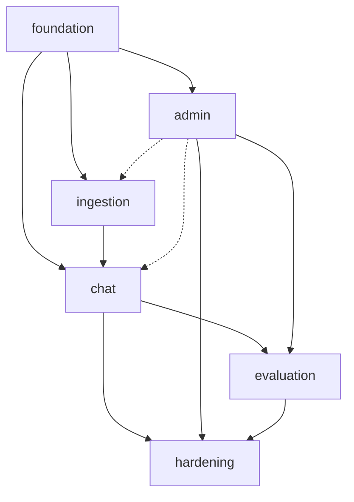

# MVP Capability Plan — AI Knowledge Assistant (RAG Platform) v1

Canonical **delivery plan** for the MVP. It is the single place that assigns
**one owner per MVP acceptance criterion**, fixes the **critical-path order**
of the six delivery slices, states what is **in / out of scope** for v1,
defines the **Definition of Done** each slice must meet, and records the
**human sign-off**.

This document defines **workflow, not requirements**. It is subordinate to the
source-of-truth chain (AGENTS.md precedence): [BRD.md](BRD.md) → [NFR.md](NFR.md)
→ [adr/](adr/) → [Solution_Architecture.md](Solution_Architecture.md) →
[Module_Boundaries.md](Module_Boundaries.md) + [Shared_Abstractions.md](Shared_Abstractions.md)
→ [Database_Schema.md](Database_Schema.md) → [API_Contracts.md](API_Contracts.md) +
`openapi/*.yaml` → [Communication_Patterns.md](Communication_Patterns.md) →
[prd/](prd/) → [Design_System.md](Design_System.md). [Architecture_Options.md](Architecture_Options.md)
is historical analysis only, not authority. On any conflict, the authoritative
docs win — report the drift, do not silently patch this plan.

Downstream of this plan: one **OpenSpec change per slice**
(`openspec/changes/<slice>/` — proposal, design, delta specs, tasks) plus the
canonical implementation spec `docs/specs/<NN>_<Slice>_Spec.md` (generated from
[spec-prompts/](spec-prompts/)) → implementation → tests → verification per the
`rag-change-workflow` skill and the operator runbook
[docs/qa/slice-implementation-runbook.md](qa/slice-implementation-runbook.md)
plus per-slice before/during/after plans in
[docs/qa/slice-plans/](qa/slice-plans/).
Slice boundaries and the dependency rationale live in
[Solution_Architecture.md §8](Solution_Architecture.md) and
[Module_Boundaries.md §9](Module_Boundaries.md); this plan does not restate
them, it operationalizes them.

> **Status:** APPROVED — signed off 2026-08-05, see [§7](#7-sign-off).
> `foundation-slice` OpenSpec change is **proposed** (69 tasks, none started)
> and may begin implementation. Minimum trusted loop (docs-phase) established
> 2026-08-06 — see `docs/qa/verification-manifest.json`.

---

## 1. Ownership matrix — one owner per MVP acceptance criterion

Every row has exactly **one owner**: an owning module (per
[Module_Boundaries.md §2](Module_Boundaries.md)) or a named cross-module
delivery concern where no single module can enforce the requirement. The owner
is accountable for its spec scenario, implementation, tests, and evidence.
"Depends on" lists modules whose output the owner consumes; it does not
transfer ownership. Shared contracts (`shared.model`, `shared.exception`), the
DB schema, and CI/ArchUnit infrastructure are foundation-slice deliverables
regardless of who reads them.

**Row-ID convention (plan-local shorthand, defined here only):**
`ING-ACn` = [prd/01_Ingestion.md](prd/01_Ingestion.md) §10 criterion *n*;
`SRCH-ACn` = [prd/02_Search.md](prd/02_Search.md) §10; `CHAT-ACn` =
[prd/03_Chat.md](prd/03_Chat.md) §10; `EVAL-ACn` =
[prd/04_Evaluation.md](prd/04_Evaluation.md) §10; `ADM-ACn` =
[prd/05_Admin.md](prd/05_Admin.md) §10; `OBS-ACn` =
[prd/06_Observability.md](prd/06_Observability.md) §10; `FND-n` = foundation
requirements from SAD §2.3/§8 + Module_Boundaries §9 step 1 (the foundation
slice has no PRD of its own); `RET-DOC`, `RET-CHAT`, and `RET-AUDIT` =
data-owner retention requirements from BRD §4.5 + Module_Boundaries §6 B2.
The PRD/BRD/SAD text is authoritative; these IDs are only handles for
traceability inside this plan, the OpenSpec specs, and tests.

Rows are grouped by the **slice in which their acceptance evidence closes**.
The owning module may deliver implementation in an earlier slice when a later
slice supplies the required verification harness.

### Slice 1 — foundation: walls, schema, bootstrap, canary

| Ref | Requirement (source) | Owner | Depends on | Done signal |
|-----|----------------------|-------|-----------|-------------|
| FND-1 | Gradle skeleton, `api`/`worker` profiles as separate JVMs, Docker Compose stack (SAD §8.1; ADR-001) | cross-module scaffold | — | Local stack boots: PG+pgvector, Keycloak, MinIO, backend (2 JVMs), frontend shell |
| FND-2 | All ArchUnit walls written first, CI-blocking, non-deferrable (SAD §2.3, §9.2; MB §8, §9.1) | build/test infra | FND-1 | Each rule demonstrably red on a violation, green on the tree; CI blocks |
| FND-3 | OIDC login, JWT validation, JIT provisioning, disabled-user denial (BRD §2.4; BA §7.2.a) | `adapters.identity` | FND-1 | Login round-trip against Keycloak; invalid token → 401; disabled member denied |
| FND-4 | Tenant/workspace/role bootstrap + seed data + Flyway V1 per Database_Schema §9.1 (SAD §8.1) | `admin` (minimal) | FND-3 | Demo tenant, workspace, one user per role seeded; migration test passes |
| FND-5 | `policy` stub: `resolvePermissions()` → `AllowedFilterSet`; `callProvider()` fail-closed default; permission cache TTL ≤ 60 s + `LISTEN/NOTIFY` + `perm_cache_version` (MB §3; SAD §7.1; ADR-004) | `policy` | FND-4 | Cache-invalidation and `LISTEN`-drop-flush integration tests pass |
| FND-6 | `audit` append-only: sole writer, INSERT-only DB role, `BEFORE UPDATE OR DELETE` trigger, monthly partitions, `record()` in caller's transaction (ADR-005, ADR-015; covers OBS-AC1/7/8) | `audit` | FND-4 | UPDATE/DELETE rejected; rollback removes audit row; success → exactly one row |
| FND-7 | `search` stub: `SearchReader`/`SearchWriter`, every read requires `AllowedFilterSet`; canary chunk seeded per tenant, canary-check live (SAD §2.3) | `search` | FND-4 | Canary FK chain provisioned atomically per workspace; canary hit → P1 signal |
| FND-8 | `ai.provider` adapter SPI, package-private adapter classes, one local OpenAI-compatible stub (SAD §2.3; ADR-004) | `ai.provider` | FND-1 | SDK-import ArchUnit wall green; adapter reachable only via `PolicyEngine.callProvider()` |

### Slice 2 — ingestion: document lifecycle + pipeline ([prd/01_Ingestion.md](prd/01_Ingestion.md))

| Ref | Owner | Depends on | Done signal |
|-----|-------|-----------|-------------|
| ING-AC1 | `documents.pipeline` | `search`, `ai.provider`, `policy` | Uploaded PDF/MD/TXT searchable within SLO, only after full successful indexing (cutover) |
| ING-AC2 | `documents.pipeline` | `worker.runtime` | Failed ingestion shows clear reason; manual retry works from `failed`/`av_blocked` |
| ING-AC3 | `documents.mgmt` | — | Same-hash duplicate in `(workspace, collection, name)` → no new version, audit recorded |
| ING-AC4 | `documents.mgmt` | `search` | Hard delete removes vector entries; search returns zero hits |
| ING-AC5 | `documents.pipeline` | `policy`, `admin` | Provider-policy violation blocks embedding, fail-closed, with audit + admin notification |
| ING-AC6 | `documents.mgmt` | `policy` | Ingestion-status queries return nothing to non-permitted users |
| ING-AC7 | `documents.mgmt` | `search` | Delete during reindex cleans active **and** building profiles; cutover blocked until pending deletes drained (SAD §3.2) |
| ING-AC8 | `worker.runtime` | `documents.pipeline` | Retry exhaustion → `dead_letter` + reason, visible in admin monitor, re-enqueue only by authorized retry |
| ING-AC9 | `worker.runtime` | — | Tenant-fair dequeue: one tenant's bulk import does not starve others |
| ING-AC10 | `documents.mgmt` | `adapters.objectstorage` | Ack < 2 s before AV; file held in pending-av area (encrypted, not indexed, not searchable) |
| ING-AC11 | `documents.pipeline` | `adapters.objectstorage`, `admin` | AV-positive file quarantined, never parsed/indexed/searchable; admin notified; audit recorded |

> **Slice gate (mandatory before merge):** the SAD §9.1 pgvector benchmark —
> 100k-chunk corpus, realistic ACL selectivity, p95 ≤ 1.0 s **and**
> recall@8 ≥ 0.85 — with results recorded in a new ADR
> (`docs/adr/NNN-pgvector-index-parameters.md`). See [§6](#6-open-dependencies--blockers).

### Slice 3 — chat / RAG: search read path + conversation ([prd/02_Search.md](prd/02_Search.md), [prd/03_Chat.md](prd/03_Chat.md))

| Ref | Owner | Depends on | Done signal |
|-----|-------|-----------|-------------|
| SRCH-AC1 | `search` | `policy` | Only ACL-permitted chunks returned (negative ACL fixtures + canary) |
| SRCH-AC2 | `search` | — | p95 ≤ 1.5 s at 100k chunks under nominal load (re-confirms benchmark gate) |
| SRCH-AC4 | `search` | — | Cursor pagination stable, non-duplicating across pages |
| SRCH-AC5 | `web` | `search` | Similarity score absent from responses for USER/VIEWER by default |
| CHAT-AC1 | `rag` | `search`, `policy` | Answers cite only permitted chunks (negative ACL tests); `rag` resolves its own `AllowedFilterSet` (MB v2.1) |
| CHAT-AC3 | `rag` | `web`, `ai.provider` | p95 TTFT < 2 s streaming over SSE (`token`/`citation`/`heartbeat`/`done`/`error`, ADR-011) |
| CHAT-AC4 | `rag` | `audit` | Diagnostics record retrieved + cited chunk IDs for every answer, including refusals |
| CHAT-AC5 | `policy` | `rag` | Provider region/policy mismatch → fail-closed block + full audit (`policy.providergate`) |
| CHAT-AC6 | `policy` | `chat`, `rag` | Permission revoked mid-conversation effective on next question (≤ 60 s, `policy.access`) |
| CHAT-AC7 | `rag` | `web`, `audit` | Streaming interruption still produces audit record + partial citations |

> Slice 3 delivers RRF ranking and the deterministic refusal path. Acceptance
> evidence for SRCH-AC3 and CHAT-AC2 closes in slice 5, where the golden-suite
> harness exists; their domain owners remain `search` and `rag`.
>
> `chat` also owns the non-AC in-scope behavior of PRD §03: conversation
> lifecycle, 30-min inactivity, memory window (10 turns / 2,000 tokens),
> feedback with 24 h edit lock, retention-governed persistence.

### Slice 4 — admin: RBAC, ACL, policy, registry ([prd/05_Admin.md](prd/05_Admin.md))

| Ref | Owner | Depends on | Done signal |
|-----|-------|-----------|-------------|
| ADM-AC1 | `admin` | `policy` | Role assignment usable within seconds (cache invalidation works) |
| ADM-AC2 | `admin` | `policy` | Revocation denies on next request (≤ 60 s) |
| ADM-AC3 | `admin` | `documents` | Sensitive-collection delete blocked without second ADMIN approval (four-eyes) |
| ADM-AC4 | `admin` | — | Workspace cannot select a provider not on the approved registry |
| ADM-AC5 | `admin` | `audit` | Cross-border toggle on `restricted+` workspace requires four-eyes co-sign, fully audited |
| ADM-AC6 | `policy` | `admin` | Explicit deny beats explicit allow for same user + collection (most-specific-wins resolution) |

> Slice 4 also delivers the `web` rate-limit filter (SAD §7.8 Concern 2,
> fail-closed on counter loss) and `NotificationService` (in-app + SMTP,
> retry 5×, MB §3 `admin`).

### Slice 5 — evaluation: golden Q&A + runner + oracle ([prd/04_Evaluation.md](prd/04_Evaluation.md))

| Ref | Owner | Depends on | Done signal |
|-----|-------|-----------|-------------|
| EVAL-AC1 | `evaluation` | `rag` | Runner uses the exact live RAG pipeline (negative ACL cases in suite prove permission parity) |
| EVAL-AC2 | `evaluation` | — | Case expecting refusal that gets an answer → `fail`, regardless of LLM-judge verdict |
| EVAL-AC3 | `evaluation` | `admin` | Synthetic > 5 pp pass-rate drop fires regression alert to workspace ADMINs |
| EVAL-AC4 | `evaluation` | `chat` | Feedback → golden promotion requires expected answer + expected sources |
| EVAL-AC5 | `documents` | `evaluation` | Soft-delete marks dependent cases `stale` in the same transaction |
| SRCH-AC3 | `search` | `evaluation` | Golden suite proves RRF beats dense-only and FTS-only on top-3 relevance |
| CHAT-AC2 | `rag` | `evaluation` | Golden negative suite proves insufficient retrieval returns the refusal template, not a hallucination |

> Slice 5 owns the golden-suite verification harness and closes SRCH-AC3 and
> CHAT-AC2 acceptance evidence without taking implementation ownership from
> `search` or `rag`. It also extends `worker.runtime` for eval runs isolated
> from live-chat latency (PRD §04 §6; SAD §9.2).

### Slice 6 — operational hardening ([prd/06_Observability.md](prd/06_Observability.md), BRD §4.5)

| Ref | Owner | Depends on | Done signal |
|-----|-------|-----------|-------------|
| OBS-AC2 | `rag` | `audit` | Every chat answer (incl. refusals, interruptions) has a matching audit event with chunk IDs — delivered in slice 3, re-verified here end-to-end |
| OBS-AC3 | shared runtime logging configuration | all | `api` and `worker` profile tests prove document text, full prompts, retrieved context, and LLM responses are logged only with explicit workspace approval; secrets, access tokens, and sensitive PII are never logged |
| OBS-AC4 | `audit` | `adapters.objectstorage` | NDJSON audit export round-trips to a verified equal set; artifact encrypted, 7-day expiry |
| OBS-AC5 | `admin` | — | SMTP failure for 30 min triggers in-app admin banner (notification fallback) |
| OBS-AC6 | `web` | `metrics` | Dashboards surface per-tenant SLO gauges (BRD §4.4 numbers are per tenant) |
| RET-DOC | `documents` | `admin` (`RetentionPolicy`), `worker.runtime` | Document versions and derived artifacts purge per centralized periods; hard-delete propagation covers every embedding profile and object storage |
| RET-CHAT | `chat` | `admin` (`RetentionPolicy`), `worker.runtime` | Enabled chat content, citations, and feedback purge per centralized periods; metadata-only workspaces retain no disabled content |
| RET-AUDIT | `audit` | `admin` (`RetentionPolicy`), `worker.runtime` | Expired audit partitions detach per centralized period without breaking current-partition inserts or export |

> OBS-AC1/7/8 (append-only + transactional audit) are delivered in the
> foundation slice (FND-6) and only re-verified here.

> **Cross-cutting constraints** (not per-slice rows, owned where the work
> lands): NFR §2 latency ceilings and NFR §3 capacity → every owning module at
> its DoD; NFR §4.3 cross-tenant isolation + canary → `policy`/`search`;
> NFR §6.5 token budget fail-closed → `policy.providergate`; NFR §7.1–7.3
> quality gates → CI ([§5](#5-definition-of-done-per-slice)); residency/data
> lifecycle (BRD §4.2, §4.5) → `policy` + `admin` + each purge owner.

---

## 2. Critical-path DAG

Solid edges are hard dependencies; the dashed edges (`admin -.-> ingestion`,
`admin -.-> chat`) are soft — foundation seeds a working provider registry +
workspace AI policy (schema-only CRUD), so ingestion and chat run on seeded
defaults; the admin slice only makes registry/policy/ACL fully editable later.

Hard ordering constraints (from SAD §8, Module_Boundaries §9, Database_Schema §9):

1. **Everything after `foundation`** — it owns the Gradle skeleton, Docker
   Compose stack, Flyway V1 (Database_Schema §9.1 + canary chain), shared VOs,
   the hard-walled module stubs, and **all ArchUnit walls, which are
   CI-blocking from first commit and non-deferrable** (MB §8, §9 step 1).
2. **Benchmark gate before ingestion merges** — SAD §9.1 pgvector benchmark
   must pass and be recorded in a new ADR before slice 2 merges.
3. **Ingestion before chat** — chat needs indexed, permission-scoped content;
   search executes only over the active embedding profile (PRD §02 §6).
4. **`rag` before `evaluation`** — the eval runner reuses the live pipeline
   (BRD §3.5); `rag` resolves permissions internally so eval inherits the same
   structural guarantee (MB v2.1).
5. **Admin before evaluation** — regression alerts need `NotificationService`
   (MB §3 `evaluation` → `admin` dependency).
6. **Hardening last** — retention purge, audit export, notification fallback,
   and the end-to-end re-verification span all prior slices.
7. **Cloud topology (SAD §8 track 7) is not an MVP slice** — it is
   production-launch work and stays out of this plan.

---

## 3. Phased delivery order

One OpenSpec change per slice (split if a change exceeds reasonable review
size), each producing the canonical spec doc from its prompt in
[spec-prompts/](spec-prompts/).

| # | Slice | OpenSpec change | Spec doc | Key modules | Status |
|---|-------|-----------------|----------|-------------|--------|
| 1 | Foundation | `foundation-slice` | `docs/specs/01_Foundation_Spec.md` | `policy`, `audit`, `search`, `ai.provider` (stubs), `admin` (bootstrap), `web`, `adapters.identity` | ✳ proposed (69 tasks, 0 done) — unblocked; implementation may begin |
| 2 | Ingestion | `ingestion-slice` | `docs/specs/02_Ingestion_Spec.md` | `documents` (all sub-packages), `worker.runtime`, `adapters.objectstorage` | ☐ |

> **Ingestion-slice prerequisite:** make `tools/benchmark/` harness runnable,
> execute SAD §9.1 gate (recall@8 ≥ 0.85, p95 ≤ 1.0 s), fill
> `docs/adr/019-pgvector-index-parameters.md` — scaffold exists; see
> `tools/benchmark/README.md`.
| 3 | Chat / RAG | `chat-slice` | `docs/specs/03_Chat_Spec.md` | `rag`, `chat`, `search` (read path) | ☐ |
| 4 | Admin | `admin-slice` | `docs/specs/04_Admin_Spec.md` | `admin` (full CRUD, audit viewer), `web` rate limiting | ☐ |
| 5 | Evaluation | `evaluation-slice` | `docs/specs/05_Evaluation_Spec.md` | `evaluation`, `worker.runtime` (eval runs), `search`/`rag` acceptance closure | ☐ |
| 6 | Hardening | `hardening-slice` | `docs/specs/06_Hardening_Spec.md` | shared runtime logging, `documents`/`chat`/`audit` retention, `admin` notifications, `web`/`metrics` dashboards | ☐ |

> The `foundation-slice` change resolves the known canary-chunk cross-doc
> conflict (SAD §2.3 foundation canary vs Database_Schema §9.1 table set) with
> **resolution (a), extended**: the seven-table canary FK chain moves into V1
> and `docs/Database_Schema.md` is edited canonically in that change.

---

## 4. Scope — in / out for v1

**In scope (v1):** everything in the ownership matrix above. Confirmed
decisions that bind implementation (all already resolved in the source docs —
listed here so no slice re-litigates them):

- AV scanning is **async**, the first gated worker stage; ack < 2 s p95 comes
  before AV; unscanned files live only in the encrypted pending-av area
  (PRD §01 §5.1–5.2).
- `api` and `worker` are **separate JVMs**; handoff is durable job rows +
  object-storage keys only, never in-memory objects (SAD §9.2; ADR-001).
- Vector index is **HNSW** (`m=16`, `ef_construction=128`, `ef_search=64`),
  subject to the benchmark gate; IVFFlat is roadmap (SAD §9.1).
- `rag` **resolves its own permission filter** via `policy.access`; no caller
  may supply a hand-built `AllowedFilterSet` (MB v2.1).
- `PromptRegistry` lives in `rag` (classpath templates); `evaluation` injects
  it for judge rubrics; no separate `prompts/` package at MVP (MB §6 B1).
- Retention **values** centralize in `admin.RetentionPolicy`; purge
  **execution** stays with each data owner (MB §6 B2).
- Hard delete is **idempotent and step-checkpointed** (`last_completed_step`);
  profile set read at execution time so building profiles get cleaned
  (MB §6 B3; SAD §3.2).
- `ingestion_jobs.dead_letter` column exists **from the first migration**
  (SAD §5); broker-level DLQ is roadmap.
- Per-tenant **canary chunk** ships in the foundation slice, not deferred
  (SAD §2.3); canary in any result = P1.
- One role per user per workspace; capabilities are additive flags (BA §7.1.c;
  PRD §05 §5.2).
- Chat memory window = min(last 10 turns, 2,000 tokens); chat-content
  persistence **off by default**; feedback editable 24 h then locked
  (PRD §03 §5.2, §5.7).
- Refusal criterion: zero permitted chunks, or all top-K below cosine 0.55, or
  context < 200 tokens (PRD §03 §5.3).
- Similarity scores hidden from USER/VIEWER by default (PRD §02 §4).
- Per-tenant AI **token budget is fail-closed** at ≥ 110% of cap, enforced in
  `policy.providergate` (SAD §7.8 Concern 3; NFR §6.5).
- Metrics live **in PostgreSQL**, exposed via Actuator + admin dashboard; no
  Prometheus/Grafana/SIEM at MVP (BRD §5.5; ADR-008).

**Out of scope (v1)** — per BRD §3.4, §4.1–4.2, §5 roadmap lists, PRD §3
sections, and the ADR exclusion list: autonomous agents / tool execution,
Slack/Teams/voice, long-term personal memory, cross-tenant analytics,
cross-workspace search/chat/eval, field-level redaction, fine-tuning, automated
compliance decisions, scanned PDFs / OCR, external connectors (GitHub,
SharePoint, Confluence, …), SCIM provisioning, reranker models, scheduled/CI
eval runs, prompt A/B testing, audit hash-chain tamper evidence, and — without
a new accepted ADR — Kubernetes, Kafka/brokers, Redis as a correctness
dependency, dedicated vector DBs, managed observability SaaS, Node.js BFF
(ADR-006, ADR-008, ADR-017, ADR-018).

---

## 5. Definition of Done (per slice)

A slice is **Done** only when all of the following hold:

1. **Spec:** the slice's OpenSpec change validates (proposal, design, delta
   specs, tasks) and `docs/specs/<NN>_<Slice>_Spec.md` exists, reviewed against
   `docs/` — cross-doc conflicts found during spec work are **reported**, never
   silently resolved (AGENTS.md).
2. **Traceability:** every matrix row whose acceptance evidence closes in the
   slice is cited in that slice's spec and covered by at least one test that
   references its row ID. Earlier implementation slices record explicit
   handoffs for later verification rows. Docs-phase enforcement exists
   (`scripts/check-traceability.mjs`); phase `full` (`@trace` tags in tests)
   activates when implementation tests land — see [§6](#6-open-dependencies--blockers).
3. **Contract:** `openapi/*.yaml` updated and parses; API_Contracts §4
   invariants hold (`/api/v1` base path, `ProblemDetails` errors,
   `X-Request-Id` on every response, ADR-011 SSE event set).
4. **Schema:** Flyway migrations match [Database_Schema.md §9](Database_Schema.md)
   for the slice exactly — no invented tables/columns; canonical schema doc
   updated in the same change when schema evolves.
5. **Tests:** unit + integration (Testcontainers) green; ArchUnit walls green;
   coverage per NFR §7.2 — ≥ 70% line for backend modules, **≥ 90% for
   the permission engine, audit writer, and retention enforcement**; tests for
   matrix rows written red-first.
6. **Quality gates (CI):** per NFR §7.1/§7.3/§9.1 — Checkstyle + SpotBugs +
   Error Prone (Java), ESLint + Prettier (TS), Ruff + mypy (Python tooling),
   SAST, dependency scan, secret scan; PR reviewed by ≥ 1 approver; PR
   feedback ≤ 10 min.
7. **Protected rules hold** (AGENTS.md): no cross-tenant/workspace exposure;
   pre-retrieval permission filtering; provider residency/policy validation;
   fail-closed on ambiguity; no secrets in source/logs/prompts/fixtures;
   canary never appears in results.
8. **Slice gate met** (table below).
9. **Evidence + handoff:** audit events and metrics required by each row's
   canonical PRD/BRD source are emitted and visible; deferred verification
   handoffs are recorded; `docs/current-state.md` updated.

| Slice | Slice-specific gate |
|-------|---------------------|
| foundation | ArchUnit rules demonstrably red/green; canary seeded + detectable; audit append-only + same-transaction tests pass (OBS-AC1/7/8) |
| ingestion | SAD §9.1 benchmark passes (p95 ≤ 1.0 s, recall@8 ≥ 0.85); results ADR merged; delete-during-reindex test green (ING-AC7) |
| chat | Deterministic refusal-path unit/integration tests green (golden-suite acceptance deferred to slice 5); SSE contract conformance (ADR-011); fail-closed provider tests (CHAT-AC5) |
| admin | Four-eyes and deny-precedence tests green (ADM-AC3/AC6); rate-limit filter fail-closed test |
| evaluation | A seeded golden suite (incl. negative-ACL, ranking-comparison, and refusal cases) runs end-to-end and closes SRCH-AC3/CHAT-AC2; regression alert fires on synthetic drop (EVAL-AC3) |
| hardening | RET-DOC/RET-CHAT/RET-AUDIT purge paths verified; both runtime profiles pass content-minimized logging tests (OBS-AC3); NDJSON export round-trip (OBS-AC4); E2E suite covers the top-10 journeys (NFR §7.2) |

---

## 6. Open dependencies / blockers

Docs-phase tooling and scaffolds below are in the repo. Remaining work is
implementation activation owned by the named slices (none of these change any
requirement doc).

### 6.1 Completed (docs / scaffolds)

1. **CI pipeline — docs phase live.** `.github/workflows/ci.yml` runs:
   verification-manifest check, OpenAPI 3.1 lint (redocly, errors block),
   OpenSpec strict validation, relative-link check (`scripts/check-doc-links.mjs`),
   traceability freshness (**no rewrite-before-check**), golden-seed validation,
   slice G4 gates when evidence exists (`scripts/check-slice-gates.mjs`),
   Mermaid render, secret scanning (gitleaks), evidence artifact upload.
   Human merge gate documented in `docs/qa/branch-protection.md` +
   `.github/CODEOWNERS` (replace `@OWNER`).
2. **PR template.** [.github/pull_request_template.md](../.github/pull_request_template.md)
   references plan §5 DoD checklist, matrix row IDs, verification evidence,
   rollback note, and reviewer requirements (NFR §7.1, §9.7).
3. **Traceability tooling.** `scripts/check-traceability.mjs` maps matrix row
   IDs to OpenSpec delta specs (phase `docs`) and optionally `@trace` tags in
   tests (phase `full`); report at `docs/qa/traceability-report.md`; wired in
   CI with `--check-fresh`.
4. **Golden question seed set.** `docs/eval/golden-seed.yaml` (50 benchmark +
   10 refusal + 10 negativeAcl); validated by `scripts/check-golden-seed.mjs`
   in CI.
5. **Benchmark harness — scaffolded.** `tools/benchmark/` (README, corpus
   design, script skeletons); ADR-019 placeholder at
   `docs/adr/019-pgvector-index-parameters.md`.
6. **E2E journey map.** `docs/qa/e2e-journeys.md` maps NFR §7.2 top-10
   journeys to slices + matrix rows; Playwright chosen; commented
   `frontend-verify` job includes Playwright install/run steps.
7. **Coverage policy.** `docs/qa/coverage-policy.md` (thresholds, JaCoCo
   snippet, ratchet rule); foundation-slice task added;
   `madrapps/jacoco-report` step in commented `backend-verify` CI job.

### 6.2 Remaining blockers (slice-owned)

1. **Enable + complete backend/frontend CI (foundation DoD).** Two parts:

   - **Enable commented jobs** in `.github/workflows/ci.yml` once the Gradle /
     frontend trees exist. Staged commands today (exact):
     - backend: `checkstyleMain` / `checkstyleTest` / `spotbugsMain`,
       `dependencyCheckAnalyze`, `test` (Testcontainers + ArchUnit),
       `jacocoTestCoverageVerification`, `madrapps/jacoco-report` PR comment,
       `build -x test`
     - frontend: `npm run lint`, `tsc --noEmit`, `test:coverage`, Playwright
       install/run, `npm run build`
     - Note: the lint step *name* says “Error Prone” and the build step *name*
       says “SBOM”, but neither is a separate wired task yet — only labels.
   - **Add missing gates** (NFR §7.1/§7.3/§9.1) before claiming the full
     battery:
     - SAST (tool TBD — e.g. CodeQL; must exist and fail the job)
     - Error Prone as a real Gradle compile/check task (not just the lint label)
     - Prettier check (frontend formatting)
     - SBOM generation wired (CycloneDX or equivalent artifact), not just the
       build step label
     - job-level `timeout-minutes` so the pipeline is enforced ≤ 10 min
       (NFR §9.1)
     - Ruff + mypy for Python tooling (`tools/benchmark/`) — land with the
       ingestion-slice harness when that Python code becomes runnable
       (foundation may stub the CI step commented until then)
2. **Traceability phase `full`.** Wire `@trace` tags in implementation tests
   and run the checker in `full` mode once test code exists (per-slice as
   matrix rows close).
3. **Benchmark harness runnable (ingestion prerequisite).** Make
   `tools/benchmark/` executable, pass SAD §9.1 (recall@8 ≥ 0.85, p95 ≤ 1.0 s),
   fill ADR-019 — see plan §3 note; blocks ingestion-slice merge.
4. **E2E tests implemented.** Journey map only today; Playwright tests land
   per [docs/qa/e2e-journeys.md](qa/e2e-journeys.md) staging rule; all 10 green
   = hardening gate.
5. **Coverage enforcement in Gradle/Vitest.** Policy + CI comment step staged;
   JaCoCo / Vitest threshold config lands with the foundation slice build.

**Known cross-doc drift to fix (report-only here; owned by doc maintenance,
already catalogued in Module_Boundaries §6):** SAD §4.1 still shows AV on the
API path (superseded by PRD §01 async AV); BA §7.3.d "synchronous ClamAV"
superseded; PRD §01 §11 still lists the worker-pool model as open (resolved in
SAD §9.2).

---

## 7. Sign-off

This plan governs MVP delivery. Signed off below; slice implementation
(including the already-proposed `foundation-slice` OpenSpec change) may proceed.

| Role | Name | Decision | Date |
|------|------|----------|------|
| Product owner | Alex Chulkin | ☑ approved | 2026-08-05 |
| Tech lead | Alex Chulkin | ☑ approved | 2026-08-05 |

**Sign-off notes:** Same person holds PO and TL; dual role acknowledged.
